# BWStest

[](https://travis-ci.org/shabbychef/BWStest)
[](http://codecov.io/github/shabbychef/BWStest?branch=master)
[](https://cran.r-project.org/package=BWStest)
[](http://www.r-pkg.org/pkg/BWStest)
[](http://www.r-pkg.org/pkg/BWStest)


Performs the [Baumgartner-Weiß-Schindler 2-sample test](http://doai.io/10.2307/2533862) of equal probability
distributions. 

-- Steven E. Pav, shabbychef@gmail.com

## Installation

This package can be installed 
from CRAN, 
via [drat](https://github.com/eddelbuettel/drat "drat"), or
from github:


```r
# via CRAN:
install.packages("BWStest")
# via drat:
if (require(drat)) {
    drat:::add("shabbychef")
    install.packages("BWStest")
}
# get snapshot from github (may be buggy)
if (require(devtools)) {
    install_github("shabbychef/BWStest")
}
```

# Basic Usage

The front end for the hypothesis test is the function `bws_test`. By default it supports
the the classical Baumgartner-Weiß-Schindler test for a two-sided alternative, returning a `htest` object:


```r
require(BWStest)
set.seed(12345)
# under the null:
x <- rnorm(200)
y <- rnorm(200)
hval <- bws_test(x, y)
show(hval)
```

```
## 
## 	two-sample BWS test
## 
## data:  x vs. y
## B = 1, p-value = 0.2
## alternative hypothesis: true difference in survival functions is not equal to 0
```

```r
# under the alternative:
z <- rnorm(200, mean = 1)
hval <- bws_test(x, z)
show(hval)
```

```
## 
## 	two-sample BWS test
## 
## data:  x vs. z
## B = 30, p-value <2e-16
## alternative hypothesis: true difference in survival functions is not equal to 0
```

The code also supports alternative test statistics from Neuhäuser and Murakami, along with supporting
one-sided alternatives for some of the tests:


```r
set.seed(12345)
# under the alternative:
x <- rnorm(200)
y <- rnorm(200, mean = 1)
hval <- bws_test(x, z, alternative = "less")
show(hval)
```

```
## 
## 	two-sample Neuhauser/Murakami test
## 
## data:  x vs. z
## B_2 = -30, p-value <2e-16
## alternative hypothesis: true difference in survival functions is less than 0
```

```r
x <- rnorm(8)
y <- rnorm(8, mean = 1)
hval <- bws_test(x, z, method = "B3", alternative = "two.sided")
show(hval)
```

```
## 
## 	two-sample Murakami test
## 
## data:  x vs. z
## B_3 = 2, p-value = 0.009
## alternative hypothesis: true difference in survival functions is not equal to 0
```

We should note that the `B3` through `B5` tests do _not_ achieve nominal coverage
for large sample sizes and should _only_ be used on sample sizes of about 12 or fewer
in each of the two samples.

## Checking the null

  _Doverai No Proverai_ (Trust, but verify.) -- Russian proverb.

Here we perform 5000 simulations of the BWS test under the null hypothesis, then
compute the CDF of the test statistic. If the code is correct, the resultant p-values
should be uniform. So I q-q plot under the uniform law:


```r
require(BWStest)

# now compute a bunch under the null:
set.seed(1234)
bvals <- replicate(5000, bws_stat(rnorm(100), rnorm(100)))
# compute the approximate p-values under the null:
pvals <- bws_cdf(bvals)

require(ggplot2)
ph <- ggplot(data.frame(pv = pvals), aes(sample = pv)) + 
    stat_qq(distribution = stats::qunif)
print(ph)
```

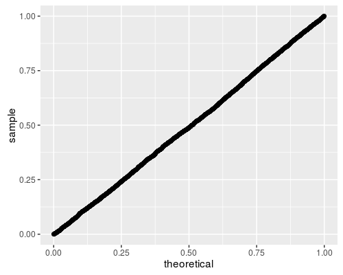

Looks good to me!

## Under the alternative

Here we replicate figure 2A of Baumgartner _et al._ We draw two samples from the normal distribution,
both with unit standard deviation, letting _a_ be the difference in means. 
We check the empirical rejection rate at the 0.05 level for a few different tests.
As in Baumgartner, we find that the lowly t-test
is the most powerful in this case, with the BWS, Cramer-Von Mises, and Wilcoxon tests displaying similar power, 
then the KS test the least powerful. Note that the Kolmogorov Smirnov test does not appear to have nominal
coverage under the null, probably due to the small sample size.


```r
n.sim <- 10000
avals <- seq(0, 3.2, length.out = 17)
alpha <- 0.05
mnsize <- 10

# this is archived on CRAN, unfortunately:
library(CvM2SL2Test)
# find the CVM critical value.
critv <- uniroot(function(x) {
    cvmts.pval(x, mnsize, mnsize) - alpha
}, lower = 0, upper = 100, maxiter = 5000)$root

set.seed(1234)
simul <- sapply(avals, function(a) {
    rejs <- replicate(n.sim, {
        x <- rnorm(mnsize, mean = 0)
        y <- rnorm(mnsize, mean = a)
        bws <- bws_cdf(bws_stat(x, y), lower_tail = FALSE) <= 
            alpha
        ttv <- t.test(x, y, alternative = "two.sided")$p.value <= 
            alpha
        cvm <- cvmts.test(x, y) >= critv
        ksv <- ks.test(x, y, alternative = "two.sided")$p.value <= 
            alpha
        wcx <- wilcox.test(x, y, alternative = "two.sided")$p.value <= 
            alpha
        c(bws, ttv, cvm, ksv, wcx)
    })
    rejrate <- rowMeans(rejs)
    names(rejrate) <- c("BWS test", "t test", "Cramer-Von Mises test", 
        "Kolmogorov Smirnov test", "Wilcoxon test")
    rejrate
}, simplify = "matrix")

Arejrates <- data.frame(t(simul))
Arejrates$a <- avals
```

```r
library(tidyr)
library(dplyr)
library(ggplot2)
plotdf <- tidyr::gather(Arejrates, "test", "rejection_rate", 
    -a) %>% dplyr::mutate(test = gsub("\\.", " ", test))
ph <- ggplot(plotdf, aes(x = a, y = rejection_rate, 
    group = test, colour = test)) + geom_line() + geom_point() + 
    labs(x = "a, difference in means", y = "rejection rate")
print(ph)
```

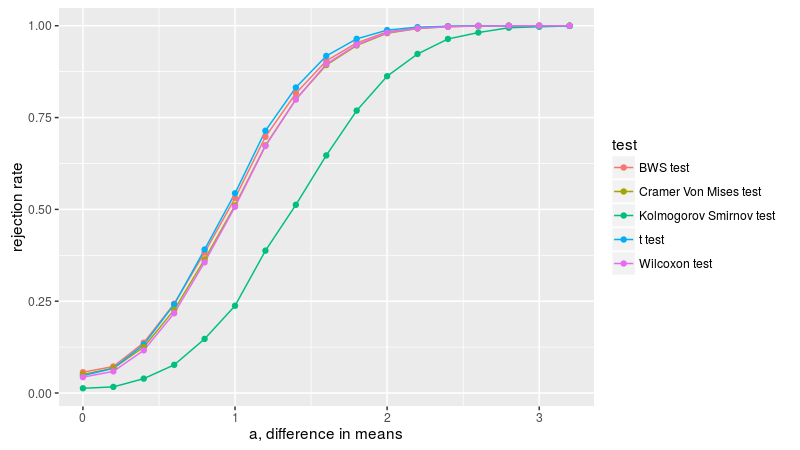

Here we replicate figure 2B of Baumgartner _et al._ We draw two samples from the normal distribution,
both with zero mean, one with unit standard deviation, the other with standard deviation of _sigma_.
We compute the empirical rejection rate at the 0.05 level, dropping the t-test
since it is not relevant for this formulation.
As in Baumgartner, 
we find the BWS test is the most powerful, followed by KS test, then Cramer-Von Mises, 
then Wilcoxon, which is basically useless in this simulation.


```r
n.sim <- 10000
svals <- seq(1, 45, length.out = 10)
alpha <- 0.05
mnsize <- 10

# this is archived on CRAN, unfortunately:
library(CvM2SL2Test)
# find the CVM critical value.
critv <- uniroot(function(x) {
    cvmts.pval(x, mnsize, mnsize) - alpha
}, lower = 0, upper = 100, maxiter = 5000)$root

set.seed(1234)
simul <- sapply(svals, function(s) {
    rejs <- replicate(n.sim, {
        x <- rnorm(mnsize, mean = 0, sd = 1)
        y <- rnorm(mnsize, mean = 0, sd = s)
        bws <- bws_cdf(bws_stat(x, y), lower_tail = FALSE) <= 
            alpha
        cvm <- cvmts.test(x, y) >= critv
        ksv <- ks.test(x, y, alternative = "two.sided")$p.value <= 
            alpha
        wcx <- wilcox.test(x, y, alternative = "two.sided")$p.value <= 
            alpha
        c(bws, cvm, ksv, wcx)
    })
    rejrate <- rowMeans(rejs)
    names(rejrate) <- c("BWS test", "Cramer-Von Mises test", 
        "Kolmogorov Smirnov test", "Wilcoxon test")
    rejrate
}, simplify = "matrix")

Brejrates <- data.frame(t(simul))
Brejrates$sigma <- svals
```

```r
plotdf <- tidyr::gather(Brejrates, "test", "rejection_rate", 
    -sigma) %>% dplyr::mutate(test = gsub("\\.", " ", 
    test))
ph <- ggplot(plotdf, aes(x = sigma, y = rejection_rate, 
    group = test, colour = test)) + geom_line() + geom_point() + 
    labs(x = "sigma, ratio of standard deviations", 
        y = "rejection rate")
print(ph)
```

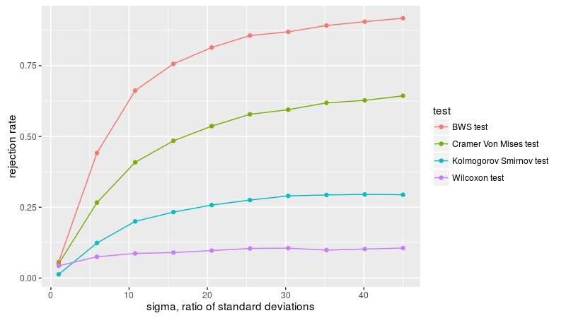

Here we replicate figure 3A of Baumgartner _et al._ We draw two samples from the exponential distribution,
letting _l_ be the ratio of the rate parameters of the two populations.
We compute the empirical rejection rate at the 0.05 level.
As in Baumgartner, 
we find the BWS test is the most powerful, followed by Wilcoxon, then Cramer-Von Mises, then the
KS test.


```r
n.sim <- 10000
lvals <- seq(1, 12)
alpha <- 0.05
mnsize <- 10

# this is archived on CRAN, unfortunately:
library(CvM2SL2Test)
# find the CVM critical value.
critv <- uniroot(function(x) {
    cvmts.pval(x, mnsize, mnsize) - alpha
}, lower = 0, upper = 100, maxiter = 5000)$root

set.seed(1234)
simul <- sapply(lvals, function(l) {
    rejs <- replicate(n.sim, {
        x <- rexp(mnsize, rate = 1)
        y <- rexp(mnsize, rate = l)
        bws <- bws_cdf(bws_stat(x, y), lower_tail = FALSE) <= 
            alpha
        cvm <- cvmts.test(x, y) >= critv
        ksv <- ks.test(x, y, alternative = "two.sided")$p.value <= 
            alpha
        wcx <- wilcox.test(x, y, alternative = "two.sided")$p.value <= 
            alpha
        c(bws, cvm, ksv, wcx)
    })
    rejrate <- rowMeans(rejs)
    names(rejrate) <- c("BWS test", "Cramer-Von Mises test", 
        "Kolmogorov Smirnov test", "Wilcoxon test")
    rejrate
}, simplify = "matrix")

Crejrates <- data.frame(t(simul))
Crejrates$lratio <- lvals
```

```r
plotdf <- tidyr::gather(Crejrates, "test", "rejection_rate", 
    -lratio) %>% dplyr::mutate(test = gsub("\\.", " ", 
    test))
ph <- ggplot(plotdf, aes(x = lratio, y = rejection_rate, 
    group = test, colour = test)) + geom_line() + geom_point() + 
    labs(x = "l, ratio of rate parameters", y = "rejection rate")
print(ph)
```

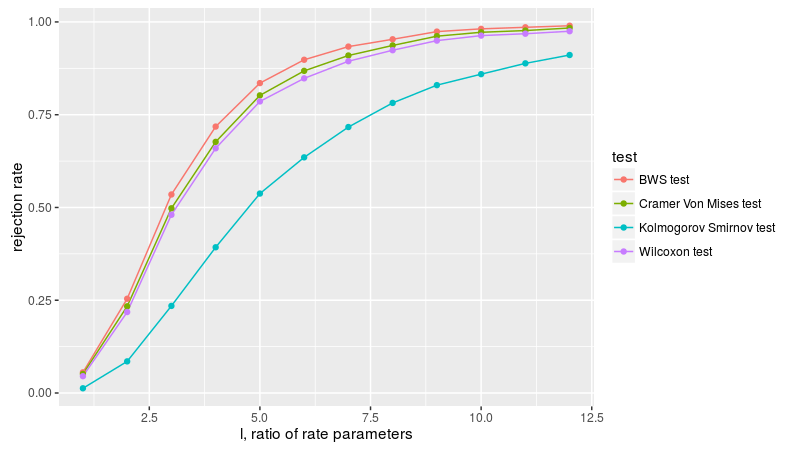

Here we replicate figure 3B of Baumgartner _et al._ We draw two samples, one from the normal distribution
with zero mean and variance one-twelth, the other uniformly on -0.5 to 0.5. We take equal sample sizes
from these two populations, then vary the sample size, checking the
empirical rejection rate at the 0.05 level. Since the first two moments are equal, the Wilcoxon test
is useless here, and not applied.
As in Baumgartner, we find the BWS test is the most powerful, 
followed by the KS test and Cramer-Von Mises tests. 
Based on the power plots here, I theorize that Baumgartner _et al._ are plotting the _total_ sample
sizes on the _x_ axis, that is, drawing _n_ from both distributions, then plotting empirical power
versus _2n_. We follow that convention, which makes the plots match those of Baumgartner.


```r
n.sim <- 10000
mvals <- seq(10, 670, by = 60)
alpha <- 0.05

# this is archived on CRAN, unfortunately:
library(CvM2SL2Test)

set.seed(1234)
simul <- sapply(mvals, function(mnsize) {
    # find the CVM critical value.  note that this
    # basically converged for mnsize > 100 or so, so we
    # take the min..  for reasons of speed.
    critv <- uniroot(function(x) {
        cvmts.pval(x, min(mnsize, 80), min(mnsize, 
            80)) - alpha
    }, lower = 0, upper = 2, maxiter = 100)$root
    rejs <- replicate(n.sim, {
        x <- rnorm(mnsize, mean = 0, sd = 1/sqrt(12))
        y <- runif(mnsize, min = -0.5, max = 0.5)
        bws <- bws_cdf(bws_stat(x, y), lower_tail = FALSE) <= 
            alpha
        cvm <- cvmts.test(x, y) >= critv
        ksv <- ks.test(x, y, alternative = "two.sided")$p.value <= 
            alpha
        c(bws, cvm, ksv)
    })
    rejrate <- rowMeans(rejs)
    names(rejrate) <- c("BWS test", "Cramer-Von Mises test", 
        "Kolmogorov Smirnov test")
    rejrate
}, simplify = "matrix")

Drejrates <- data.frame(t(simul))
Drejrates$ssize <- 2 * mvals
```

```r
plotdf <- tidyr::gather(Drejrates, "test", "rejection_rate", 
    -ssize) %>% dplyr::mutate(test = gsub("\\.", " ", 
    test))
ph <- ggplot(plotdf, aes(x = ssize, y = rejection_rate, 
    group = test, colour = test)) + geom_line() + geom_point() + 
    labs(x = "m+n, total sample size", y = "rejection rate")
print(ph)
```

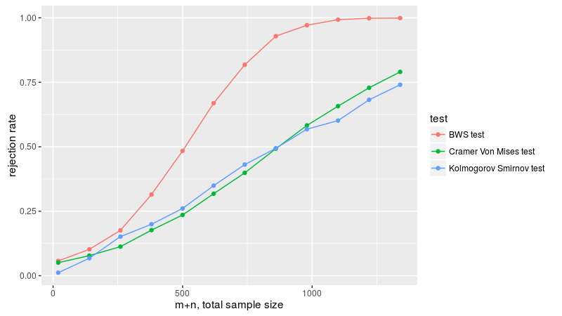

## Murakami tests

[Neuhäuser](http://doai.io/10.1007/BF02762032) and 
[Murakami](http://doai.io/10.1080/00949655.2010.551516) described
some modifications to the original test of Baumgartner. Neuhäuser's
test allows one to test against directional alternatives. Murakami
enumerated some modifications to the weighting scheme. These are
available via the `murakami_stat` function, where the `flavor`
corresponds to the test number from Murakami's paper, namely

* 0 corresponds to the original BWS statistic.
* 1 corresponds to Murakami's first modification.
* 2 corresponds to Neuhäuser's statistic, which can take negative values.
* 3 through 5 correspond to different weighting schemes of Murakami's.

Here we take these through the paces as above.

### Under the null

As above, we draw samples under the null and compare to the putative
CDF function


```r
require(BWStest)

# now compute a bunch under the null:
n1 <- 9
n2 <- n1
set.seed(1234)
allpvs <- lapply(0L:5L, function(flavor) {
    bvals <- replicate(5000, murakami_stat(rnorm(n1), 
        rnorm(n2), flavor = flavor))
    # compute the approximate p-values under the null:
    pvals <- murakami_cdf(bvals, n1 = n1, n2 = n2, 
        flavor = flavor)
    data.frame(pv = pvals, flavor = flavor)
})

df <- do.call(rbind, allpvs)

require(ggplot2)
ph <- ggplot(df, aes(sample = pv)) + facet_grid(flavor ~ 
    .) + stat_qq(distribution = stats::qunif)
print(ph)
```

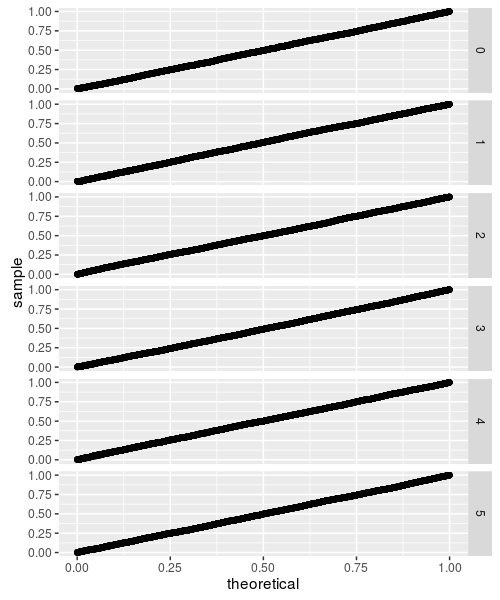

While these all look fine, they are based on small sample sizes. The CDF is approximated by evaluating
all the permutations (with memoisation to tame the computational requirements), but this can only be
done up to some reasonably small sample size. If the test statistic does not converge beyond that
sample size, the CDF approximation will not be accurate. This appears to be the case for flavors 3 through 5,
as demonstrated below:


```r
require(BWStest)

# now compute a bunch under the null:
n1 <- 50
n2 <- n1
set.seed(1234)
allpvs <- lapply(0L:5L, function(flavor) {
    bvals <- replicate(5000, murakami_stat(rnorm(n1), 
        rnorm(n2), flavor = flavor))
    # compute the approximate p-values under the null:
    pvals <- murakami_cdf(bvals, n1 = n1, n2 = n2, 
        flavor = flavor)
    data.frame(pv = pvals, flavor = flavor)
})

df <- do.call(rbind, allpvs)

require(ggplot2)
ph <- ggplot(df, aes(sample = pv)) + facet_grid(flavor ~ 
    .) + stat_qq(distribution = stats::qunif)
print(ph)
```

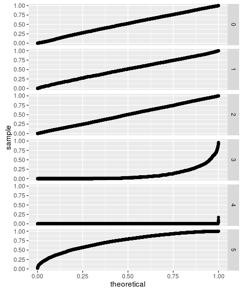

So that's not so great. 

## Under the alternative

We can perform the power comparisons of Baumgartner _et al._ using the Murakami test statistics.
Here we consider the setup of figure 2A, samples of size 10 from the normal distribution with
equal variances but different means. Neuhäuser's test is, as expected, more powerful for detecting
this one-sided alternative, probably on par with the t-test, while the BWS test (basically equivalent
to Murakami 1) is next, then 5, 3, 4.


```r
n.sim <- 10000
avals <- seq(0, 3.2, length.out = 17)
alpha <- 0.05
mnsize <- 10

set.seed(1234)
simul <- sapply(avals, function(a) {
    statvs <- replicate(n.sim, {
        x <- rnorm(mnsize, mean = 0)
        y <- rnorm(mnsize, mean = a)
        bws <- bws_stat(x, y)
        murav <- sapply(1L:5L, function(flavor) {
            murakami_stat(x, y, flavor = flavor)
        })
        c(bws, murav)
    })
    rej_bws <- mean(bws_cdf(statvs[1, ], lower_tail = FALSE) <= 
        alpha)
    rej_mur <- sapply(2:6, function(rown) {
        mean(murakami_cdf(statvs[rown, ], mnsize, mnsize, 
            flavor = rown - 1, lower_tail = FALSE) <= 
            alpha)
    })
    
    rejrate <- c(rej_bws, rej_mur)
    names(rejrate) <- c("BWS test", "Murakami 1", "Neuhauser", 
        "Murakami 3", "Murakami 4", "Murakami 5")
    rejrate
}, simplify = "matrix")

Arejrates <- data.frame(t(simul))
Arejrates$a <- avals
```

```r
library(tidyr)
library(dplyr)
library(ggplot2)
plotdf <- tidyr::gather(Arejrates, "test", "rejection_rate", 
    -a) %>% dplyr::mutate(test = gsub("\\.", " ", test))
ph <- ggplot(plotdf, aes(x = a, y = rejection_rate, 
    group = test, colour = test)) + geom_line() + geom_point() + 
    labs(x = "a, difference in means", y = "rejection rate")
print(ph)
```

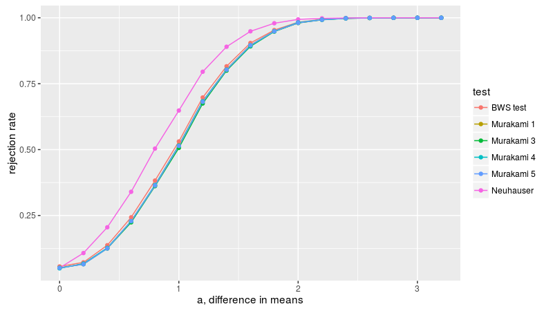

Now we consider figure2B, with two samples of equal size from the normal distribution with zero
mean, but different standard deviations. Neuhäuser's test is nearly useless here because the 
means of the populations are equal. Murakami 3, 4, and 5 are the most powerful, followed by BWS.


```r
n.sim <- 10000
svals <- seq(1, 45, length.out = 10)
alpha <- 0.05
mnsize <- 10

set.seed(1234)
simul <- sapply(svals, function(s) {
    statvs <- replicate(n.sim, {
        x <- rnorm(mnsize, mean = 0, sd = 1)
        y <- rnorm(mnsize, mean = 0, sd = s)
        bws <- bws_stat(x, y)
        murav <- sapply(1L:5L, function(flavor) {
            murakami_stat(x, y, flavor = flavor)
        })
        c(bws, murav)
    })
    rej_bws <- mean(bws_cdf(statvs[1, ], lower_tail = FALSE) <= 
        alpha)
    rej_mur <- sapply(2:6, function(rown) {
        mean(murakami_cdf(statvs[rown, ], mnsize, mnsize, 
            flavor = rown - 1, lower_tail = FALSE) <= 
            alpha)
    })
    
    rejrate <- c(rej_bws, rej_mur)
    names(rejrate) <- c("BWS test", "Murakami 1", "Neuhauser", 
        "Murakami 3", "Murakami 4", "Murakami 5")
    rejrate
}, simplify = "matrix")

Brejrates <- data.frame(t(simul))
Brejrates$sigma <- svals
```

```r
plotdf <- tidyr::gather(Brejrates, "test", "rejection_rate", 
    -sigma) %>% dplyr::mutate(test = gsub("\\.", " ", 
    test))
ph <- ggplot(plotdf, aes(x = sigma, y = rejection_rate, 
    group = test, colour = test)) + geom_line() + geom_point() + 
    labs(x = "sigma, ratio of standard deviations", 
        y = "rejection rate")
print(ph)
```

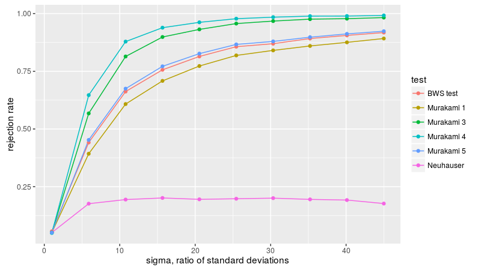

Now to figure 3A, with
two equal sized samples from the exponential distribution,
letting _l_ be the ratio of the rate parameters of the two populations. The BWS test
is the most powerful here, apparently.


```r
n.sim <- 10000
lvals <- seq(1, 12)
alpha <- 0.05
mnsize <- 10

set.seed(1234)
simul <- sapply(lvals, function(l) {
    statvs <- replicate(n.sim, {
        x <- rexp(mnsize, rate = 1)
        y <- rexp(mnsize, rate = l)
        bws <- bws_stat(x, y)
        murav <- sapply(1L:5L, function(flavor) {
            murakami_stat(x, y, flavor = flavor)
        })
        c(bws, murav)
    })
    rej_bws <- mean(bws_cdf(statvs[1, ], lower_tail = FALSE) <= 
        alpha)
    rej_mur <- sapply(2:6, function(rown) {
        mean(murakami_cdf(statvs[rown, ], mnsize, mnsize, 
            flavor = rown - 1, lower_tail = FALSE) <= 
            alpha)
    })
    
    rejrate <- c(rej_bws, rej_mur)
    names(rejrate) <- c("BWS test", "Murakami 1", "Neuhauser", 
        "Murakami 3", "Murakami 4", "Murakami 5")
    rejrate
}, simplify = "matrix")

Crejrates <- data.frame(t(simul))
Crejrates$lratio <- lvals
```

```r
plotdf <- tidyr::gather(Crejrates, "test", "rejection_rate", 
    -lratio) %>% dplyr::mutate(test = gsub("\\.", " ", 
    test))
ph <- ggplot(plotdf, aes(x = lratio, y = rejection_rate, 
    group = test, colour = test)) + geom_line() + geom_point() + 
    labs(x = "l, ratio of rate parameters", y = "rejection rate")
print(ph)
```

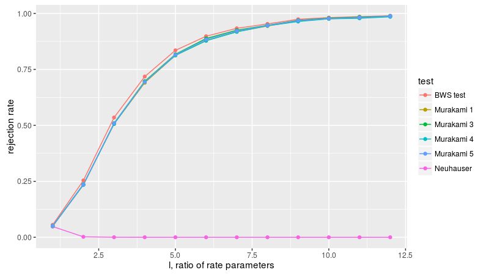

Now figure 3B, with a normal sample and a uniform sample, with equal first and second moments, varying
the sample size. Because flavors 3 through 5 are not well behaved, we drop them here. Once again
the BWS test is the most powerful. 


```r
n.sim <- 10000
mvals <- seq(10, 670, by = 60)
alpha <- 0.05

set.seed(1234)
simul <- sapply(mvals, function(mnsize) {
    statvs <- replicate(n.sim, {
        x <- rnorm(mnsize, mean = 0, sd = 1/sqrt(12))
        y <- runif(mnsize, min = -0.5, max = 0.5)
        bws <- bws_stat(x, y)
        murav <- sapply(1L:2L, function(flavor) {
            murakami_stat(x, y, flavor = flavor)
        })
        c(bws, murav)
    })
    rej_bws <- mean(bws_cdf(statvs[1, ], lower_tail = FALSE) <= 
        alpha)
    rej_mur <- sapply(2:3, function(rown) {
        mean(murakami_cdf(statvs[rown, ], mnsize, mnsize, 
            flavor = rown - 1, lower_tail = FALSE) <= 
            alpha)
    })
    
    rejrate <- c(rej_bws, rej_mur)
    names(rejrate) <- c("BWS test", "Murakami 1", "Neuhauser")
    rejrate
}, simplify = "matrix")

Drejrates <- data.frame(t(simul))
Drejrates$ssize <- 2 * mvals
```

```r
plotdf <- tidyr::gather(Drejrates, "test", "rejection_rate", 
    -ssize) %>% dplyr::mutate(test = gsub("\\.", " ", 
    test))
ph <- ggplot(plotdf, aes(x = ssize, y = rejection_rate, 
    group = test, colour = test)) + geom_line() + geom_point() + 
    labs(x = "m+n, total sample size", y = "rejection rate")
print(ph)
```

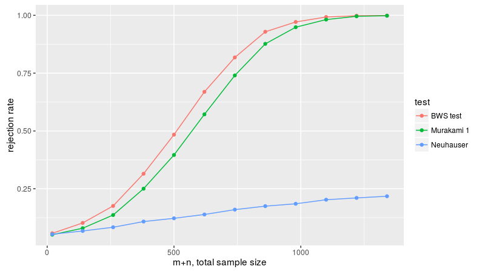

# Future work

I anticipate the following:

* Modifications of flavors 3 through 5 so that they converge for large
sample sizes.

