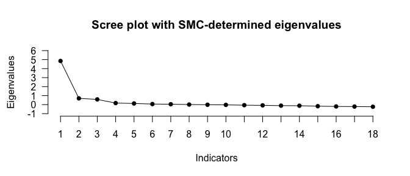

<!-- README.md is generated from README.Rmd. Please edit that file -->

# EFAtools

<!-- badges: start -->

[](https://travis-ci.com/mdsteiner/EFAtools)
[](https://CRAN.R-project.org/package=EFAtools)
[](https://doi.org/10.21105/joss.02521)
<!-- badges: end -->

The EFAtools package provides functions to perform exploratory factor
analysis (EFA) procedures and compare their solutions. The goal is to
provide state-of-the-art factor retention methods and a high degree of
flexibility in the EFA procedures. This way, implementations from R
psych and SPSS can be compared. Moreover, functions for Schmid-Leiman
transformation, and computation of omegas are provided. To speed up the
analyses, some of the iterative procedures like principal axis factoring
(PAF) are implemented in C++.

## Installation

You can install the release version from
[CRAN](https://cran.r-project.org/) with:

``` r
install.packages("EFAtools")
```

You can install the development version from
[GitHub](https://github.com/) with:

``` r
install.packages("devtools")
devtools::install_github("mdsteiner/EFAtools")
```

To also build the vignette when installing the development version, use:

``` r
install.packages("devtools")
devtools::install_github("mdsteiner/EFAtools", build_vignettes = TRUE)
```

## Example

Here are a few examples on how to perform the analyses with the
different types and how to compare the results using the `COMPARE`
function. For more details, see the vignette by running
`vignette("EFAtools", package = "EFAtools")`. The vignette provides a
high-level introduction into the functionalities of the package.

``` r
# load the package
library(EFAtools)

# Run all possible factor retention methods
N_FACTORS(test_models$baseline$cormat, N = 500, method = "ML")
#> Warning in N_FACTORS(test_models$baseline$cormat, N = 500, method = "ML"): ! 'x' was a correlation matrix but CD needs raw data. Skipping CD.
#>                                                                                                                                                                  ◉ 🏃 ◯ ◯ ◯ ◯ ◯ Running EKC                                                                                                                                                                 ◉ ◉ 🏃 ◯ ◯ ◯ ◯ Running HULL                                                                                                                                                                 ◉ ◉ ◉ 🏃 ◯ ◯ ◯ Running KGC                                                                                                                                                                 ◉ ◉ ◉ ◉ 🏃 ◯ ◯ Running PARALLEL                                                                                                                                                                 ◉ ◉ ◉ ◉ ◉ 🏃 ◯ Running SCREE                                                                                                                                                                 ◉ ◉ ◉ ◉ ◉ ◉ 🏃  Running SMT                                                                                                                                                                 ◉ ◉ ◉ ◉ ◉ ◉ ◉ Done!
#> 
#> ── Tests for the suitability of the data for factor analysis ───────────────────
#> 
#> Bartlett's test of sphericity
#> 
#> ✓ The Bartlett's test of sphericity was significant at an alpha level of .05.
#>   These data are probably suitable for factor analysis.
#> 
#>   𝜒²(153) = 2173.28, p < .001
#> 
#> Kaiser-Meyer-Olkin criterion (KMO)
#> 
#> ✓ The overall KMO value for your data is marvellous with 0.916.
#>   These data are probably suitable for factor analysis.
#> 
#> ── Number of factors suggested by the different factor retention criteria ──────
#> 
#> ◌ Comparison data: NA
#> ◌ Empirical Kaiser criterion: 2
#> ◌ Hull method with CAF: 3
#> ◌ Hull method with CFI: 1
#> ◌ Hull method with RMSEA: 1
#> ◌ Kaiser-Guttman criterion with PCA: 3
#> ◌ Kaiser-Guttman criterion with SMC: 1
#> ◌ Kaiser-Guttman criterion with EFA: 1
#> ◌ Parallel analysis with PCA: 3
#> ◌ Parallel analysis with SMC: 3
#> ◌ Parallel analysis with EFA: 3
#> ◌ Sequential 𝜒² model tests: 3
#> ◌ Lower bound of RMSEA 90% confidence interval: 2
#> ◌ Akaike Information Criterion: 3
```



``` r
# A type SPSS EFA to mimick the SPSS implementation with
# promax rotation
EFA_SPSS <- EFA(test_models$baseline$cormat, n_factors = 3, type = "SPSS",
                  rotation = "promax")

# look at solution
EFA_SPSS
#> 
#> EFA performed with type = 'SPSS', method = 'PAF', and rotation = 'promax'.
#> 
#> ── Rotated Loadings ────────────────────────────────────────────────────────────
#> 
#>       F1      F2      F3  
#> V1   -.048    .035    .613
#> V2   -.001    .067    .482
#> V3    .060    .056    .453
#> V4    .101   -.009    .551
#> V5    .157   -.018    .438
#> V6   -.072   -.049    .704
#> V7    .001    .533    .093
#> V8   -.016    .581    .030
#> V9    .038    .550   -.001
#> V10  -.022    .674   -.071
#> V11   .015    .356    .232
#> V12   .020    .651   -.010
#> V13   .614    .086   -.067
#> V14   .548   -.068    .088
#> V15   .561    .128   -.070
#> V16   .555   -.050    .091
#> V17   .664   -.037   -.027
#> V18   .555    .004    .050
#> 
#> ── Factor Intercorrelations ────────────────────────────────────────────────────
#> 
#>       F1      F2      F3  
#> F1    1.000   0.617   0.648
#> F2    0.617   1.000   0.632
#> F3    0.648   0.632   1.000
#> 
#> ── Variances Accounted for ─────────────────────────────────────────────────────
#> 
#>                       F1      F2      F3  
#> SS loadings           4.907   0.757   0.643
#> Prop Tot Var          0.273   0.042   0.036
#> Cum Prop Tot Var      0.273   0.315   0.350
#> Prop Comm Var         0.778   0.120   0.102
#> Cum Prop Comm Var     0.778   0.898   1.000
#> 
#> ── Model Fit ───────────────────────────────────────────────────────────────────
#> 
#> CAF: .50
#> df: 102

# A type psych EFA to mimick the psych::fa() implementation with
# promax rotation
EFA_psych <- EFA(test_models$baseline$cormat, n_factors = 3, type = "psych",
                  rotation = "promax")

# compare the type psych and type SPSS implementations
COMPARE(EFA_SPSS$rot_loadings, EFA_psych$rot_loadings,
        x_labels = c("SPSS", "psych"))
```


    #> Mean [min, max] absolute difference:  0.0090 [ 0.0001,  0.0245]
    #> Median absolute difference:  0.0095
    #> Max decimals where all numbers are equal: 0
    #> Minimum number of decimals provided: 17
    #> 
    #>        F1      F2      F3  
    #> V1    0.0150  0.0142 -0.0195
    #> V2    0.0109  0.0109 -0.0138
    #> V3    0.0095  0.0103 -0.0119
    #> V4    0.0118  0.0131 -0.0154
    #> V5    0.0084  0.0105 -0.0109
    #> V6    0.0183  0.0169 -0.0245
    #> V7   -0.0026 -0.0017  0.0076
    #> V8   -0.0043 -0.0035  0.0102
    #> V9   -0.0055 -0.0040  0.0117
    #> V10  -0.0075 -0.0066  0.0151
    #> V11   0.0021  0.0029  0.0001
    #> V12  -0.0064 -0.0050  0.0136
    #> V13  -0.0109 -0.0019  0.0163
    #> V14  -0.0049  0.0028  0.0070
    #> V15  -0.0107 -0.0023  0.0161
    #> V16  -0.0051  0.0028  0.0074
    #> V17  -0.0096 -0.0001  0.0136
    #> V18  -0.0066  0.0014  0.0098


``` r
# Average solution across many different EFAs with oblique rotations
EFA_AV <- EFA_AVERAGE(test_models$baseline$cormat, n_factors = 3, N = 500,
                      method = c("PAF", "ML", "ULS"), rotation = "oblique",
                      show_progress = FALSE)

# look at solution
EFA_AV
#> 
#> Averaging performed with averaging method mean (trim = 0) across 162 EFAs, varying the following settings: method, init_comm, criterion_type, start_method, rotation, k_promax, P_type, and varimax_type.
#> 
#> The error rate is at 0%. Of the solutions that did not result in an error, 100% converged, 0% contained Heywood cases, and 100% were admissible.
#> 
#> 
#> ══ Indicator-to-Factor Correspondences ═════════════════════════════════════════
#> 
#> For each cell, the proportion of solutions including the respective indicator-to-factor correspondence. A salience threshold of 0.3 was used to determine indicator-to-factor correspondences.
#> 
#>       F1      F2      F3 
#> V1    .11     .00    1.00
#> V2    .11     .00    1.00
#> V3    .11     .00     .94
#> V4    .11     .00    1.00
#> V5    .11     .00     .94
#> V6    .11     .00    1.00
#> V7    .11     .94     .00
#> V8    .11    1.00     .00
#> V9    .11     .94     .00
#> V10   .11    1.00     .00
#> V11   .11     .89     .00
#> V12   .11    1.00     .00
#> V13  1.00     .00     .00
#> V14  1.00     .00     .00
#> V15  1.00     .00     .00
#> V16  1.00     .00     .00
#> V17  1.00     .00     .00
#> V18  1.00     .00     .00
#> 
#> 
#> ══ Loadings ════════════════════════════════════════════════════════════════════
#> 
#> ── Mean ────────────────────────────────────────────────────────────────────────
#> 
#>       F1      F2      F3  
#> V1    .025    .048    .576
#> V2    .060    .077    .451
#> V3    .115    .066    .425
#> V4    .157    .007    .518
#> V5    .198   -.002    .412
#> V6    .002   -.028    .658
#> V7    .074    .497    .102
#> V8    .056    .538    .046
#> V9    .100    .510    .018
#> V10   .048    .625   -.046
#> V11   .082    .336    .228
#> V12   .094    .606    .007
#> V13   .597    .083   -.047
#> V14   .531   -.056    .093
#> V15   .548    .122   -.049
#> V16   .540   -.041    .097
#> V17   .633   -.033   -.009
#> V18   .542    .009    .060
#> 
#> ── Range ───────────────────────────────────────────────────────────────────────
#> 
#>       F1      F2      F3  
#> V1    0.513   0.086   0.239
#> V2    0.431   0.093   0.186
#> V3    0.394   0.108   0.179
#> V4    0.415   0.110   0.214
#> V5    0.315   0.122   0.177
#> V6    0.514   0.104   0.267
#> V7    0.527   0.255   0.089
#> V8    0.520   0.275   0.078
#> V9    0.470   0.276   0.080
#> V10   0.533   0.313   0.097
#> V11   0.482   0.176   0.102
#> V12   0.548   0.324   0.103
#> V13   0.081   0.289   0.114
#> V14   0.063   0.220   0.117
#> V15   0.091   0.280   0.107
#> V16   0.072   0.230   0.122
#> V17   0.108   0.270   0.124
#> V18   0.081   0.246   0.118
#> 
#> 
#> ══ Factor Intercorrelations from Oblique Solutions ═════════════════════════════
#> 
#> ── Mean ────────────────────────────────────────────────────────────────────────
#> 
#>       F1      F2      F3  
#> F1    1.000   0.431   0.518
#> F2    0.431   1.000   0.454
#> F3    0.518   0.454   1.000
#> 
#> ── Range ───────────────────────────────────────────────────────────────────────
#> 
#>       F1      F2      F3  
#> F1    0.000   1.276   0.679
#> F2    1.276   0.000   1.316
#> F3    0.679   1.316   0.000
#> 
#> 
#> ══ Variances Accounted for ═════════════════════════════════════════════════════
#> 
#> ── Mean ────────────────────────────────────────────────────────────────────────
#> 
#>                   F1      F2      F3  
#> SS loadings       2.443   1.929   1.904
#> Prop Tot Var      0.136   0.107   0.106
#> Prop Comm Var     0.389   0.307   0.303
#> 
#> ── Range ───────────────────────────────────────────────────────────────────────
#> 
#>                   F1      F2      F3  
#> SS loadings       2.831   1.356   1.291
#> Prop Tot Var      0.157   0.075   0.072
#> Prop Comm Var     0.419   0.215   0.215
#> 
#> 
#> ══ Model Fit ═══════════════════════════════════════════════════════════════════
#> 
#>        M (SD) [Min; Max]
#> 𝜒²: 101.73 (34.62) [53.23; 125.98]
#> df: 102
#> p: .369 (.450) [.054; 1.000]
#> CFI: 1.00 (.00) [1.00; 1.00]
#> RMSEA: .01 (.01) [.00; .02]
#> AIC: -102.27 (34.62) [-150.77; -78.02]
#> BIC: -532.16 (34.62) [-580.66; -507.91]
#> CAF: .50 (.00) [.50; .50]
```


``` r
# Perform a Schmid-Leiman transformation
SL <- SL(EFA_psych)

# Based on a specific salience threshold for the loadings (here: .20):
factor_corres <- SL$sl[, c("F1", "F2", "F3")] >= .2

# Compute omegas from the Schmid-Leiman solution
OMEGA(SL, factor_corres = factor_corres)
#> Omega total, omega hierarchical, and omega subscale for the general factor (top row) and the group factors:
#> 
#>      tot  hier   sub
#> g  0.883 0.750 0.122
#> F1 0.769 0.498 0.272
#> F2 0.764 0.494 0.270
#> F3 0.745 0.543 0.202
```

## Citation

If you use this package in your research, please acknowledge it by
citing:

Steiner, M.D., & Grieder, S.G. (2020). EFAtools: An R package with fast
and flexible implementations of exploratory factor analysis tools.
*Journal of Open Source Software*, 5(53), 2521.
<https://doi.org/10.21105/joss.02521>

## Contribute or Report Bugs

If you want to contribute or report bugs, please open an issue on GitHub
or email us at <markus.d.steiner@gmail.com> or
<silvia.grieder@gmail.com>.
