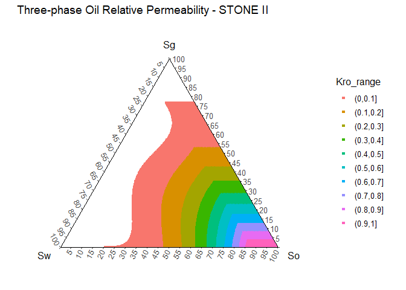

<!-- README.md is generated from README.Rmd. Please edit that file -->

# Rrelperm

<!-- badges: start -->

<!-- badges: end -->

`Rrelperm` generates two- and three-phase relative permeability
estimates for water and hydrocarbon systems. The calculated results are
reported in a tabular format for fluid saturations from zero to one.

## Installation

You can install the released version of Rrelperm from
[CRAN](https://CRAN.R-project.org) with:

``` r
install.packages("Rrelperm")
```

## Example

``` r
library(Rrelperm)
library(ggplot2)
library(ggtern)
library(magrittr)

rel_perm_owg_st_ii_swsg <- kr3p_StoneII_SwSg(SWCON = 0.13, SWCRIT = 0.13, SOIRW = 0.20, 
                                      SORW = 0.2, SOIRG = 0.1, SORG = 0.1, SGCON = 0, 
                                      SGCRIT = 0, KRWIRO = 0.45, KROCW = 1, KRGCL = 0.35, 
                                      NW = 4.25, NOW = 2.5, NG = 3, NOG = 2, 
                                      NP = 501)

rel_perm_owg_st_ii_swsg <- as.data.frame(rel_perm_owg_st_ii_swsg)
colnames(rel_perm_owg_st_ii_swsg) <- c("Sw", "Sg", "So", "Kro")

rel_perm_owg_st_ii_swsg$Kro_range <- cut(rel_perm_owg_st_ii_swsg$Kro, breaks = seq(0,1, by = 0.1),
                                   right = TRUE, include.lowest = FALSE)

rel_perm_owg_st_ii_swsg_oil <- rel_perm_owg_st_ii_swsg[rel_perm_owg_st_ii_swsg$Kro > 0, ]

rel_perm_owg_st_ii_swsg_oil <- droplevels(rel_perm_owg_st_ii_swsg_oil)

p <- ggtern(data = rel_perm_owg_st_ii_swsg_oil, aes(x = Sw, y = Sg, z = So, value = Kro)) +
  geom_point(aes(value = Kro, fill = Kro_range, color = Kro_range), size = 1, shape = 22) +
  scale_T_continuous(limits = c(0.0,1.0), breaks = seq(0,1,by = 0.05)) +
  scale_L_continuous(limits = c(0.0,1.0), breaks = seq(0,1,by = 0.05)) +
  scale_R_continuous(limits = c(0.0,1.0), breaks = seq(0,1,by = 0.05)) +
  ggtitle("Three-phase Oil Relative Permeability - STONE II") +
  theme_classic()

p
```


