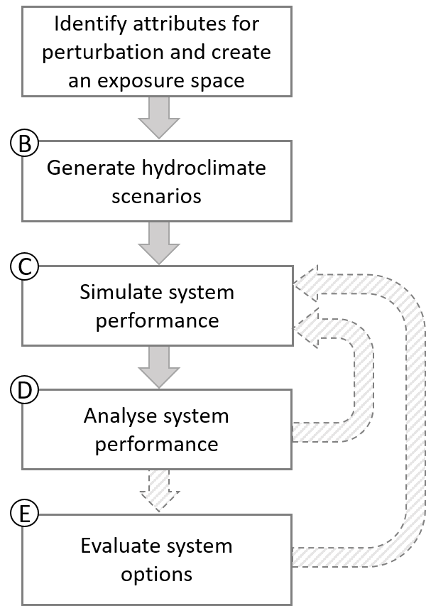
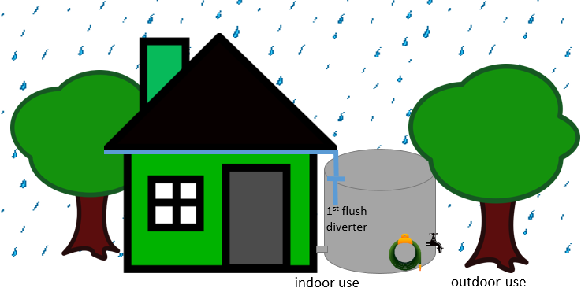

```{r setup, include=FALSE}
knitr::opts_chunk$set(echo = TRUE, collapse = TRUE, comment = "#>")
library(foreSIGHT)
```

# 1. Introduction

A variable and changing climate presents significant challenges to the functioning and/or performance of both natural and engineered systems. Managed systems---both engineered and managed natural systems---traditionally have been designed under the assumption that future climate conditions will mirror those experienced in the past. Yet with the continuing advance of climate change, there is a need to understand how systems might perform under a range of plausible future climate conditions or, conversely, what system interventions might be required so that systems continue to achieve desired levels of performance. Given the complexity of most climate-sensitive systems, formalised approaches are required to understand likely climate impacts and evaluate the viability of adaptive measures to minimise climate vulnerability. 

To this end, scenario-neutral (or 'bottom-up') approaches (Prudhomme et al. 2010, Brown 2011, Culley et al. 2016) are advocated as a means of rigorously stress testing a system under a range of plausible future climate conditions. These approaches treat the system's behaviour and performance as the central concerns of the analysis, and enable better understanding of the complex climate-system relationships to support adaptation decision making. These approaches can be combined with 'top-down' climate impact assessment methods through the integration of projections from climate models and/or other lines of evidence. The *fore*SIGHT package contains functions that support both 'bottom-up' system stress testing, and the analysis of the implication of 'top-down' climate projections on system performance.

This vignette demonstrates the high-level work flow of climate 'stress-testing' using the *fore*SIGHT package. The document is intended as a quick start guide and uses a highly simplified case study of a rainwater tank system model to demonstrate how the functions in the package can be used together. The vignette makes numerous assumptions that may not be appropriate for a realistic case study, and the reader is referred to the Detailed Tutorial for more detailed description of full *fore*SIGHT functionality. 

## 1.1. Objectives and application areas of *fore*SIGHT

The objectives of *fore*SIGHT are to support climate impact and vulnerability assessments and the assessment of adaptation options by:

* stress testing climate-sensitive systems, including both 'current' system configurations, as well as potential alternative system configurations as part of the development of adaptation strategies;
* comparing the climate sensitivity of multiple system configurations to inform adaptation decision making; and
* comparing stress-testing outcomes with the results from 'top-down' climate impact assessments to better understand future risk for each system configuration.

The *fore*SIGHT modelling software adopts a rigorous quantitative approach to stress testing, that has been designed with several core assumptions in mind:  

* that the system dynamics (either 'current' or alternative system configurations) can be represented and adequately described by a numerical system model that provides a mapping between weather/climate variables and relevant system performance measures; and  
* that the system model is forced by hydroclimatic time series data.   

Indeed, it is this latter feature that gives the software its name (the SIGHT in *fore*SIGHT stands for System Insights from the Generation of Hydroclimatic Timeseries). In particular, *fore*SIGHT has been designed specifically for the quantitative analysis of systems that exhibit dynamics in time, with examples of such systems including:  

* environmental systems (either natural or managed) that may be resilient to individual natural hazards but become vulnerable to multiple sequential hazards or long-term structural shifts in the climate;   
* water resource systems with natural (e.g. soil moisture, groundwater) and/or human-constructed (e.g. reservoirs, managed aquifer recharge) storages, for which past weather can affect current system performance;  
* agricultural systems where crop outcomes (e.g. yield and various quality measures) are influenced by the weather throughout a growing season and even between seasons;  
* renewable energy systems such as solar, wind and hydroelectricity and/or coupled storage solutions (e.g. pumped hydroelectricity or lithium battery systems); and  
* systems that depend on one or several of the above systems, such as mining (often dependent on groundwater and/or surface water reserves), transportation (often sensitive to flooding and various other natural hazards), tourism (often highly dependent on ecosystem health) and so forth.

The focus on detailed numerical modelling and system 'stress testing' highlights that *fore*SIGHT is particularly suited to situations where the consequences of system performance degradation and/or failure as a result of climate change are likely to be significant, as well as for quantitative decision making and/or engineering design. It is assumed that a high-level (qualitative) risk assessment would have already been conducted and the outcome of that assessment is that a detailed quantitative analysis is required. 

## 1.2. *fore*SIGHT workflow for climate stress testing

The *fore*SIGHT workflow is shown the diagram below, and comprises five distinct steps that are further described in the paragraphs below. A core aspect of the *fore*SIGHT functionality is to evaluate how the system performs under a range of plausible climate scenarios created by perturbing statistical properties of observed climate time series. The workflow involves the steps shown in the following diagram, each of which are discussed in the case study presented in Section 2. As highlighted in the previous section, at this point it is assumed that a detailed quantitative analysis of a system is required (based, for example, on the outcomes of a qualitative risk assessment) and that a numerical system model is available. 


```{r CRAFTWorkflow, echo=FALSE, fig.cap="Workflow of climate 'stress-testing' using foreSIGHT", out.width = '30%'}

```    
   
<br>

**Step A.** The process of system stress testing involves assessing how a system's behaviour (including its 'function' or 'performance') varies as a result of plausible climatic changes. These changes are described by means of climate *“attributes”*, which we define as statistical measures of weather variables. Examples of attributes are annual total rainfall, annual number of wet days, and annual average temperature. In this step, the attributes that are deemed to be most relevant for a particular system are identified. These attributes are generally selected based on *a priori* understanding of system dynamics and likely system vulnerability. The maximum-minimum bounds of the perturbations in the selected attribute, and the type of sampling within this range are also decided. The attributes and perturbations are used to create an exposure space. The outcome of this step is a set of sampled points within an exposure space, that provide the 'targets' for time series generation algorithms in Step B.

**Step B.** This step involves generation of perturbed time series corresponding to the sampled points of target perturbations created in Step A. A reference (typically observed) time series of the relevant hydro-climate variables is required to create the perturbed time series using a selected method of perturbation. The supported perturbation methods in *fore*SIGHT include the application of scaling factors to the supplied time series, or the use of the 'inverse method' of Guo et al (2018) to optimise the parameters of stochastic weather generator type models to generate time series with desired perturbed attributes. If stochastic models are used for time series generation, multiple replicates of time series that correspond to the same target can be generated  to better represent stochastic ('natural') variability. The outcome of this step is a set of perturbed time series that correspond as closely as possible to each point in the exposure space.

**Step C.** The perturbed time series generated in Step B are used to drive the system model and simulate system 'performance'. The performance metrics should represent measures that are most relevant to the system under consideration, and can include a variety of economic, social and/or environmental measures. It is assumed that the performance metrics are calculated within the system model and thus represent the outputs from that model (i.e. the *fore*SIGHT package does not calculate the performance metrics itself). The outcome of this step is a quantitative representation of how system performance varies across the exposure space. 

**Step D.** This step visualises the system performance metrics calculated in step C to understand the system responses to the perturbations in the selected climate attributes. If minimum or maximum threshold criteria of the performance metrics are defined, these thresholds can be used to identify instances of unsatisfactory system performance/system failure. In this step, the performance metrics are visualised in the perturbation space of the climate attributes, i,e, the axes used for visualisation are the perturbed climate attributes. Such figures are henceforth named "performance spaces"---these visualisations enable identification of combinations of perturbations that result in changes to system performance. In cases where the 'stress-test' includes multiple perturbed attributes and performance metrics, multiple visualisations of performance spaces are used to represent all combinations of attributes/metrics. If alternate climate information is available from other sources of evidence (eg: 'top-down' approaches), they can be superimposed on the visualisations generated in this step. Inclusion of this additional climate data may provide information about the plausibility of the perturbations in the attributes. The outcome of this step are plots of the system performance spaces/thresholds and understanding of the system responses to the climate perturbations.

**Step E.** This step involves analysis of alternate system configurations/policies in order to support decision making. Visualisations are created for the alternate system choices to compare their performance. The outcome of this step are plots of the performance spaces/thresholds for all system choices and understanding of the  preferred choices under climate perturbations.

These five steps complete the framework of climate impact assessment using *fore*SIGHT.

Several parts of the *fore*SIGHT workflow can involve significant computational effort and thus runtimes. This is particularly relevant for Step B (generation time series that represent the target attributes) and Step C (simulating the time series through the system model), and depends on the approach to perturbation and selected system model, respectively. In relation to perturbation methods, there are multiple ways to perturb historical weather time series, from application of additive or multiplicative factors to historical weather data through to the use of sophisticated stochastic generators. To support fast run times, in this example we adopt the 'simple scaling' approach of  adding/subtracting a constant to historical temperature and multiplying precipitation by a percentage relative to historical. However, this method has the following limitations:

- Some statistical properties such as the rainfall wet-dry patterns or extremes cannot be perturbed
- Multiple attributes cannot be perturbed in combination
- It is not possible to hold some desired attributes at historical levels while perturbing others
- The length of the generated time series cannot be longer than the supplied reference time series

The implication of the above is that key modes of system vulnerability may be missed by adopting the 'simple scaling' approach The user should consider these points while using *fore*SIGHT for other case studies, with further description of the use of more sophisticated approaches for time series perturbation based on stochastic weather generators provided in the Detailed Tutorial.


## 1.3. The rainwater tank system model

Given the diversity of possible use-cases and heterogeneity of system models, *fore*SIGHT itself does not have system modelling capabilities, but instead is designed to flexibly integrate with a range of system models that are either written in R, or written in a different language but can be coupled to R via wrapper functions. Details on system model coupling to *fore*SIGHT are provided in the Detailed Tutorial.

To explore and illustrate key elements of *fore*SIGHT functionality, an inbuilt rainwater tank system model is provided as part of the software package. The system model is a representation of a domestic rainwater tank system, which has been designed to meet both indoor (grey water) and outdoor (garden irrigation) water demands. Although this system model example is simpler than anticipated real-world usages of the *fore*SIGHT model, it nevertheless provides important insights associated with system sensitivities, the role of temporal dynamics and the behaviour of storages, the interaction between supply and demand, and the identification and comparison of multiple system configurations. The core functionality of this model is now described.

A schematic representation of the rainwater tank system model is shown in the figure below. Rain falling on the roof of a house is captured and directed towards the rainwater tank. Before the rainwater is able to enter the tank, a depth of water (called the first flush) is removed from the start of each storm for water quality reasons. The water remaining after the first flush extraction flows into the rainwater tank. The amount of water supplied by the tank is calculated based on the water level in the tank. The indoor and outdoor water demands deplete the water stored in the tank. The indoor water demand is assumed to be constant throughout the year, and the outdoor water demand varies seasonally. The outdoor seasonal demand pattern is also dependent upon the daily temperature. For example, on hot days (say above 28^o^C), the gardener is assumed to apply more than the seasonal average and vice versa. The operation of the rain water tank system model is thus dependent upon the climate variables rainfall and temperature.


```{r tankScem, echo=FALSE, fig.cap="Schematic of the system model", out.width = '60%'}

```

<br>  

The tank model simulates rainwater capture and water use processes at a daily time step using rainfall and temperature time series as input. The parameters of the model that the user should specify are: the area of the roof used for rain water harvesting, the volume of the tank, the number of people using the water and the depth of water removed as the first flush. These parameters can be varied for alternate system designs.

The system model estimates the performance of the rainwater tank using five metrics:

- Average Daily Deficit - the volume of average deficit in water supplied by the tank in litres
- Reliability - the fraction of days on which the full demand could be supplied
- Volumetric reliability - the total water supplied as a fraction of the total demand
- System efficiency - the amount of water used as a percentage of the water captured by the roof
- Storage efficiency - the amount of water spilled as a percentage of the water captured by the rainwater tank
- Average tank storage - the volume of average daily storage in the tank in litres


This example system model provides sufficient scope for climate stress testing using *fore*SIGHT. This is because the tank responds to multiple climate drivers (i.e. rainfall and temperature), and the removal of the first flush at the start of the storm means that the wet-dry pattern of the rainfall and the seasonality of the demand pattern may become important in the functioning of the tank. The system model is available as the `tankWrapper()` function in *fore*SIGHT. The performance metrics available in the tank model can be viewed using the `viewTankMetrics()` function.  

Daily observed precipitation and temperature over the period from 2007 to 2016 obtained by combining data from multiple station locations to represent the general climate of Adelaide, South Australia is included in the demonstration, and may be be loaded using the data command.

A typical function call to the rainwater tank system model (`tankWrapper`) is shown below. The call returns the system performance metrics specified by the user.

``` {r demotank}
# Load example climate data
data(tankDat)

# View the metrics available for use
tankMetrics <- viewTankMetrics()

# User input: system model parameters
systemArgs <- list(roofArea = 50,                           # roof area in m2
                   nPeople = 1,                             # number of people using water
                   tankVol = 3000,                          # tank volume in L
                   firstFlush = 1,                          # depth of water removed each event in mm
                   write.file = FALSE,                      # write output tank timeseries to file T/F?
                   fnam = "tankperformance.csv")            # name of file

# performance metric chosen for reporting
metrics <- c("average daily deficit (L)", "reliability (fraction)")   

performanceOut <- tankWrapper(data = tank_obs, systemArgs = systemArgs, metrics = metrics)  
performanceOut

# Now try a different metric e.g. volumetric reliability
performanceOut <- tankWrapper(data = tank_obs, systemArgs = systemArgs, metrics = tankMetrics[1])  
performanceOut

```

# 2. Case Study - Climate 'Stress-test' of a Rainwater Tank System

The section demonstrates how *fore*SIGHT can be used to climate ‘stress-test’ the rain water tank system model under a range of plausible climate scenarios created by perturbing the attributes of the observed climate time series. This is achieved through the application of a framework involving the steps shown in the workflow in section 1.2.
  
## 2.1. Step A: Identify attributes for perturbation and create an exposure space


The function `createExpSpace` can be used to create an exposure space. The term 'exposure space' refers to the perturbed values of the attributes of weather time-series that form the basis of stress testing, representing the 'exposure' element of a traditional climate impact assessment. For example, an exposure space may consist of multiplicative perturbations of 0.8 to 1 in annual total precipitation, and 0.8 to 1.2 in mean annual number of wet days. 

To use the function `createExpSpace`, the user should provide information on the following:

- which attributes should be perturbed and which attributes should be held at historical levels
- the sampling ranges (minima and maxima) number and either the number of samples or sampling increment of the perturbed attributes
- type of perturbation

These are discussed in turn. 

**Choice of which attributes to perturb.** The selection of attributes to perturb is given by the argument `attPerturb`, and selection of attributes to be held at historical levels given by the argument `attHold`. The choice of which attributes to select for perturbation depends upon the anticipated sensitivity of the system; it is an important choice, but outside the scope of the work flow demonstrated in this vignette. When using stochastic models to generate the perturbed time series, it is important to specify `attHold` in addition to `attPerturb` to ensure that physically realistic time series are generated. This issue is discussed further in the Detailed Tutorial vignette.  

**Number of ranges and number of samples/increments.** For each perturbed attribute, the maximum-minimum values of perturbation (`attPerturbMin`, `attPerturbMax`) should be specified, as well as either the number of samples to be generated (`attPerturbSamp`) or the sampling increment (`attPerturbBy`). The perturbations in the attributes of variables like rainfall are specified in multiplicative units, while the perturbations in the attributes of variables like temperature are specified in additive units. The function `createExpSpace` uses this information to create equidistant perturbation points between the minimum-maximum values. For example, if `attPerturbMin` of an attribute of rainfall is specified as 0.9, `attPerturbMax` as 1.1, and `attPerturbSamp` as 3, the perturbation points of the attribute will be 0.9, 1, and 1.1. 

**Sampling Strategy.** The function argument `attPerturbType` can be used to specify the type sampling of the exposure space. Please refer to function documentation using `?createExpSpace` to check the options available in the package. Two common sampling approaches are 'one-at-a-time' (OAT), and 'regGrid' sampling. In the case of a 'OAT' sampling, each attribute is perturbed one-at-a-time while holding all other attributes constant. In contrast, in a 'regGrid' sampling the attributes are perturbed simultaneously to create an exposure space encompassing all combination of perturbations in the selected attributes.

The attributes available for use in *fore*SIGHT and their definitions can be viewed using the functions `viewAttributes()` and `viewAttributeDef()`

``` {r atts, R.options = list(width = 100)}
viewAttributes()

viewAttributeDef("P_ann_tot_m")
```


The combinations of perturbed attributes specified by the user provide the intended sampling of the exposure space. The function `createExpSpace` can be used to create an exposure space by specifying `attPerturb` and relevant information regarding the sampling strategy for each attribute, as well as `attHold`. A typical usage of this function is shown below. Note that `attHold` is set to `NULL` since the method of 'simple scaling' will be used in Step B to generate perturbed time series, and this method does not have the capability to hold desired attributes at historical levels. The function `plotExpSpace` can be used to plot and check the range and sampling resolution of a created 2D exposure space.

In the below function call, the attribute `Temp_ann_avg_m` is perturbed from -1^o^C to 1^o^C relative to the historical average using 9 samples between the sampling bounds, and the attribute `P_ann_tot_m` from 80% to 120% of the historical average using 13 samples between the sampling bounds.

``` {r expSpace, fig.align = 'center', dpi = 100, fig.width = 5, fig.height = 5, out.width = "60%", fig.cap = "Target locations in the exposure space"}
# specify perturbed attributes
attPerturb <- c("Temp_ann_avg_m", "P_ann_tot_m")

# specify perturbation type and minimum-maximum ranges of the perturbed attributes
attPerturbType <- "regGrid"
attPerturbSamp <- c(9, 13)
attPerturbMin = c(-1, 0.80)
attPerturbMax = c(1, 1.2)

# create the exposure space
expSpace <- createExpSpace(attPerturb = attPerturb, 
                           attPerturbSamp = attPerturbSamp, 
                           attPerturbMin = attPerturbMin,
                           attPerturbMax = attPerturbMax, 
                           attPerturbType = attPerturbType,
                           attHold = NULL)                    # no attributes held at historical levels

# plot the exposure space
plotExpSpace(expSpace)

```

<br>  

Each point in this exposure space is what is referred to as a 'target' location, in the sense that it describes the desired attribute values of the time series to be generated in Step B to inform the system stress test. 

<br>

Alternately, the argument `attPerturbBy` of the function `createExpSpace` may be used to specify the increments in perturbations instead of `attPerturbSamp`. The below code provides an example of this usage, which has been designed to generate an equivalent exposure space compared to the earlier example.

``` {r expSpace2}
# specify perturbed attributes
attPerturb <- c("Temp_ann_avg_m", "P_ann_tot_m")

# specify perturbation type and minimum-maximum ranges of the perturbed attributes
attPerturbType <- "regGrid"
attPerturbBy <- c(0.25, 0.0333)  # to be used instead of attPerturbSamp
attPerturbMin = c(-1, 0.80)
attPerturbMax = c(1, 1.2)

# create the exposure space
expSpace2 <- createExpSpace(attPerturb = attPerturb, 
                           attPerturbSamp = NULL,            # set to null
                           attPerturbMin = attPerturbMin,
                           attPerturbMax = attPerturbMax, 
                           attPerturbType = attPerturbType,
                           attPerturbBy = attPerturbBy,
                           attHold = NULL)                   

```

## 2.2. Step B: Generate perturbed time series

Having created the exposure space and the target locations, the next step is to created hydro-climate time series with these desired attribute values. The function `generateScenarios` can be used to generate perturbed time series corresponding to all the target locations in the exposure space. The function supports two types of techniques for perturbation, (1) simple scaling and (2) stochastic simulation, the details of which can be controlled by the user using the function argument `controlFile`. Simple scaling applies an additive or multiplicative change to the user-supplied observed time series to create perturbed time series, whereas stochastic simulation uses one of several available stochastic weather generators in combination with the inverse approach of Guo et al. (2018). 

The capacity to generate tailored individual and joint changes to a variety of attributes, including annual averages, seasonality, variability, intermittency and extremes of a variety of hydroclimatic variables (e.g. rainfall, temperature, potential evapotranspiration, radiation) represents one of the core features of *fore*SIGHT, and requires the use of stochastic weather generation models as well as sophisticated calibration routines. Further information on application of stochastic models can be found in the Detailed Tutorial. Instead, this Quick Start Guide uses a technique called 'simple scaling' in which historical weather series are perturbed (or scaled) by a multiplicative or additive factor. This approach has significant limitations but is quick and easy to implement, and thus is used here for illustrative purposes. 

The first step to implementing this approach is to supply observed time series as input to `generateScenarios` using the argument `reference`. A typical function call to `generateScenarios` is shown below, with the outputs of the simulation saved to a list object called 'sim', which is then typically used as an input to the system model as part of Step C. This object contains perturbed time series for all the target locations in the exposure space and the resulting simulation file is typically large in size. The summary (metadata) of the simulation may be obtained using the function `getSimSummary`, which can be used as input to the plotting functions in *fore*SIGHT.

Finally, note that because we are using simple scaling, only a single perturbed weather time series is generated for each target, and that the length of the weather time series is identical to the observed data contained in `tank_obs`. If stochastic simulation was used, it becomes possible to generate weather time series of different lengths, and also to generate multiple 'realisations' (or 'replicates') of the perturbed weather time series for each target in order to simulate stochastic variability (sometimes referred to as 'weather noise'). These issues are discussed further in the Detailed Tutorial.

```{r genScen, message = FALSE}
# Load example reference climate data
data(tankDat)

# Expected format of the input reference climate data
head(tank_obs)

# generate perturbed time series using simple scaling
sim <- generateScenarios(reference = tank_obs,             # input observed data
                         expSpace = expSpace,        # exposure space created by the user
                         controlFile = "scaling")    # using simple scaling

# get metadata for later use
simSummary <- getSimSummary(sim)

```

## 2.3. Step C: Simulate system performance

To understand how the system responds to perturbations in the climate attributes, it is necessary to run the system model for each of the simulated weather time series in order to obtain one or several measures of system performance that relate to each point in the exposure space. The perturbed time series generated in the previous section can be used to run the system model and calculate the system performance at all locations in the exposure space using the function  `runSystemModel`. `runSystemModel` requires a perturbed simulation (`sim`) and system model function (`systemModel`) as input arguments, as well as a list of system model arguments (`systemArgs`) that need to be supplied to the system model, and a vector of performance metrics (`metrics`) that represent the system model output(s). This case study uses as the system model the rainwater tank function, `tankWrapper()` described in section 1.2. 

A typical function call to `runSystemModel` is shown below.

```{r runSysM}
# define the arguments of the systemModel, here tankWrapper
systemArgs <- list(roofArea = 205, 
                   nPeople = 1, 
                   tankVol = 2400, 
                   firstFlush = 2.0, 
                   write.file = FALSE)

metrics <- c("average daily deficit (L)", "reliability (fraction)", "volumetric reliability (fraction)")

# run the system model
systemPerf <- runSystemModel(sim = sim,                     # simulation; the perturbed time series
                            systemModel = tankWrapper,      # the system model function
                            systemArgs = systemArgs,        # argument to the system model function
                            metrics = metrics)              # selected performance metrics 
                                                            
# the output contains three performance metrics for all target locations
utils::str(systemPerf)

```


The output of `runSystemModel` contains the values of the performance metrics at all target locations in the exposure space. 

## 2.4. Step D: Visualise system performance

The *fore*SIGHT package contains functions to plot the system performance calculated using `runSystemModel`. The output of `runSystemModel` is termed the *"performance space"* as it contains the system performance at each target location in the exposure space. The performance plotting functions use the system performance and the simulation summary as input arguments. There are three functions to plot performance available in *fore*SIGHT. Typical usages of these functions are demonstrated below using the case study data.    

<br>  

**plotPerformanceOAT:** The function plots lines showing the changes in a system performance metric with one-at-a-time (OAT) perturbations in attributes. This function is intended for use with an "OAT" exposure space, assuming all other attributes are held constant (usually at their historical levels). However, if "OAT" perturbations exist in a "regGrid" exposure space, the function will subset these targets to create the plots. This subset can be thought of as a slice through the exposure space when the other attributes are kept at historical levels. If the exposure space does not contain attribute values at historical levels, the "OAT" plots cannot be created. `plotPerformanceOAT` will print an error to inform that there are no "OAT" perturbations in the exposure space in such an instance.


For example, OAT plots may be created for the case study example in this vignette as shown below.

```{r plotOAT, dpi = 100, fig.show = "hold", fig.width = 4, fig.height = 4, out.width = "47%", fig.cap = "Changes in performance for OAT perturbations"}
# OAT perturbation plot of the first metric
p1 <- plotPerformanceOAT(systemPerf[1],  # the first performance metric calculated using runSystemModel
                         simSummary)     # summary of the simulation

```

<br>

Alternatively, the argument `metric` may be used to specify the name of the performance metric to be plotted. The code below provides an example.

```{r plotOAT_2, dpi = 100, fig.show = "hide", fig.width = 4, fig.height = 4, out.width = "47%", fig.cap = "Changes in performance metric: volumetric reliability (fraction)"}
# OAT perturbation plot of the first metric
p1_2 <- plotPerformanceOAT(systemPerf,                          # performance metrics 
                           simSummary,                          # summary of the simulation
                           metric = "volumetric reliability (fraction)")  # name of the metric      

```

<br>

Note that time series generated using simple scaling cannot not contain replicates. If stochastic models are used to generate the perturbed time series with more than two replicates, the OAT plots would include a shading that indicates the minimum-maximum ranges of the performance metric across replicates.

**plotPerformanceSpace:** The function plots a heatmap and contours of a given system performance metric at multiple target locations in the exposure space. This function can be used to plot from two dimensions selected by the user. The function returns a `ggplot` object that can be used to place the plots in panels using higher dimensions, as desired by the user. In some cases, there may be a clear performance 'threshold', above or below which the system performance becomes undesirable and/or triggers a system 'failure' (for example, an agreed minimum specified level of system reliability). In this case, the user may specify the threshold value of the performance metric as an input argument, resulting in the addition of a thick contour line to the plot in order to mark this threshold in the performance space. If the exposure space has more than two perturbed attributes (i.e., a multi dimensional performance space), the user may specify the perturbed attributes to be used as the axes of the plot.

The case study has only two perturbed attributes. The performance space heatmap and contours may be plotted using the code shown below. In this case a threshold of 28 litres per day for the average maximum water deficit is used to illustrate a hypothetical case where the rainwater tank is no longer economically viable for deficit values above this threshold. This threshold assumes that the rainwater tank was sized on the threshold of economic viability using historical climate assumptions.The threshold of 28L/day corresponds to about 10% of the peak (summer) season residential water use of a single person household.

```{r plotP, fig.show = 'hide', fig.align = 'center', dpi = 100, fig.width = 5.5, fig.height = 5.5, out.width = "60%", R.options = list(width = 100), message = FALSE, fig.cap = "Performance space and user defined threshold"}
# performance space of the first metric with a user specified threshold of 27
p2 <- plotPerformanceSpace(systemPerf,                            # performance metric
                           simSummary,                            # simulation summary
                           metric = "average daily deficit (L)",  # the name of the metric
                           perfThresh = 28,                       # user-defined performance threshold
                           perfThreshLabel = "Max Deficit")       # custom label for the threshold
```

<br> 

It is possible to add various lines of evidence to provide guidance on which parts of the exposure space are more or less plausible in a future climate. For example it is possible to superimpose projections from climate models to the performance space plotted using `plotPerformanceSpace`. This climate data should contain values of projected changes in attributes that are used as the axes of the performance space, and which need to be developed separately from the *fore*SIGHT workflow. For example, one might extract relevant attribute values from a 30 year future timeslice from the relevant climate model output, potentially after downscaling, bias correction or other processing. 

One may also elect to use the climate model simulations (potentially after downscaling, bias correction or other processing) as inputs to the system model to generate new performance values corresponding to each projection time series, and in this case it is possible to plot the performance values corresponding to the climate model simulations as coloured data points in plots created using `plotPerformanceSpace`, using the same colour scale. The code below provides an example, in which the system performance obtained from the time series of two simulations from each of three climate models are illustrated. 


```{r plotClimData, dpi = 100, fig.show = "hold", fig.width = 7, fig.height = 5.5, out.width = "75%", message = FALSE, fig.cap = "Performance spaces overlaid with alternate climate data points"}
# load an exmaple alternate climate data available in the package
data("egClimData")

# expected format of egClimData - the column names should match attribute and performance metric names!
head(egClimData)

# rename "Avg. Deficit" to match the name of the performance metric
colnames(egClimData)[6] <- "average daily deficit (L)"

# performance space overlaid with alternate climate data
p3 <- plotPerformanceSpace(systemPerf[1],                       # performance metric
                           simSummary,                          # simulation summary
                           perfThresh = 28,                     # user-defined performance threshold
                           perfThreshLabel = "Max Deficit",     # custom label for the threshold
                           climData = egClimData)               # alternate climate data

```
<br>


**plotPerformanceSpaceMulti:** The third function available in *fore*SIGHT for plotting system performance is the joint presentation of multiple system performance metrics to facilitate decision making. The function plots contours showing the number of performance metric thresholds exceeded in the performance space. The user should specify the minimum or maximum thresholds of each performance metric as input arguments for calculation. 

Using the case study data, the number of thresholds exceeded may be plotted as shown below.

```{r plotMulti, fig.align = 'center', dpi = 100, fig.width = 5.5, fig.height = 5.5, out.width = "60%", R.options = list(width = 100), message = FALSE, fig.cap = "Total number of performance thresholds exceeded"}
# plot number of performance thresholds exceeded
p4 <- plotPerformanceSpaceMulti(systemPerf,                          # 3 performance metrics
                           simSummary,                          # simulation summary
                           perfThreshMin = c(NA, 0.8, 0.6),     # min thresholds for each metric
                                                                #       use NA if not applicable
                           perfThreshMax = c(28, NA, NA),       # max thresholds for each metric
                           climData = egClimData)       
```

<br>

## 2.5 Step E: Evaluate system options

The process of climate 'stress-testing' is often undertaken to facilitate decisions involving choices between multiple system configurations or operating policies. Step E of the process involves comparison of the results from these alternate choices under climate perturbations. Steps C and D are repeated for the multiple configurations/policies and the results are used to compare the performance spaces and number of thresholds exceeded to identify choices that exhibit better performances under changes in climate attributes. Figures created using the plotting functions `plotPerformanceSpace()` and `plotPerformanceSpaceMulti()` discussed in Step D can be used for the comparison.

To illustrate such a comparison in this case study, consider the following alternate configuration of a rain water tank. The original configuration is referred to as "System A" and this alternate configuration is referred to as "System B" henceforth. System B is alternate rain water tank design that harvests water from the some roof area (`roofArea`), but has a higher tank volume (`tankVol`), compared to System A. The generated perturbed scenarios are used to simulate the performance of this alternate system (System B) in the example below. 

```{r runSysM_alter}
# plot number of performance thresholds exceeded
systemArgsB <- list(roofArea = 205,
                  nPeople = 1, 
                  tankVol = 2600,
                  firstFlush = 2.0,
                  write.file = FALSE)

# run the system model
systemPerfB <- runSystemModel(sim = sim,                    # simulation; the perturbed time series
                            systemModel = tankWrapper,      # the system model function
                            systemArgs = systemArgsB,       # argument to the system model function
                            metrics = metrics)              # selected performance metrics 

```

The performance spaces of the average daily deficit (L) for the two system configurations can be compared by generating the figures shown in Step D for system B, using the code below. We leave it to the user to create these figures.

```{r pSpaceB, dpi = 100, fig.show = "hide", fig.width = 7, fig.height = 5.5, out.width = "47%", message = FALSE, fig.cap = "Performance spaces for two alternate rain water tank configurations"}
data("egClimData")
colnames(egClimData)[6] <- "average daily deficit (L)"
p5 <- plotPerformanceSpace(systemPerfB[1],                      # performance metric
                           simSummary,                          # simulation summary
                           perfThresh = 28,                     # user-defined performance threshold
                           perfThreshLabel = "System B\n Max Deficit",  # custom label for the threshold
                           climData = egClimData,               # alternate climate data
                           colLim = c(22, 32))

p6 <- plotPerformanceSpaceMulti(systemPerfB,                          # 3 performance metrics
                           simSummary,                          # simulation summary
                           perfThreshMin = c(NA, 0.8, 0.6),     # min thresholds for each metric
                                                                #       use NA if not applicable
                           perfThreshMax = c(28, NA, NA),       # max thresholds for each metric
                           climData = egClimData)               # alternate climate data

```


In addition *fore*SIGHT contains a function named `plotOptions` that can be used to plot the differences in the performance metrics of two system options and the shift the performance threshold contours. The below code provides an example.The comparison shows that the threshold values of maximum deficit (28 litres) are exceeded in a fewer perturbed scenarios for systemB (lower area of the performance space), compared to systemA. Thus, systemB exhibits better performance in terms of this performance metric.

```{r pSpaceCompare, dpi = 100, fig.show = "hold", fig.width = 7, fig.height = 5.5, out.width = "47%", message = FALSE, fig.cap = "Performance spaces for two alternate rain water tank configurations"}
data("egClimData")
p7 <- plotOptions(performanceOpt1 = systemPerf[1],  # performance metrics of option 1
                  performanceOpt2 = systemPerfB[1],  # performance metrics of option 2
                  sim = simSummary,                    # simulation metadata
                  opt1Label = "System A",                   # label of option 1
                  opt2Label = "System B",                   # label of option 2
                  titleText = "Avg Deficit: System B - System A", # plot title
                  perfThresh = 28,                       # threshold value of the metric
                  perfThreshLabel = "Max. Deficit (28L)",      # label of the threshold contour
                  climData = egClimData)                 # other climate data

```

<br>

Thus, in this case study the results of the 'stress-test' indicate that system B is preferable as it should operate satisfactorily across a wider range of conditions, including the drier climate projected by the alternate climate data.

This concludes the workflow of climate 'stress-testing' a system using the *fore*SIGHT package. These steps may be repeated to compare the performance of other system configurations or operating policies.

# 3. Conclusions

This vignette demonstrates how *fore*SIGHT may be used for climate impact assessment of an environmental system. The example code provides an introduction to how the functions work together for application of a 'stress-testing' framework. 

While the climate impact analysis has been presented as a sequential work flow here for demonstration, there are important aspects to be considered. 'Stress testing' typically involves iterative procedures to understand the sensitivities of the system to changes in various hydro-climate attributes, to choose the most relevant attributes for perturbation, and to compare the performance of alternate system configurations. *fore*SIGHT offers multiple options for an advanced user at each stage of this 'stress-testing' process. There are nuances surrounding the selection of these choices especially when more complex stochastic models are used to generate perturbed time series to assess real-world systems.The reader is directed to the Detailed Tutorial for details.


# 4. References

- Brown, C. (2011) Decision-scaling for robust planning and policy under climate uncertainty, World Resour. Rep., World Resour. Inst., Washington D.C. (Available online at https://www.wri.org/our-work/project/world-resources-report/wrr.)
- Culley, S., S. Noble, A. Yates, M. Timbs, S. Westra, H. R. Maier, M. Giuliani, and A. Castelletti (2016), A bottom-up approach to identifying the maximum operational adaptive capacity of water resource systems to a changing climate, Water Resour. Res., 52, 6751-6768, \doi{10.1002/2015WR018253}.
- Guo, D., S. Westra, and H. R. Maier (2018), An inverse approach to perturb historical rainfall data for scenario-neutral climate impact studies, J. Hydrol., 556, 877-890, \doi{10.1016/j.jhydrol.2016.03.025}.
- Prudhomme, C., R. L. Wilby, S. Crooks, A. L. Kay, and N. S. Reynard (2010), Scenario-neutral approach to climate change impact studies: Application to flood risk, J. Hydrol., 390, 198-209, \doi{10.1016/j.jhydrol.2010.06.043}.

<br>

