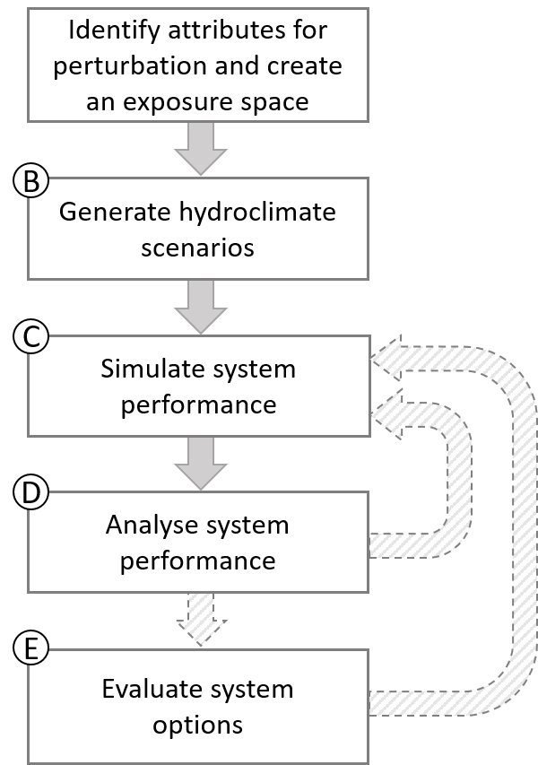

```{r setup, include=FALSE}
knitr::opts_chunk$set(echo = TRUE, collapse = TRUE, comment = "#>")
library(foreSIGHT)
```

# 1. Introduction

A variable and changing climate presents significant challenges to the functioning and/or performance of both natural and engineered systems. Managed systems---both engineered and managed natural systems---traditionally have been designed under the assumption that future climate conditions will mirror those experienced in the past. Yet with the continuing advance of climate change, there is a need to understand how systems might perform under a range of plausible future climate conditions or, conversely, what system interventions might be required so that systems continue to achieve desired levels of performance. Given the complexity of most climate-sensitive systems, formalised approaches are required to understand likely climate impacts and evaluate the viability of adaptive measures to minimise climate vulnerability. 

To this end, scenario-neutral (or 'bottom-up') approaches (Prudhomme et al. 2010, Brown 2011, Culley et al. 2016) are advocated as a means of rigorously stress testing a system under a range of plausible future climate conditions. These approaches treat the system's behaviour and performance as the central concerns of the analysis, and enable better understanding of the complex climate-system relationships to support adaptation decision making. These approaches can be combined with 'top-down' climate impact assessment methods through the integration of projections from climate models and/or other lines of evidence. The *fore*SIGHT package contains functions that support both 'bottom-up' system stress testing, and the analysis of the implication of 'top-down' climate projections on system performance.
  
This vignette demonstrates the options available for climate 'stress-testing' a system using *fore*SIGHT by applying the inverse approach (Guo et al. 2018) to optimise the parameters of one or more stochastic weather generators. The examples in this vignette both collate---and provide context to---information scattered in the function help files to discuss the considerations for application of *fore*SIGHT to more complex case studies and systems. It is assumed that the reader is familiar with the basic work flow of the package functions as has been demonstrated in the *Quick Start Guide* vignette.

## 1.1. Objectives and application areas of *fore*SIGHT

The objectives of *fore*SIGHT are to support climate impact and vulnerability assessments and the assessment of adaptation options by:

1. stress testing climate-sensitive systems, including both 'current' system configurations, as well as potential alternative system configurations that may be considered as part of the development of adaptation strategies;
2. comparing the climate sensitivity of multiple alternative system configurations to inform adaptation decision making; and
3. comparing stress-testing outcomes with the results from 'top-down' climate impact assessments to better understand future risk for each system configuration.

The *fore*SIGHT modelling software adopts a rigorous quantitative approach to stress testing that has been designed with several core assumptions in mind:  

* that the system dynamics (either 'current' or alternative system configurations) can be represented and adequately described by a numerical system model that provides a mapping between weather/climate variables and relevant system performance metrics; and  
* that the system model is forced by hydroclimatic time series data.   

Indeed, it is this latter feature that gives the software its name (the SIGHT in *fore*SIGHT stands for System Insights from the Generation of Hydroclimatic Timeseries). In particular, *fore*SIGHT has been designed specifically for the quantitative analysis of systems that exhibit dynamics in time, with examples of such systems including:  

* environmental systems (either natural or managed) that may be resilient to individual natural hazards but become vulnerable to multiple sequential hazards or long-term structural shifts in the climate;   
* water resource systems with natural (e.g. soil moisture, groundwater) and/or human-constructed (e.g. reservoirs, managed aquifer recharge) storages, for which past weather can affect current system performance;  
* agricultural systems where crop outcomes (e.g. yield and various quality measures) are influenced by the weather throughout a growing season and even between seasons;  
* renewable energy systems such as solar, wind and hydroelectricity and/or coupled storage solutions (e.g. pumped hydroelectricity or lithium battery systems); and  
* systems that depend on one or several of the above systems, such as mining (often dependent on groundwater and/or surface water reserves), transportation (often sensitive to flooding and various other natural hazards), tourism (often highly dependent on ecosystem health) and so forth.

The focus on detailed numerical modelling and system 'stress testing' highlights that *fore*SIGHT is particularly suited to situations where the consequences of system performance degradation and/or failure as a result of climate change are likely to be significant, as well as for quantitative decision making and/or engineering design. It is assumed that a high-level (qualitative) risk assessment would have already been conducted and the outcome of that assessment is that a detailed quantitative analysis is required. 

## 1.2. *fore*SIGHT workflow for climate stress-testing

The *fore*SIGHT workflow is shown the diagram below, and comprises five distinct steps that collectively address the three objectives outlined above. A core aspect of the *fore*SIGHT functionality is to evaluate how the system performs under a range of plausible climate scenarios created by perturbing statistical properties of observed climate time series. The workflow involves the steps shown in the following diagram, each of which are discussed in the case study presented in Section 2. As highlighted in the previous section, at this point it is assumed that a detailed quantitative analysis of a system is required (based, for example, on the outcomes of a qualitative risk assessment) and that a numerical system model is available or can be developed as part of the analysis. 


```{r CRAFTWorkflow, echo=FALSE, fig.cap="Workflow of climate 'stress-testing' using foreSIGHT", out.width = '30%'}

```    
   
<br>
Each of the modelling steps are elaborated upon below. 


**Step A.** The process of system stress testing involves assessing how a system's behaviour (including its 'function' or 'performance') varies as a result of plausible climatic changes. These changes are described by means of climate *attributes*, which we define as statistical measures of weather variables. Examples of attributes are annual total rainfall, annual number of wet days, and annual average temperature. In this step, the attributes that are deemed to be most relevant for a particular system are identified. These attributes are generally selected based on *a priori* understanding of system dynamics and likely system vulnerability. The minimum-maximum bounds of the perturbations in the selected attribute, and the type of sampling within this range, are also decided. The attributes and perturbations are used to create an 'exposure space'. The outcome of this step is a set of sampled points within an exposure space, that provide the 'targets' for time series generation algorithms in Step B.

**Step B.** This step involves generation of perturbed time series corresponding to the sampled points of target perturbations created in Step A. A reference (typically observed) time series of the relevant hydro-climate variables is required to create the perturbed time series using a selected method of perturbation. The supported perturbation methods in *fore*SIGHT include the application of scaling factors to the supplied time series, or the use of the 'inverse method' of Guo et al (2018) to optimise the parameters of stochastic weather generator type models to generate time series with desired perturbed attributes. If stochastic models are used for time series generation, multiple replicates of time series that correspond to the same target can be generated  to better represent stochastic ('natural') variability. The outcome of this step is a set of perturbed time series that correspond as closely as possible to each point in the exposure space.

**Step C.** The perturbed time series generated in Step B are used to drive the system model and simulate system 'performance'. The performance metrics should represent measures that are most relevant to the system under consideration, and can include a variety of economic, social and/or environmental measures. It is assumed that the performance metrics are calculated within the system model and thus represent the outputs from that model (i.e. the *fore*SIGHT package does not calculate the performance metrics itself). The outcome of this step is a quantitative representation of how system performance varies across the exposure space. 

**Step D.** This step visualises the system performance metrics calculated in Step C to understand the system responses to the perturbations in the selected climate attributes. If minimum or maximum threshold criteria of the performance metrics are defined, these thresholds can be used to identify instances of unsatisfactory system performance/system failure. In this step, the performance metrics are visualised in the perturbation space of the climate attributes; in other words, the axes used for visualisation are the perturbed climate attributes. Such figures are henceforth named 'performance spaces'---these visualisations enable identification of combinations of perturbations that result in changes to system performance. In cases where the 'stress-test' includes multiple perturbed attributes and performance metrics, multiple visualisations of performance spaces are used to represent all combinations of attributes/metrics. If alternate climate information is available from other sources of evidence (for example, from 'top-down' approaches), they can be superimposed on the visualisations generated in this step. Inclusion of this additional climate data may provide information about the plausibility of the perturbations in the attributes. The outcome of this step are plots of the system performance spaces/thresholds and understanding of the system responses to the climate perturbations.

**Step E.** This step involves analysis of alternate system configurations/policies in order to support decision making. Visualisations are created for the alternate system choices to compare their performance. The outcomes of this step are plots of the performance spaces/thresholds for all system choices and understanding of the preferred choices under climate perturbations.

These five steps complete the framework of climate impact assessment using *fore*SIGHT, and are discussed at length in the following sections.

## 1.3. What's covered in this tutorial?

This tutorial will provide a detailed description of the core functionality of the *fore*SIGHT software, broken down into each of the five steps described in the previous section. The basic structure of each section is as follows:

- Each section will commence with a brief overview of the purpose of the Step and key learning outcomes. 
- Following the overview, there will be a series of subsections that focus on key decisions that need to be made in implementing the step. These subsections commence with a box providing basic theory and key considersations that should be taken into account in making these decisions, followed by a description of software functionality needed to implement each decision.
- These elements are then combined to describe a series of 'use cases', in which the basic *fore*SIGHT workflow is implemented against a set of hypothetical anticipated applications of the software.

In addition to learning about core *fore*SIGHT functionality, you'll also learn about a number of advanced usages *fore*SIGHT including:      

- specifying exposure space perturbations on irregular grids  
- using stochastic models to generate perturbed series and modifying the default settings for stochastic models/parameters
- modifying default optimisation settings and specifying penalty attributes and weights   
- assessing the fitness of stochastic time series relative to the desired target attributes  
- defining custom wrapper functions for system models in R  
- using system models external to R  
- exercising finer control on plotting performance spaces  
- parallelising computationally intensive functions in the package  

The implementation of the *fore*SIGHT methodology, and the bottom-up framework more generally, requires the use of a consistent set of terminology to describe key concepts. This terminology is summarised in a glossary section, and we use **bold** font when making reference to key terms defined in the glossary. 

Finally, we have developed a *Frequently Asked Questions* section which we'll be expanding on over time, and included references to a small number of key scientific papers. 

# 3. Step A: Identify attributes for perturbation and create an exposure space (`createExpSpace`)
> **In this step you'll learn...**
> 
> - What's meant by the terms **exposure space**, **climate attributes** and **exposure space targets**, as well as the difference between **perturbed** and **held** attributes
> - How to select attributes for stress testing
> - How to select reasonable bounds for each attribute
> - How to determine the appropriate sampling strategy for the exposure space
> - How to decide which attributes to hold at historical levels

In this step, we'll take you through the basic process of creating an exposure space. The term **exposure space** refers to the set of future climate conditions to which a system might be exposed. This is a multidimensional space that in principle could represent any feature of the climate that might impact a given system, such as the averages, variability, seasonality, intermittency, extremes, interannual variability of a range of weather variables including rainfall, temperature, wind, solar radiation, and so forth. We henceforth refer to these features as **attributes**, which are formally defined as statistical measures of weather time series. 

While stress testing a system against the full set of plausible changes in all relevant attributes might sound good in theory, this would lead to an infinite number of future climate states and thus is not feasible in practice. Rather, it will be necessary to:

- Select the attributes that are likely to be the most important for the system in question;
- Select reasonable bounds for each attribute, to capture a **plausible** set of climatic changes; 
- Provide an appropriate sampling strategy to generate the exposure space; and
- Select the attributes to 'hold' at historical levels

The following subsections will guide you through each of decisions.

## 3.1. Step A1: Selecting Attributes for Stress Testing

> **Key Considerations: Step A1**  
>  
> The purpose of climate stress testing is to understand system sensitivity to a range of plausible future climates, as a core foundation for making informed adaptation decisions. In *fore*SIGHT this is achieved by perturbing a number of **climate attributes**, and seeing how the system responds to those perturbations. 
> 
> The first part of the stress test is to choose the relevant attributes to perturb. This creates a dilemma: without having yet having evaluated system sensitivity, how should one go about choosing the attributes to use for stress testing? We suggest that the following considerations be taken into account:
> 
> - Consider any *a priori* knowledge of likely system sensitivity and vulnerability. This can come from expert understanding of system dynamics (e.g. dominant processes and key timescales over which the system operates), knowledge of historical system sensitivity and/or evidence associated with any previous system 'failures', or any other information that could give insight into the most important climate attributes 
> - Consider likely climatic changes in the region based on available lines of evidence (e.g. climate projections and other relevant information). If there is reasonable confidence that an attribute is not likely to change in the future, then there is less value for including it in a stress test. 
> - If in doubt, then it is generally worth erring on the side of caution and including the attribute in question in the analysis, rather than risking the possibility of missing a major area of system vulnerability. 
> 
> Beyond these high-level considerations, there are also several further practical considerations:  
>  
> - Is it possible to perturb the attributes using the an available perturbation method? This is relevant as part of the choice between 'simple scaling' and stochastic methods, and also as part of the choice of specific stochastic weather generator to use (discussed further in Step B). 
> - Is there enough *marginal* value of including an attribute given others that have already been included? For example, if a stress test has already been conducted on the 95 percentile of daily rainfall, then perhaps stress testing it against the 96 percentile is unlikely to deliver much additional insight. 
> - Can the system model take the relevant perturbed weather generator values as inputs? For example if a system model runs at a daily timescale, then its capacity to account for sub-daily inputs is limited. Note that in this case, if *a priori* knowledge suggests that variability at the sub-daily scale is very important, then it may be a case of developing a better system model!
> 
> The outcome of attribute selection could be a large number of attributes identified for perturbation, which may then need to be reduced in subsequent steps. This was discussed at length by Culley et al (2020) and will likely also dictate the sampling strategy discussed in Step A3. 

*fore*SIGHT has the relative unique capability to perturb a large number of climate attributes, either jointly or in isolation. The climate attributes that are currently supported by *fore*SIGHT and their definitions can be viewed using the helper functions `viewAttributes()` and `viewAttributeDef()` available in the package.

``` {r atts, R.options = list(width = 100)}
viewAttributes()

viewAttributeDef("P_ann_tot_m")
```

It is noted that attributes are specified either as a fractional change relative to historical levels (and thus do not have units), or they are specified using the metric system. For situations where the units are not consistent with those adopted by the preferred system model, then unit conversions will need to be included as part of the system model wrapper function. This is covered further as part of Step C.

The large number of supported attributes in *fore*SIGHT does not mean that all attributes can be used in all situations. In particular, *fore*SIGHT has two key perturbation methods (simple scaling and stochastic generation), and an ever-increasing library of stochastic generators. In the case of simple scaling, the only attributes that can be perturbed are annual averages, with other attributes changing in a proportional manner. In contrast, when using stochastic generation, then the attributes that can be perturbed will depend on the stochastic generator. This can be interrogated as follows:

``` {r compAtts, R.options = list(width = 100)}
# models that are compatible with the attributes of precipitation
viewModels("P", compatibleAtts = TRUE)
```

Once the attributes are selected, we need to include these as a vector into the function `createExpSpace` via the argument `attPerturb`. For example if we are interested in the total annual rainfall, the mean annual number of wet days, the total JJA rainfall, we define the argument `attPerturb` as:

`attPerturb <- c("P_ann_tot_m", "P_ann_nWet_m", "P_JJA_tot_m")`


## 3.2. Step A2: Selecting reasonable bounds for each attribute
> **Key Considerations: Step A2**  
>  
> The purpose of the stress test is to evaluate system model performance against a range of plausible future changes. Thus far we have been vague about what we mean by the word **plausible**, but it's an absolutely fundamental element of the stress test.  
>  
> One of the primary objectives of stress testing is we want to minimise the likelihood of surprises and unexpected system failures. These are often called 'Black Swan' events and represent situations that were not foreseen when the system was originally designed.  
>  
> To minimise the risk of not capturing future changes, we first need to make sure we capture the right *types* of changes, which are defined by the attribute selection step (Step A1). But we also need to ensure that we get the right *magnitudes* of overall changes.  
>  
> Thus, by **plausible**, we mean that the changes are deemed to be physically possible, albeit not necessarily likely in all cases. For this reason, our guidance generally has been to select attribute ranges (minimum and maximum values) that roughly represent the 'worst case' of what is possible based on current understanding. In practice this could mean selecting bounds that are slightly wider than the range identified by climate models (recognising that climate models may not capture all plausible future changes), or consideration of various other lines of evidence.  
>  
> Yet we want to emphasise the word 'slightly' here. We know the world is not going to warm by 100^o^C, so let's not get carried away imagining worse case scenarios that are almost certainly not going to occur in reality! This not only would represent a waste of computational resources, but also would direct analytical attention way from the sorts of changes that are more likely to occur in practice.  
>  
> A final note. *fore*SIGHT---as well as every other application of 'bottom-up' or 'scenario-neutral' analysis we have seen thus far---defines the bounds of the exposure space by the bounds in individual attributes. In other words, the exposure space becomes a (hyper) cube defined by the univariate bounds. Yet certain *combinations* of changes may be more or less likely, and indeed some combinations may not be physically possible. This is a current limitation of bottom-up methods, and is addressed somewhat by the subsequent superposition of 'top-down' projections onto the exposure space to highlight parts of the space that are more or less probable. 

As highlighted in the above box, there are a lot of factors to consider in setting the bounds of the exposure space. However, much of this analysis needs to happen before starting to use *fore*SIGHT, based on a combination of expert knowledge, and potentially the interrogation of climate model output. To assist with this, *fore*SIGHT contains a function, named `calculateAttributes`, to calculate the values of attributes from climate data. By using this function with multiple climate model output time series (potentially in combination with some form of downscaling and/or bias correction), the function may be used to estimate the range of the attribute projections, which can be used as one of the information sources to determine attribute bounds. The usage of the function is illustrated below.

``` {r attCalc, R.options = list(width = 100)}
# load example climate data
data("tankDat")
# select attributes
attSel <- c("P_ann_tot_m", "P_ann_nWet_m", "P_ann_R10_m", "Temp_ann_rng_m", "Temp_ann_avg_m")
# calculate attributes
tank_obs_atts <- calculateAttributes(tank_obs, attSel = attSel)
tank_obs_atts
```

Once we've decided upon the bounds, we put the minima and maxima in as vectors, corresponding to the entries into the `attPerturb` argument. So if we are planning on perturbing the three attributes described in the previous section, we would define the bounds as:

```{r attBounds, R.options = list(width = 100)}
attPerturbMin = c(0.7, 0.8, 0.6)
attPerturbMax = c(1.1, 1.2, 1.1)
```


## 3.3. Step A3: Determining the appropriate sampling strategy for the exposure space

> **Key Considerations: Step A3**  
>  
> For climate stress testing the system, we analyse the changes in system performances over an **exposure space** defined by the selected **perturbed attributes** (Step A1) and their respective minimum-maximum bounds (Step A2). To do that, we need to *sample* the exposure space, to obtain a set of **target attribute values** for subsequent perturbation in Step B.
>  
> The method of sampling to create the target attribute values within the exposure space is what is referred to as the sampling strategy. Imagine an exposure space, the axes of which are the perturbed attributes. When there are multiple perturbed attributes, the exposure space targets can have perturbations in one perturbed attribute (while others are held at historical levels), a subset of the perturbed attributes (while the remaining are held at historical levels), or all of them.  
> 
> Ideally, we want to have many samples within the minimum-maximum bounds of all perturbed attributes for comprehensive analysis of the system performances over the entire exposure space. However, we may end up with too many exposure space targets than it is possible to analyse using the computational resources available. Hence we need sampling strategies to reduce the number of exposure space targets, while sampling the space adequately.
> 
> Thus, the primary concerns in selecting a sampling strategy is the *desired resolution* of the exposure space and the computational resources available to conduct the stress-test. Generating the perturbed time series (Step C), and running the system model using the perturbed time series (Step D) are typically computationally intensive, and influence this decision.
>  
>  The number of exposure space targets increase exponentially if there are multiple attributes that need to be perturbed simultaneously. Practically, if computational constrains exists, we perform a preliminary assessment using one-at-a-time sampling of `attPerturb` to select the most relevant attributes for the stress-test. 

Three arguments---`attPerturbType`, `attPerturbSamp`, and `attPerturbBy`---determine the sampling strategy input to `createExpSpace`. The type of sampling is specified using the `attPerturbType` argument. The function currently supports two types of sampling - 'one-at-a-time' (`'OAT'`), and regular grid (`'regGrid'`). In the case of an 'OAT' sampling, each attribute is perturbed one-at-a-time while holding all other attributes constant. In contrast, in a 'regGrid' sampling the attributes are perturbed simultaneously to evenly sample an exposure space encompassing all combination of perturbations in the selected attributes. The number of samples or the increment of perturbation is prescribed using the arguments `attPerturbSamp` or `attPerturbBy`, respectively, for each perturbed attribute.

Once the sampling strategy for the perturbing the three attributes selected in the previous section has been decided, we specify these arguments as shown below.

```{r attSamp, R.options = list(width = 100)}
attPerturbType <- "OAT"
attPerturbSamp <- NULL
attPerturbBy <- c(0.1, 0.2, 0.1)

# Or equivalently, by specifying the number of samples as attPerturbSamp
attPerturbType <- "OAT"
attPerturbSamp <- c(5, 3, 5)
attPerturbBy <- NULL
```


In addition to `OAT` and `regGrid` sampling methods, it is also possible to put customised target combinations as inputs, and this option can provide flexibility to include a much wider range of sampling methods (such as Latin hypercube sampling or other sparse sampling approaches). In these cases, the targets are provided in a matrix to `attTargetsFile`, with other arguments (`attPerturbType`, `attPerturbSamp`, `attPerturbBy`, `attPerturbMin` and `attPerturbMax`) set to NULL. This usage is illustrated in one of the 'irregular perturbations' Use Case provided later in this chapter 


## 3.4. Step A4: Deciding which attributes to hold at historical levels
> **Key Considerations: Step A4**  
>  
> So, we've identified the attributes, identified the plausible ranges and even identified a carefully developed strategy for sampling the exposure space. Done, right? Wrong.  
>  
> There is a significant downside in the flexibility achieved by using stochastic generators to perturb climate, and if we're not careful we can easily get weather sequences that are simply not physically realistic.  
>  
> Let's illustrate this using a simple example. Suppose we know that a system is primarily influenced by the annual average temperature. Thus, we have a very nice one-attribute problem, and we simply select this attribute in *fore*SIGHT, identify a plausible range, and in this case we'd just select a one-at-a-time sampling strategy. 
>  
> Now let's assume that in Step B we choose a sophisticated weather generator that can simulate daily temperature, and we apply the 'inverse method' (more on what this  means in the discussion of Step B) to simulate any possible temperature time series that achieves the target annual temperature series.  
>  
> Wait. *Any* possible time series? Yes - without providing more information, it might simulate a 1^o^C rise in *average* temperature in such a way that the day-to-day variability of the temperature can blow up (for example one day could be +100^o^C and the next -100^o^C), or the seasonality could reverse (winter hotter than summer), or indeed the time series could reflect any other change consistent with the specified target.  
>  
> The way around this is tell the computer to perturb the temperature time series to achieve the target, *subject to* keeping all other attributes as close to the historical (or baseline) levels as possible. Thus could mean asking for a 1^o^C rise in temperature while keeping day-to-day variability and seasonality roughly constant. 
> There's lots of theory developed on this, and if you're interested in learning more refer to Culley et al (2019).

As described in the Box above, holding some attributes at constant levels (and commonly at the level of the **reference time series** can be important to generate realistic weather time series. This is where the `attHold` argument comes in, and represents a list of all attributes to keep at historical levels. Something like:

`attHold <- c("P_ann_P99_m", "P_ann_maxWSD_m", "P_ann_seasRatio_m")`

In this case, these three attributes are held at reference levels. The attributes 99th percentile rainfall, maximum length of the wet spells are held at reference levels so that the perturbations do not result in unrealistic extreme rainfall events. In addition, the attribute "P_ann_seasRatio_m" is held at reference levels so that the seasonal cycle of the generated data is realistic. If you're still not convinced why this is important, go to Step B where we provide an example of not holding some attributes at constant values. There are also mechanisms to ensure to preferentially matching the desired values of some attributes during time series generation, by prescribing **attribute penalty**. More on this in Step B.

Now that we've discussed the theoretical considerations and core functionality associated with Step A, we now bring all the pieces together to show some realistic 'use cases' for the `createExpSpace` function.

## 3.5. Use Case A1: An 'OAT' exposure space

Consider the starting phase of a case study, where a number climate attributes have been identified for perturbation based on *a priori* knowledge of the system dynamics. If the identified attributes are large in number, simultaneously perturbing them would result in an exposure space with too many target points for the stress test. However, it could be viable to create an "OAT" exposure space containing one-at-a-time perturbations in the identified attributes to perform a preliminary assessment. The assessment can help identify if there a subset of attributes to which the system performance is most sensitive to that can be used for the analysis, noting the important caveat that this form of assessment is not capable of analysing possible higher-order sensitivities due to *interactions* between attributes.

Suppose that an understanding of the dynamics of the system under consideration suggests that the system is sensitive to changes in annual and JJA rainfall totals. In addition, changes in the number of wet days are also expected to affect the system performance. So these attributes are selected for perturbation to create an "OAT" exposure space for the preliminary stress-test. Regional climate projections for the region indicate that the annual and JJA total rainfalls are expected to decrease. The range of the projected decreases in annual total rainfall is -20% to 0%, the range of projected decreases in JJA total is -30% to -0%, and the projected changes in the number of wet days is -10% to +10% for the future time-slice of interest. The minimum and maximum perturbation bounds encompassing these projected changes are selected for the stress-test, to cover the range of expected changes in the region. The generated exposure space is selected to be larger than the expected changes from climate projections by 10%. Thus the min-max bounds selected are: (0.7 to 1.1) for "P_ann_tot_m", (0.6 to 1.1) for "P_JJA_tot_m", and (0.8 to 1.2) for "P_ann_nWet_m". Based on computational resources required to generate the data and run the system model we decide to perform the analysis using a total of 15 target locations in the exposure space. This information is used to select the perturbation increment of the perturbed attributes.

To maintain the realism of the perturbed time series, some attributes have to be held at reference levels. The attributes "P_ann_P99_m", "P_ann_maxWSD_m" are selected to be held at reference levels so that the generated time series have realistic wet extremes, with decreasing annual and JJA totals. The hypothetical climate projections also indicate that there are no changes in the extremes, so these are assumed to stay the same as the reference series. In addition, the seasonal rainfall ratio is held at existing levels so that the seasonal cycle represented in the generated time series are realistic. It is noted that as part of the "OAT" sampling strategy, each of the "perturbed" attributes are being changed individually with the remaining perturbed attributes staying at the levels of the reference time series, and so effectively become "held" attributes as part of the perturbation.

The following example code illustrates the creation of an 'OAT' exposure space using the `createExpSpace` function.

``` {r expSpaceOAT, fig.align = 'center', dpi = 100, fig.show = "hold", fig.width = 5, fig.height = 5, out.width = "47%", fig.cap = "Target locations in two slices of an OAT exposure space"}
# specify attributes
attPerturb <- c("P_ann_tot_m", "P_ann_nWet_m", "P_JJA_tot_m")
attHold <- c("P_ann_P99_m", "P_ann_maxWSD_m", "P_ann_seasRatio_m")

# ***** OAT Exposure Space ****** 
# specify perturbation type and minimum-maximum ranges of the perturbed attributes
attPerturbType <- "OAT"
attPerturbBy <- c(0.1, 0.1, 0.1)
attPerturbMin = c(0.7, 0.8, 0.6)
attPerturbMax = c(1.1, 1.2, 1.1)

# create the exposure space
expSpace_OAT <- createExpSpace(attPerturb = attPerturb, 
                           attPerturbSamp = NULL, 
                           attPerturbMin = attPerturbMin,
                           attPerturbMax = attPerturbMax, 
                           attPerturbType = attPerturbType,
                           attPerturbBy = attPerturbBy,
                           attHold = attHold)

# plot the exposure space
plotExpSpace(expSpace_OAT, y = attPerturb[1], x = attPerturb[2])
plotExpSpace(expSpace_OAT, y = attPerturb[2], x = attPerturb[3])

```


## 3.6. Use Case A2: A 'regGrid' exposure space

For most practical applications of the scenario-neutral method published to-date, the mode of presentation involves plotting system performance as a set of changing contours on a (usually but not necessarily two-dimensional) exposure space. In *fore*SIGHT this mode of presentation is facilitated through the 'regGrid' sampling of the exposure space, enabling the presentation of joint variations of a range of **perturbed attributes**. Although this method is not limited to two dimensions, there is a clear trade-off in number of attributes, grid resolution and runtimes; for example having 10 attributes with 10 samples each between the minimum and maximum bounds, would lead to the requirement of 10^10^ separate time series to be generated and run through a system model. Therefore in practice this approach is best done once a critical set of attributes are identified, either through the one-at-a-time method described in Use Case A1, or more sophisticated methods described in Culley et al (2020).

In terms of implementation, after identifying the attributes and deciding on the bounds and perturbation increments (or number of samples), a 'regGrid' exposure space is created, which consists of target points with simultaneous perturbations in the selected perturbed attributes. The `createExpSpace` function can be used as follows.


``` {r expSpace_regGrid, fig.align = 'center', dpi = 100, fig.show = "hold", fig.width = 5, fig.height = 5, out.width = "47%", fig.cap = "Target locations in two slices of a regGrid exposure space"}
# ***** regGrid Exposure Space *****
attPerturbType <- "regGrid"
expSpace_regGrid <- createExpSpace(attPerturb = attPerturb, 
                           attPerturbSamp = NULL, 
                           attPerturbMin = attPerturbMin,
                           attPerturbMax = attPerturbMax, 
                           attPerturbType = attPerturbType,
                           attPerturbBy = attPerturbBy,
                           attHold = attHold)

# plot the exposure space
plotExpSpace(expSpace_regGrid, y = attPerturb[1], x = attPerturb[2])
plotExpSpace(expSpace_regGrid, y = attPerturb[2], x = attPerturb[3])

```


## 3.7. Use Case A3: Exposure space with irregular perturbations

Sometimes when multiple attributes are selected for perturbation, it may not be feasible to use a 'regGrid' exposure space for the stress test because the higher dimensions of the exposure space result in an infeasibly large number of target points. As an alternative to the one-at-a-time method described in Use Case A1, the user may wish to input custom target combinations, which potentially could be obtained from a sampling method such as Latin hypercube sampling (see Culley et al, 2020). 

To this end, the `createExpSpace` function offers the functionality to input target points created externally to *fore*SIGHT through the function argument `attTargetsFile`. The argument is intended for users who want to sample target locations using alternate sampling techniques not currently available in `createExpSpace`. 

The target locations are created by the user outside *fore*SIGHT, saved in a CSV file and provided as an input to `createExpSpace`. In this case, the arguments `attPerturbSamp`, `attPerturbMin`, `attPerturbMax`, `attPerturbType`, and `attPerturbBy` should be set to `NULL`. It is to be noted that `createExpSpace` does not perform checks on the user input target locations read in from the CSV file. The user must therefore ensure that the perturbations specified in this file are feasible. The CSV file should contain column `headers` that correspond to all attributes specified as `attPerturb` and `attHold`. The rows of the file should correspond to the target locations in the exposure space. 

The below code provides an example of this usage.

```{r, expSpaceIrregular, fig.align = 'center', dpi = 100, fig.show = "hold", fig.width = 5, fig.height = 5, out.width = "47%", fig.cap = "Target locations in two slices of an irregular grid exposure space"}
attPerturb <- c("P_ann_tot_m", "P_ann_nWet_m", "P_JJA_tot_m")
attHold <- c("P_ann_P99_m", "P_ann_maxWSD_m", "P_ann_seasRatio_m")

# creating example target locations and saving it in a CSV file for illustration
# note that the user would create these target locations using a sampling method of their choice
# the file should contain all perturbed and held attributes
tempFile <- paste0(tempdir(), "\\targetsFile.csv")
attTargets <- rbind(c(1, 1, 1, 1, 1, 1),
                    c(0.7, 1, 0.6, 1, 1, 1),
                    c(0.8, 1, 0.7, 1, 1, 1),
                    c(0.9, 1, 0.8, 1, 1, 1),
                    c(1.1, 1, 1, 1, 1, 1),
                    c(0.7, 1.2, 0.6, 1, 1, 1),
                    c(0.8, 1.2, 1, 1, 1, 1),
                    c(0.9, 1.2, 1.1, 1, 1, 1),
                    c(1, 0.8, 1, 1.1, 0.7, 1),
                    c(1.1, 0.8, 1.1, 0.8, 1, 1))

colnames(attTargets) <- c(attPerturb, attHold)
write.table(attTargets, file = tempFile, sep = ",")

# creating exposure space using targets from csv file
expSpace_Irreg <- createExpSpace(attPerturb = attPerturb,
                           attPerturbSamp = NULL,
                           attPerturbMin = NULL,
                           attPerturbMax = NULL,
                           attPerturbType = NULL,
                           attPerturbBy = NULL,
                           attHold = attHold,
                           attTargetsFile = tempFile)

# plot the exposure space
plotExpSpace(expSpace_Irreg, y = attPerturb[1], x = attPerturb[2])
plotExpSpace(expSpace_Irreg, y = attPerturb[2], x = attPerturb[3])

```


```{r, CRANcleanup1, echo = FALSE, results = FALSE}
# removing tempFile
file.remove(tempFile)
```

# 4. Step B: Generate perturbed climate time series (`generateScenarios`)

> **In this step you'll learn...**
> 
> - What's meant by the terms **reference period**, **simple scaling**, **stochastic generation**, **stochastic weather generator**, **attribute penalty**, **realisation** and **random seed**
> - How to select an appropriate reference period for subsequent analysis
> - How to select the time series perturbation method
> - How to select the stochastic generator
> - Whether and how to select attribute penalties 
> - How to select length of the perturbed time series, the number of replicates and how to control the random seed

Now that we have identified the specific points in the exposure space to analyse, we turn to the challenge of generating time series that correspond to those attribute values. In this step, we create perturbed hydro-climate time series with attributes corresponding to the **target attribute values**. The function `generateScenarios` can be used to create the perturbed time series. The mandatory arguments required are a reference (typically observed) time series (argument `obs`) and the exposure space created in Step A (argument `expSpace`). 

Before doing this, the user needs to make a number of decisions:

 - What is the reference period for analysis, which determines the baseline for subsequent perturbations?
 - What is the time series perturbation method? 
 
If the time series perturbation method is a stochastic one (i.e. one that uses stochastic weather generators), there are several other decisions that need to be made:

- Which stochastic weather generator to use;
- How to weight the different **perturbed** and **held** attributes to balance trade-offs and achieve the desired time series; and
- Other considerations such as length of each stochastic realisation, number of realisations and control of the random seed.

The subsections below provide a guide to each of these decisions, followed by a set of practical 'Use Case' examples to show how these come together. 

## 4.1. Step B1. Selecting the reference time series

> **Key Considerations: Step B1**
> 
> As part of the scenario neutral methodology, all perturbations are described against some reference **attribute values**, which in turn are usually calculated from a reference weather time series. This **reference period** is generally synonymous with the notion of a **climatological baseline**. 
> 
> There are no requirements in the *fore*SIGHT software for the nature of the reference time series other than that it must conform to certain formatting requirements described in the examples below. However, in practice, there are a number of considerations in choosing the reference period:
>
> - **Purpose of analysis:** In many cases it is anticipated that the focus of the stress testing will be to evaluate plausible changes in system performance either against current system performance or system performance over some historical period of record. 
>
> - **Length of reference period:** The length of the reference period must be sufficient to obtain appropriately precise estimates of relevant climate attributes. The World Meteorological Organisation generally suggests a minimum period of 30 years, although the specific decision will depend on the data availability, the degree of non-stationarity and various other considerations.
> 
> - **Integration with top-down climate impact assessments.** For situations where top-down projections will be included as part of the analysis---perhaps by superimposition of top-down projections on the scenario-neutral performance space, or by way of a comparative analysis---it might be necessary to ensure all the approaches are calculated relative to a consistent climatological baseline. 
> 
> - **Availability of (high-quality) historical weather data.** Data availability can be a major constraint to stochastic modelling, with even relatively densely gauged regions experiencing regular interruptions in the historical record or other data anomalies. The quality of reference weather time series should be evaluated using established methods where possible.
>
> - **The potential non-stationarity of historical weather data.** Given that climate change is increasingly detectable in weather time series data, system performance can be expected to be different across different reference periods such as: (i) aggregated over the instrumental record; (ii) aggregated over the recent record such as the last decade or two; or (iii) estimated based on the 'current' climate. 
>
> The above factors highlight that it is not possible to provide prescriptive guidance on the choice of reference period, and will require careful tailoring to the unique circumstances of each *fore*SIGHT application. 

The variables available in *fore*SIGHT and their units can be viewed using the function `viewVariables()`. It is important to ensure that the input reference time series are specified in these units if stochastic models are used to generate the perturbed time series. This is because the default bounds of the stochastic model parameters in the package are based on these units. The input `reference` data should contain the variables that are required for the system under consideration (i.e. as input to the **system model** described in Step C). These `reference` data need not contain all the variables that are available in *fore*SIGHT, but can be a subset of them which are to be used in the stress-test.

```{r fSVars}
# Hydro-climate variables available
viewVariables() 
```

An example 'observed data' object sourced from multiple observation gauges to represent a general Adelaide (South Australia) climate is available in the package and can be loaded using the `data` command as shown below. This is intended to illustrate the expected format of `reference`. The `reference` data should be a data.frame. The first three columns should contain the `year`, `month`, and `day` of the data named accordingly. Further columns of the data.frame should contain the hydro-climate variables of interest named by their short names as listed in the `viewVariables()` function. 

```{r refFormat}
# Load example climate data
data(tankDat)

# Expected format of the input obs climate data
head(tank_obs)
```

The time series can be input to the `generateScenarios` function using the `reference` argument.

```{r refInput}
reference = tank_obs
```

*fore*SIGHT also contains a function that can be used to calculate the attributes of interest for climate data supplied by the user: `calculateAttributes()`. The usage of this function is shown below. The function is intended for use with the `reference` data or additional climate data from other sources that will be used with the plotting functions in *fore*SIGHT (see Step D).

```{r refAttCalc}
attSel <- c("P_ann_tot_m", "P_MAM_tot_m", "P_JJA_tot_m", "Temp_ann_avg_m", "Temp_ann_rng_m")
tank_obs_atts <- calculateAttributes(tank_obs, attSel)
tank_obs_atts
```

## 4.2. Step B2. Selecting the time series perturbation method

> **Key Considerations: Step B2**
> 
> As highlighted in the Introduction, a key role of the *fore*SIGHT software is to enable the quantitative stress testing of climate-sensitive systems using perturbed hydroclimatic time series. But what is the best way of achieving the perturbations?
>
> There are two methods supported in *fore*SIGHT, and these reflect the main approaches that have been adopted in most published scenario-neutral applications thus far. 
>
> The first method is called **Simple Scaling**, which as the name suggests scales the weather time series by specified additive or multiplicative factors to achieve the desired perturbed time series. Although this method has the benefit of simplicity, there are a number of disadvantages:
> 
> - some statistical properties such as the rainfall wet-dry patterns or extremes cannot be perturbed
> - multiple attributes cannot be perturbed in combination
> - it is not possible to hold some desired attributes at historical levels while perturbing others
> - the length of the generated time series cannot be longer than the supplied reference time series.
>
> The second method involves the use of **Stochastic Weather Generators** to generate perturbed weather time series that correspond to the target attribute values. This approach has the advantage of considerably more flexibility, in that it can perturb complex combinations of changes such as the simultaneous decrease in the averages, increase in the intermittency and increase in the extremes of rainfall. It also has the advantage of being able to represent stochastic variability, in the sense that it is possible to generate multiple 'realisations' or **Stochastic Replicates** of future weather that each share the same attribute values but evolve differently over time, and also generate realisations of different lengths. Yet this approach also has several disadvantages:
>
> - The process of calibrating stochastic generators to achieve particular attribute values is much slower and can involve considerable runtimes
> - Care is needed to identify useful **Perturbed Attributes** that are physically feasible (for example it is not possible to simulate a rainfall time series that simultaneously shows both an increase in the annual total rainfall and number of wet days, and yet a decrease in the amounts per wet day).
> - If both the **Perturbed Attributes** and **Held Attributes** are not carefully specified, it is possible to generate unrealistic time series
> - Care is needed to match the specific stochastic generator to the problem requirements.
>
> It is difficult to provide definitive advice on the most appropriate method to select, as it will depend on the unique aspects of each problem. However the best guide will come from the attributes that were selected during the analysis of Step A1---if individual attributes or attribute combinations have been selected that cannot be generated using **Simple Scaling**, then this provides strong indication that stochastic methods are likely to be most appropriate. 

As highlighted in the above box, care is needed to decide select the specific perturbation method, with the decision depending significantly on the attributes selected for stress testing as part of Step A1. Once the method of perturbation has been selected, you need to supply this information to the function `generateScenarios` via the argument controlFile. 

In particular, if simple scaling is required, then simply use the argument:

```{r controlFile1, R.options = list(width = 100)}
controlFile = "scaling"
```

If a stochastic model is required, there are two options. Firstly, one can simply use the default stochastic model and associated settings in *fore*SIGHT by not specifying a `controlFile` argument, or by setting the `controlFile` argument to `NULL`.  

```{r controlFile2, R.options = list(width = 100)}
controlFile = NULL
```

The default assumes WGEN with a harmonic function to capture seasonality, and will  simulate all the supported WGEN weather variables that are input as part of the reference (e.g. observed) climate time series. It also assumes that every attribute is treated equally (i.e. no penalty applied to different attributes). In contrast, to provide a greater level of customisation, the argument is entered as:

```{r controlFile3, eval = FALSE, R.options = list(width = 100)}
# input a user created JSON file that specifies the selection of model options
controlFile = path-to-a-user-created-JSON-file  
```

where the JSON file contains a range of advanced options including selecting the type of stochastic model, overwriting the default model parameter bounds, changing default optimisation arguments, and setting penalty attributes to be used in optimisation. 

If you elect to use 'simple scaling' you can skip straight to Use Case 1 (Simple Scaling) at the end of this chapter. If you elect to use the default stochastic method, you can skip straight to Use Case 2 (Using the Default Stochastic Models). However if you would like to choose the stochastic generator or add penalty weights to the attributes, then continue reading (for other settings in the JSON file such as default weather generator parameter bounds or optimisation arguments, refer to Options for Advanced Users chapter at the end of this tutorial). 


## 4.3. Step B3: Selecting the stochastic generator

> **Key Considerations: Step B3**
> 
> There is a plethora of options for stochastic weather generators described in the scientific literature, each with different features and assumptions. This variety provides a high degree of flexibility for perturbing weather time series in a variety of ways to comprehensively 'stress test' a climate-sensitive system. The *fore*SIGHT software currently supports a small number of weather generators; however the software has been developed in such a way that additional weather generators can be added over time. 
> 
> There is no single 'correct' weather generator for all applications, with the choice depending on a range of considerations:
>
> - **Data timestep.** Most weather generators run at a daily timestep, which is a common timestep for reporting of key weather variables. However there are also weather generators available at various sub-daily timesteps, as well as longer aggregated timesteps such as monthly or annual. The key consideration here is to ensure the time step is consistent with the likely timescales of system performance sensitivity, which in turn need to correpsond to the relevant time scales of weather inputs that are require for the system model.  
> 
> - **The key timescales of system sensitivity.** In addition to data timestep, it is important that the stochastic generator is able to simulate variability in **Climate Attributes** representing key timescales of system sensitivity. For example some systems may respond at sub-seasonal and seasonal timescales, and others at interannual timescales. It is noted that a stochastic generator may be able to simulate variability at timescales that are equal to or longer than its timestep, but not shorter. 
> 
> - **Relevant weather variables.** Weather generators have the capability of simulating a range of surface variables, including precipitation, temperature, wind, solar radiation, humidity and so forth---as well as derived variables such as potential evapotranspiration that are calculated through various recognised formulations. In many cases weather generators simulate precipitation first, followed by the other variables that are then conditioned to the precipitation time series; however each weather generator is different and it is necessary to review the documentation to understand the basis for generating the weather time series.
>
> - **Other key structural features** that drive the weather generator's capacity to simulate individual or combined changes in attributes. For example, some weather generators use 'harmonic' functions to simulate the seasonal cycle, which may enable capacity to simulate key shifts in seasonality but may necessarily be capable of simulating changes at the month-by-month level. 
>
> It is beyond the scope of this tutorial to review the structure of each weather generator supported by *fore*SIGHT, and the reader is referred to relevant references for further information. Beyond developing a theoretical understanding of the structure (and potential structural limitations) of individual weather generators, a pragmatic approach to assess the appropriateness of weather generation choice is through evaluating the relevant diagnostics in achieving specified target attributes. Poor performance in diagnostics may be due to several issues, including weather generator suitability. The use of weather generator diagnostics is discussed later in this chapter. 
>
> Finally, if you have a preferred stochastic weather generator that you'd like to have included in the overall *fore*SIGHT software, then please contact the software developers. 

*fore*SIGHT includes a few stochastic models that the user can select to generate the scenarios. The options differ in the model formulation and the temporal variation of the model parameters (refer to the package description using the command `packageDescription("foreSIGHT")` to view the references to each stochastic generator). The models available in *fore*SIGHT can be viewed using the function `viewModels` as shown below. The `defaultModel` column indicates the default stochastic model that will be used if the `controlFile` argument is `NULL`. The usage of this function is demonstrated below. The `compatibleAtts` argument can be set to `TRUE` to view the attributes that are compatible with each model. 
    
```{r, viewModel}
viewModels()

# View the models available for a specific climate variable
viewModels("P")

# View models available for temperature
viewModels("Temp")
```

The stochastic models used by `generateScenarios` can be modified using the `controlFile` argument. If the `controlFile` argument is not specified or set to `NULL`, the default stochastic model and associated settings will be used to generate the scenarios. To use stochastic models different from the default models in the package, the user can input a JSON file via the `controlFile` argument specifying the model choices. The models are defined using the `modelType` and `modelParameterVariation` fields in the `controlFile`; both these fields should be specified.

The helper function `writeControlFile` available in *fore*SIGHT can be used to create a sample JSON file that provides a template to create control files to specify alternate models that the user needs. The `writeControlFile` function can be used without arguments as shown below. Note that the following function call will write a JSON file named `sample_controlFile.json` into your working directory.

```{r, jsonFileSample, eval = FALSE}
writeControlFile()
```

The user can create a JSON file in the same format for input to `generateScenarios`. As an example, the following text may be used in the JSON file to select alternate models for precipitation and temperature.

```{r, jsonFileModel1, eval = FALSE}
# Example text to be copied to a text JSON file
{
  "modelType": {
    "P": "latent",
    "Temp": "wgen-wd"
  },
  "modelParameterVariation": {
    "P": "harmonic",
    "Temp": "harmonic"
  }
}
```

Alternatively, the `toJSON` function from the `jsonlite` package can be used to create a JSON file from an R list as shown below. The file can be used as an input to `generateScenarios` using the `controlFile` argument.

```{r, jsonFileModel2}
# create a list containing the specifications of the selected models
modelSelection <- list()
modelSelection[["modelType"]] <- list()
modelSelection[["modelType"]][["P"]] <- "latent"
modelSelection[["modelType"]][["Temp"]] <- "wgen-wd"
modelSelection[["modelParameterVariation"]] <- list()
modelSelection[["modelParameterVariation"]][["P"]] <- "harmonic"
modelSelection[["modelParameterVariation"]][["Temp"]] <- "harmonic"
utils::str(modelSelection)

# write the list into a JSON file
modelSelectionJSON <- jsonlite::toJSON(modelSelection, pretty = TRUE, auto_unbox = TRUE)
write(modelSelectionJSON, file = paste0(tempdir(), "\\eg_controlFile.json"))
```

```{r, jsonFileModel3}
# input a the JSON file
controlFile = paste0(tempdir(), "\\eg_controlFile.json")  
```

If you've elected to use an alternate stochastic model, refer to Use Case 'Choosing a different stochastic model' for an example.

## 4.4. Step B4: Selecting penalised attributes and weight

> **Key Considerations: Step B4**
>
> As part of the 'inverse' approach to stochastic generation, an optimisation algorithm is used to identify time series with attributes that are as close as possible to the target attributes.
>
> To understand what is going on, we need to get into a bit more theory. Let's imagine we have *i*=1,...,*n* different **attributes**, such as mean annual rainfall and mean annual temperature (in which case *n*=2). For a given attribute target vector (indexed by *j*), the standard (non-penalised) optimisation approach would seek to generate time series that minimise the difference in target values between the attribute values of a simulated time series $a_{i,j}$ and target values $t_{i,j}$, as given by the following equation:
>
> $O(\mathbf{a}_j, \mathbf{t}_j) = \sqrt{\sum_{i=1}^{n} (a_{i,j} - t_{i,j})^2}$
>
> In this example, the optimiser will search for 'solutions' (i.e. parameter values of the stochastic generator) that minimise the unweighted difference between $a_{i,j}$ and $t_{i,j}$ until ideally the difference becomes zero (a perfect match).
>
> However, what happens if, because of the specific configuration of the problem, it is not possible to find a solution that reduces the distances for each attribute to zero? In this case, the optimiser will search to find the best possible trade-off, in order to find the minimum distance across all the attributes.
>
> This is where the problem becomes troublesome. In this case, we have two different attributes that measure two different variables (rainfall and temperature), that are measured on different scales (fraction relative to historical for rainfall, or degrees Celsius for temperature). So for example a 0.1^o^C temperature difference would be 'weighted' the same as a 0.1 fraction (or 10%) difference in precipitation relative to the reference series. Moreover, in some cases one might want the flexibility to focus the optimiser on particular attributes (usually the **Perturbed Attributes**) at the expense of other attributes (usually the **Held Attributes**). 
>
> The proposed response to this, as described in further detail by Culley et al (2019), is to add a **penalty** term to the objective function to increase (or decrease) the focus on individual attributes. This involves adjusting the objective function to the following:
>
> $O(\mathbf{a}_j, \mathbf{t}_j) = \sqrt{\sum_{i=1}^{n} (a_{i,j} - t_{i,j})^2} + \sum_{k=1}^{p} \lambda_k abs(a_{k,j} - t_{k,j})$
>
> where *k*=1,...,*p* represents a subset of the *n* attributes (which in a slight variation of Culley et al (2019) can be either perturbed or held), and $\lambda_k$ represents a user-specified penalty parameter. The precise value of $\lambda_k$ depends on the overall objectives of the problem and will often be adjusted after assessing the diagnostics of the stochastically generated time series (discussed later in this section). The likely usage of this is to provide a means of instructing the optimiser to: 'generate stochastic realisations that reflect the perturbed attributes, while keeping other relevant features of the time series described by the held attributes as close to the reference time series as possible'--- by placing greater priority on the perturbed attributes. 

If the user needs to specify penalty attributes and penalty weights, they should be specified in the JSON file input to the `controlFile` argument of `generateScenarios`. The penalty attributes should be a subset of the perturbed/held attributes selected during the creation of the exposure space used to generate the scenarios. Note that if you want to specify both alternate model choices (Step B3), and penalty attributes to generate scenarios, the JSON `controlFile` should contain both the settings.

Consider an exposure space containing the following attributes.

```{r, jsonFilePenalty1}
attPerturb <- c("P_ann_tot_m", "P_ann_nWet_m", "Temp_ann_avg_m")
attHold <- c("P_Feb_tot_m", "P_SON_dyWet_m", "Temp_ann_rng_m", "P_DJF_avgDSD_m")
```

To apply penalties to a few selected attributes, the `penaltyAttributes` and `penaltyWeights` fields of the  JSON `controlFile` can be specified using the text shown below. The text has to be used in the JSON file.

```{r, jsonFilePenalty2, eval = FALSE}
# Example text to be copied to a JSON text file
"penaltyAttributes": ["P_ann_tot_m", "Temp_ann_avg_m", "P_Feb_tot_m", "Temp_ann_rng_m"],
"penaltyWeights": [20, 15, 10, 10]
```

Alternatively, the `toJSON` function from the `jsonlite` package can be used to create a json file from an R list as shown below. The file can be used as an input to `generateScenarios` using the `controlFile` argument.

```{r, jsonFilePenalty3, R.options = list(width = 100)}
# create a list containing the specifications of the selected models
penaltySelection <- list()
penaltySelection[["penaltyAttributes"]] <- c("P_ann_tot_m", "Temp_ann_avg_m", 
                                             "P_Feb_tot_m", "Temp_ann_rng_m")
penaltySelection[["penaltyWeights"]] <-c(20, 15, 10, 10)
utils::str(penaltySelection)

# write the list into a JSON file
penaltySelectionJSON <- jsonlite::toJSON(penaltySelection, pretty = TRUE, auto_unbox = TRUE)
write(penaltySelectionJSON, file = paste0(tempdir(), "\\eg_controlFile.json"))
```

```{r, jsonFilePenalty4}
# input a the JSON file
controlFile = paste0(tempdir(), "\\eg_controlFile.json")  
```

```{r, CRANcleanup2, echo = FALSE, results = FALSE}
# removing eg_controlFile.json
file.remove(paste0(tempdir(), "\\eg_controlFile.json"))
```

If you have elected to use penalty attributes to generate scenarios, refer to Use Case 'Specifying penalty attributes' for an example.

## 4.5. Step B5. Length of the perturbed time series, the number of replicates and controlling the random seed

> **Key Considerations: Step B5**
> 
> The issues in this section only pertain to stochastically generated series; for simple scaling, the length of **Perturbed Time Series** is equivalent to the **Reference Time Series**, and given there is no random element to the perturbation, issues such as number of replicates and randomisation process are not relevant.
> 
> For the stochastic generation algorithm, it is possible to generate time series of any arbitrary length, which can be significantly longer than the reference time series. For example, one may have a 30 year historical weather time series as the reference, yet each stochastic replicate (including, if desired, for the no change situation) can be much longer, such as 100s or 1000s of years of length. Advantages for long replicates are that this can often result in a smoother **Performance Space**, by improving the signal-to-noise ratio (the *signal* being the climatic changes represented by the **Perturbed Attributes**, and the *noise* being the stochastic **Weather Noise**). Disadvantages are largely linked to run-time, both for optimisation of the stochastic generator (i.e. as done during Step B), and for running the system model (see Step C). 
> 
> A similar but subtly different approach to addressing stochastic variability is to alter the number of replicates (or **Stochastic Realisations**). In this case, for each attribute target one might wish to generate multiple realisations (often but not necessarily of the same length as the **Reference Time Series**), which provide alternative *versions* of the weather that correspond to the same attribute values. This can be used for statistical analysis purposes, and also can provide a useful indicator of whether the system model is sensitive to elements of the weather that are not included as part of the **Attribute Targets**. 
> 
> Finally, although stochastic sequences are generally viewed as random, they can better be described as **Pseudo Random Numbers**, in which the stochastic sequences have the appearance of random but are in fact completely determined by the initial conditions provided to the random number generator. To create the appearance of randomness, the initial conditions are usually based on a varying number such as the system clock; however it is also possible to set the initial value of the generator (called a **random seed**) to achieve reproducibility in the code (e.g. by enabling a peer reviewer or other interested party to completely replicate a set of results). 

The argument `simLengthNyrs` can be used to specify the desired length of the stochastically generated perturbed time series in years using `generateScenarios`

```{r, simLength}
# simulation length of 100 years
simLengthNyrs = 100
```

By default, `generateScenarios` will generate a single replicate (or stochastic realisation) of the perturbed time series. More replicates can be generated by specifying the `numReplicates` argument of `generateScenarios`. 

```{r, numRep}
numReplicates = 5
```

The random seed used for stochastic generation of the first replicate is selected by `generateScenarios` by randomly sampling a number between 0 and 10,000. The random seeds for the subsequent replicates are incremented by 1. Thus, the perturbed stochastic data generated using `generateScenarios` for the same function arguments would typically be different. The function saves the value of the random seed used for each replicate in the output list containing the perturbed time series.

Sometimes, it may be of interest to the user to reproduce a previous stochastic simulation. It is possible to achieve this by specifying the `seedID` argument of the `generateScenarios` function to that of the first replicate of the previous simulation. The function would use the specified `seedID` as the random seed. Note that it is recommended to specify `seedID` only to reproduce a prior result.

```{r, seedID}
# the seed of the first replicate from a previous result is set as seedID
seedID = 1234
```


## 4.6. Step B6. Diagnosing stochastic model performance

> **Key Considerations: Step B6**
> 
> The quality of the stochastic replicates, in terms of the extent to which they represent the climate conditions of interest, is critical to ensure the interpretability of the ensuing stress test. We strongly recommend taking the time to carefully review stochastic model performance prior to subsequent inclusion as inputs to a system model.
> 
> As discussed earlier, the flexibility of stochastic generators to obtain a diverse set of weather conditions represents both its primary advantage and a significant disadvantage. In particular, we have often found that it is necessary to *constrain* the stochastic model using **Held Attributes**, in order to minimise the risk of generating stochastic sequences that are physically unrealistic (keep in mind that weather generators are in essence just complicated probability distributions, so one could easily generate temperature values hotter than the sun or below absolute zero if we don't tell it to do otherwise!).
> 
> As a result, we recommend focusing the diagnostics on three elements:
>
> - To what extent do the stochastic sequences reflect the **Perturbed Attribute** value targets?
> - To what extent do the stochastic sequences succeed in keeping the **Held Attributes** at their target values? 
> - Are other attribute values (i.e. ones that are neither perturbed or held) reasonable, which potentially be defined as being broadly consistent with the values of the **Reference Time Series**? 
>
> If the answer to any of the above is *no*, then it will be necessary to commence a process of diagnosis to understand the causes of the poor performance, and identify measures to rectify this. Key areas for exploration are as follows:
>
> - Have the right attributes been *held*? If an unconstrained attribute (i.e. one that is neither perturbed or held) yields unrealistic values, then the first response might be to request additional attributes to be *held* at the levels of the reference time series in order to provide additional constraints to the optimiser.
> - Has the optimiser had sufficient opportunity to find the best possible solution? If so, it is necessary to change the configuration of the optimiser to provide additional opportunity to find the appropriate solution. 
> - Is the stochastic model structurally able to simulate the desired attribute target combinations? If not, then it may be useful to select an alternative model structure.
> - Is the model *over-constrained*, in the sense of asking for attribute combinations that are not possible to achieve (e.g. an increase in both average number of wet days and rainfall per wet day, yet a decrease in average annual rainfall)? If so, one can adjust the attribute targets to focus on more realistic combinations, or alternatively one could adjust the attribute penalty values to priortise certain attributes (usually but not necessarily the perturbed attributes) over others. 
>
> In the event of poor stochastic model performance, the diagnostic approach described above will help identify an alternative approach to achieving the desired stochastic time series. However, in our experience a significant amount of trial-and-error can be required to achieve the desired outcomes, and thus this tends to be a highly iterative approach. 

*fore*SIGHT contains a function named `plotScenarios` which can be used to create plots of the biases in attributes of the simulated data relative to the specified target values, for both perturbed and held attributes. The function uses a simulation performed using `generateScenarios` as input and plots the mean and standard deviation of the absolute biases of each attribute and target, across all the replicates in heatmap-like plots. The function can be called using a single argument, which is the simulation generated using `generateScenarios`. Additional arguments allow finer control. If the scenarios contain attributes that use multiplicative changes (like precipitation) as well as attributes that are use additive changes (like temperature), the figures would contain two panels to show the biases in both type of attributes the different units. The use cases at the end of this section contain some examples of the figures created using this function.

`p <- plotScenarios(sim)   # sim the output from generateScenarios`

The figures can be used to assess how well the simulations capture the desired target values of the attributes. As a rough estimate, biases around or less than 5% are acceptable. If there are larger mean biases, we recommend that you use the diagnostic approaches described in the box above to identify alternatives to achieve the desired outcomes. If the standard deviation of the absolute biases across the replicates are high, this indicates that the attribute value is highly variable across the replicates in the generated data. You may need to adjust the optimisation parameters or increase the number of replicates to address this variability.

Now that we've discussed the theoretical considerations and core functionality associated with Step B, we bring all the pieces together to show some realistic 'use cases' for the `generateScenarios` function.

## Use Case B1: Simple Scaling

Consider a simple system that is affected only by changes in annual totals or means of one or more hydroclimate variables. Simple scaling can be used to generate perturbed time series in this case. The below code provides an example of the usage.

``` {r scaling, fig.align = 'center', dpi = 100, fig.width = 5, fig.height = 5, out.width = "60%", fig.cap = "Target locations in the exposure space"}
# specify perturbed attributes
attPerturb <- c("Temp_ann_avg_m", "P_ann_tot_m")

# specify perturbation type and minimum-maximum ranges of the perturbed attributes
attPerturbType <- "regGrid"
attPerturbSamp <- c(9, 13)
attPerturbMin = c(-1, 0.80)
attPerturbMax = c(1, 1.2)

# create the exposure space
expSpace <- createExpSpace(attPerturb = attPerturb, 
                           attPerturbSamp = attPerturbSamp, 
                           attPerturbMin = attPerturbMin,
                           attPerturbMax = attPerturbMax, 
                           attPerturbType = attPerturbType,
                           attHold = NULL)                    # no attributes held at historical levels

# Load example obs climate data
data(tankDat)

# generate perturbed time series using simple scaling
sim <- generateScenarios(reference = tank_obs,             # input observed data
                         expSpace = expSpace,        # exposure space created by the user
                         controlFile = "scaling")    # using simple scaling

```

## Use Case B2: Using the default stochastic models

The default stochastic models in *fore*SIGHT can be used to generate data in most cases. These models are compatible with all the hydro-climate attributes in *fore*SIGHT. This use case illustrates stochastic generation using the default models.

To use `generateScenarios` with the defaults, and without penalty attributes, only two input arguments are mandatory: the **target attribute values** and the **reference time series**. Optional additional arguments comprising the length of the generated perturbed time series (`simLengthNyrs`) and the number of replicates (`numReplicates`) may be specified as desired.

Consider the following exposure space of precipitation and temperature attributes. After deciding the attributes, perturbed bounds, and sampling strategy as described in Step A, the target attribute values that sample the exposure space is created using the `createExpSpace` function. The total annual precipitation and mean annual temperature are perturbed while holding the attributes `"P_ann_R10_m", "P_DJF_tot_m","Temp_ann_rng_m", "Temp_DJF_avg_m"` at existing levels (Use `viewAttributeDef()` for definitions of these attributes). The `createExpSpace` function call returns the exposure space in an R list. The `targetMat` (named after "target matrix") element of the list contains the locations of the four selected target locations in the exposure space with perturbations in annual total precipitation and annual mean temperature. Each row of this matrix is a target location. In this exposure space, target 1 corresponds to perturbation of 0.8 in "P_ann_tot_m", and -0.5 in "Temp_ann_avg_m", while the other attributes are held at existing levels and so on. Remember that the perturbations in precipitation are multiplicative while that in temperature is additive.    

``` {r useCaseB2_stepA, R.options = list(width = 100)}
# Selected attributes
attPerturb <- c("P_ann_tot_m", "Temp_ann_avg_m")
attHold <- c("P_ann_R10_m", "P_DJF_tot_m","Temp_ann_rng_m", "Temp_DJF_avg_m")

# Sampling bounds and strategy
attPerturbType = "regGrid"
attPerturbSamp = c(2, 2)
attPerturbMin = c(0.8,-0.5)
attPerturbMax = c(1.2,0.5)

# Creating the exposure space
expSpace <- createExpSpace(attPerturb = attPerturb, 
                           attPerturbSamp = attPerturbSamp, 
                           attPerturbMin = attPerturbMin, 
                           attPerturbMax = attPerturbMax,
                           attPerturbType = attPerturbType, 
                           attHold = attHold)
utils::str(expSpace)

# Four target locations in the exposure space
expSpace$targetMat
```

Having generated the exposure space, we progress to Step B of the work flow. The example climate time series, `tank_obs`, available in the package is used as the reference to create perturbed time series. The default stochastic models in *fore*SIGHT are used by not specifying a `controlFile` argument in the `generateScenarios` function call. Note that the following function call takes about 10 minutes to execute.

``` {r useCaseB2_stepB, R.options = list(width = 100), eval = FALSE}
# ******************************** NOTE ****************************
# The following generateScenarios call takes ~10 mins to complete
# ******************************************************************
data("tankDat")
sim <- generateScenarios(reference = tank_obs,   # reference time series 
                         expSpace = expSpace,    # exposure space
                         numReplicates = 3)      # number of replicates
```

The biases in the simulated attributes with respect to the specified target values of the attributes for each target are examined using the `plotScenarios` function. The following function call creates heatmap plots of the biases.

``` {r useCaseB2_stepBdiag, R.options = list(width = 100), eval = FALSE}
plotScenarios(sim)
```

The plot of the mean of absolute biases of the simulated values relative to the target values in this simulation is shown below. Note that the above `generateScenarios` function call has been set to generate three stochastic replicates. If you are running the code in this tutorial, you won't necessarily reproduce the figure below as `generateScenarios` randomly selects a `seedID` for each simulation. If you wish to reproduce the simulation in this use case set the `seedID` argument to 2407.

```{r diag_usecaseB2, echo=FALSE, fig.cap="Use case B2: Mean of absolute biases in the scenarios", out.width = '70%'}

```    

<br>
  
The mean of the absolute biases in each simulated attribute (both perturbed and held) for each target across the three replicates are plotted. The biases in the scenarios are typically low as indicated by the green shades in the plot. In other words, the attributes of the generated perturbed time series correspond well to the desired target values of the attributes. This means we may proceed with analysing other characteristics of the perturbed time series, and simulating system performance.

In this example the use of default stochastic models without penalty attributes yields satisfactory results for the target values of the specified attributes. 

## Use Case B3: Why holding attributes at reference levels are necessary

When using stochastic models to generate the perturbed time series, it is necessary to hold some attributes at reference levels to ensure the realism of the simulated climate data. This use case provides an example to illustrate why.

Consider an exposure space with perturbations only in mean annual total rainfall ("P_ann_tot_m"). First, let's create an exposure space that contains only a single perturbed target of this attribute, with no other attributes held at reference levels. The below code generates data corresponding to the single target location.

``` {r useCaseB3_noHold, R.options = list(width = 100)}
attPerturb <- c("P_ann_tot_m")
attHold <- NULL
attPerturbType = "regGrid"
attPerturbSamp = c(1)
attPerturbMin = c(1.3)
attPerturbMax = c(1.3)
expSpace <- createExpSpace(attPerturb = attPerturb, 
                           attPerturbSamp = attPerturbSamp, 
                           attPerturbMin = attPerturbMin, 
                           attPerturbMax = attPerturbMax,
                           attPerturbType = attPerturbType, 
                           attHold = attHold)
expSpace$targetMat   # exposure space containing a single target

data(tankDat)        # reference data
sim <- generateScenarios(reference = tank_obs[, 1:4], expSpace = expSpace) # simulation
```

We can use the `calculateAttributes` function to calculate the values of various attributes of both the reference and simulated time series as shown below. The percentage differences in various attributes of the simulated data with respect to the reference is also calculated. The perturbations in the attribute "P_ann_tot_m" is close to the desired increase of 30%. However, the other attributes show large differences from the reference. This is because we created the exposure space to generate perturbations in "P_ann_tot_m", without any constraints in other attributes, rendering the simulation unrealistic. 

``` {r useCaseB3_noHoldAtts, R.options = list(width = 100)}
# calculate selected attributes from reference
attSel <- c("P_ann_tot_m", "P_ann_seasRatio_m", "P_ann_nWet_m", "P_ann_maxDSD_m", "P_ann_maxWSD_m",
            "P_ann_R10_m", "P_ann_dyWet_m", "P_ann_P99_m")
obsAtts <- calculateAttributes(tank_obs, attSel)

# get the simulated precipitation and dates from sim & calculate the same attributes
P <- sim[["Rep1"]][["Target1"]][["P"]][["sim"]]   
simData <- cbind(sim[["simDates"]], P)
simAtts <- calculateAttributes(simData, attSel)

# calculate the % differences between simulated attributes and reference
percAttDiff <- (simAtts - obsAtts)/obsAtts*100
percAttDiff
```

Thus, we need to select some other attributes to hold at existing levels to make sure that the simulated data is physically realistic. Consider the other precipitation attributes calculated above. Some of them are related to number and sequence of wet precipitation days (number of wet days, wet & dry spell lengths), while others are related to the intensity of precipitation (mean wet day rainfall, 99^th^ percentile rainfall). "P_ann_R10_m" is actually a combined measure of frequency and intensity, and "P_ann_seasRatio_m" is a measure of wet to dry seasonal rainfall (Note: use `viewAttributeDef` for attribute definitions). If we select all these attributes to be held at existing levels, it would become almost impossible to perturb the annual precipitation as desired since a 30% increase in "P_ann_tot_m" warrants changes in atleast some of these rainfall characteristics. So, we need to select a viable subset of these other attributes to hold at reference levels.  

Suppose *a priori* knowledge suggests that an increase in rainfall intensity is the typical driving mechanism behind increases in annual rainfall in the region, and that a change in seasonal ratio is unrealistic. We can decide to hold the wet day frequency, spell length, and seasonal ratio related attributes at reference levels, while allowing changes in the intensity attributes. An updated exposure space and simulation are generated as shown below.

``` {r useCaseB3_hold, R.options = list(width = 100)}
attPerturb <- c("P_ann_tot_m")
attHold <- c("P_ann_seasRatio_m", "P_ann_nWet_m", "P_ann_maxDSD_m", "P_ann_maxWSD_m")
attPerturbType = "regGrid"
attPerturbSamp = c(1)
attPerturbMin = c(1.3)
attPerturbMax = c(1.3)
expSpace <- createExpSpace(attPerturb = attPerturb, 
                           attPerturbSamp = attPerturbSamp, 
                           attPerturbMin = attPerturbMin, 
                           attPerturbMax = attPerturbMax,
                           attPerturbType = attPerturbType, 
                           attHold = attHold)
expSpace$targetMat   # exposure space containing a single target

data(tankDat)        # reference data
simHold <- generateScenarios(reference = tank_obs[ ,1:4], expSpace = expSpace) # simulation
```

The updated simulated shows much lower differences in most attributes from the reference series. As expected, the attributes related to the intensity of the rainfall show large differences - generating the desired perturbation in mean annual rainfall.

``` {r useCaseB3_holdAtts, R.options = list(width = 100)}
P <- simHold[["Rep1"]][["Target1"]][["P"]][["sim"]]
simHoldData <- cbind(simHold[["simDates"]], P)
simHoldAtts <- calculateAttributes(simHoldData, attSel)
percDiff <- (simHoldAtts - obsAtts)/obsAtts*100
percDiff
```

Typically, we would also look at other characteristics of the simulation, to ensure that the perturbed series are suitable for the specific stress test. For example, let us consider the monthly rainfall climatology of the reference and simulated data. The mean monthly rainfall (in mm/day) is calculated and plotted below. We find that the simulation with held attributes are more similar to the reference series.

``` {r useCaseB3_monClim, R.options = list(width = 100), fig.align = 'center', dpi = 100, fig.width = 5, fig.height = 4, out.width = "60%", fig.cap = "Monthly precipitation climatology of reference and simulations"}
# calculate mean monthly rainfall in mm/day
tank_obs_monClim <- aggregate(tank_obs[,4], by = list(tank_obs[,2]), FUN = mean)$x
sim_monClim <- aggregate(simData[,4], by = list(simData[,2]), FUN = mean)$x
simHold_monClim <- aggregate(simHoldData[,4], by = list(simHoldData[,2]), FUN = mean)$x

# plot monthly climatology
yMax <- max(tank_obs_monClim, sim_monClim, simHold_monClim)
colSel <- c("black", "red", "forestgreen")
lwdSel <- 2
plot(tank_obs_monClim, type = "l", ylim = c(0,yMax), lwd = lwdSel, ylab = "Monthly P (mm/day)", xlab = "months", col = colSel[1])
lines(sim_monClim, col = colSel[2], lwd = lwdSel)
lines(simHold_monClim, col = colSel[3], lwd = lwdSel)
legend("topright", legend = c("reference", "sim", "simHold"), col = colSel, lwd = lwdSel)
```

We can conduct further analyses of the characteristics of the simulation to decide if other attributes need to be included in `attHold`. We leave it to the reader to build on this use case to explore what adding other attributes does. In some cases, it may become difficult to obtain the desired target values (perturbations or existing levels), due to intrinsic dependencies between the attributes (eg: totals are related to intensity & frequency). In these instances, the functionality to prescribe penalty attributes and weights can be used to set preferences for lower biases in some attributes over others to obtain desired target values. More on penalty attributes in further use cases.

## Use Case B4: Specifying penalty attributes 

In some cases, the attributes of the generated perturbed time series can show large biases in the target values of some attributes. Specifying penalties for biases in these attributes can reduce the biases. However, the reduction is often at the expense of increased biases in other attributes. Therefore, you'll typically need a few trials to identify appropriate penalty settings that provide desired results for specific scenarios. This use case provides such an example.

Consider the following exposure space of precipitation attributes. The annual total and DJF total precipitation are perturbed while holding the attributes `"P_MAM_tot_m", "P_JJA_tot_m","P_ann_nWet_m"` at existing levels (use `viewAttributeDef()` to view the definitions of these attributes). After deciding the perturbation bounds of the relevant attributes and the sampling strategy, the `createExpSpace` function is used to create the exposure space. The function call returns an R list containing the exposure space. The `targetMat` (named after "target matrix") element of the list contains the locations of the four selected target locations in the exposure space. Each row of this matrix is a target location. In this exposure space, target 1 corresponds to perturbations of 0.9 each in "P_ann_tot_m" and "P_DJF_tot_m", while the other attributes are held at existing levels, and so on. 

``` {r useCaseB3_stepA, R.options = list(width = 100)}
# Selected attributes
attPerturb <- c("P_ann_tot_m", "P_DJF_tot_m")
attHold <- c("P_MAM_tot_m", "P_JJA_tot_m", "P_ann_nWet_m")

# Sampling bounds and strategy
attPerturbType = "regGrid"
attPerturbSamp = c(2, 2)
attPerturbMin = c(0.9, 0.9)
attPerturbMax = c(1.3, 1.3)

# Creating the exposure space
expSpace <- createExpSpace(attPerturb = attPerturb, 
                           attPerturbSamp = attPerturbSamp, 
                           attPerturbMin = attPerturbMin, 
                           attPerturbMax = attPerturbMax,
                           attPerturbType = attPerturbType, 
                           attHold = attHold)
utils::str(expSpace)

# Four target locations in the exposure space
expSpace$targetMat
```

Having generated the exposure space, we progress to Step B of the work flow. The example climate time series, `tank_obs`, available in the package is used as the reference to create perturbed time series. Consider the case where the default stochastic models in *fore*SIGHT without penalty attributes are used to generate the time series for the target locations in the exposure space, similar to use case B2. The function call is set up without specifying the `controlFile` argument of `generateScenarios`. The below code generates the perturbed time series and heatmap plots to evaluate the 'fitness'. Note that the `generateScenarios` function call takes about 10 minutes to execute. The 'fitness' of the scenarios in terms of the biases in simulated attributes relative to the targets values of the attributes generated using the `plotScenarios` function is shown in the subsequent figure.

``` {r useCaseB3_stepBsim1, R.options = list(width = 100), eval = FALSE}
# ******************************** NOTE ****************************
# The following generateScenarios call takes ~10 mins to complete
# ******************************************************************
data("tankDat")
sim <- generateScenarios(reference = tank_obs,   # reference time series 
                         expSpace = expSpace,    # exposure space
                         numReplicates = 3)      # number of replicates
plotScenarios(sim)
```

Note that the above `generateScenarios` function call is set to generate 3 stochastic replicates. If you run the code in this tutorial, you won't necessarily reproduce the figure below as `generateScenarios` randomly selects a `seedID` for each simulation. If you wish to reproduce the simulation in this use case set the `seedID` argument to 2851.

```{r usecaseB3_sim1, echo=FALSE, fig.cap="Use case B3: Mean of absolute biases in the scenarios", out.width = '50%'}

```  

<br>

There are large biases (>7.5%) in the perturbed attribute annual total rainfall of the first target. To lower this bias, we can add a penalty for biases in this attribute while using `generateScenarios` via a JSON `controlFile`. Consider the case where the penalty weight of this attribute to 10, as a first guess. The below code shows the function call with this penalty setting. Note that we have specified the `seedID` as 2851 - which is the random seed selected by the function for the simulation shown in the previous figure. Thus, this new simulation starts from the same seed as the previous one, but has an additional penalty attribute and weight (which translates to an additional term in the objective function in terms of the calculations inside the function). More on the seed towards the end of this use case. Thus, in the new simulation we specify penalties for biases in "P_ann_tot_m" with weight set to 10. The fitness of the generated perturbed series is assessed using the heatmaps created using the `plotScenarios` function.

``` {r useCaseB3_stepBsim2, R.options = list(width = 100), eval = FALSE}
# specify the penalty settings in a list
penaltySelection <- list()
penaltySelection[["penaltyAttributes"]] <- c("P_ann_tot_m")
penaltySelection[["penaltyWeights"]] <- c(10)

# write the list into a JSON file
penaltySelectionJSON <- jsonlite::toJSON(penaltySelection, pretty = TRUE, auto_unbox = TRUE)
write(penaltySelectionJSON, file = paste0(tempdir(), "controlFile.json"))

# generate scenarios with penalty setting
sim_wPenalty <- generateScenarios(reference = tank_obs, expSpace = expSpace, numReplicates = 3, 
                                seedID = 2851, controlFile = paste0(tempdir(), "controlFile.json"))
plotScenarios(sim_wPenalty)

```

```{r usecaseB3_sim2, echo=FALSE, fig.cap="Use case B3: Mean of absolute biases in the scenarios using penalty (weight = 10)", out.width = '50%'}

``` 

<br>

The figure shows that the biases in the attribute for which penalty is applied, "P_ann_tot_m", is close to zero. However, the biases in the attributes that are held at historical levels are too high. Thus, it appears that the application of this penalty setting is geared towards lower biases in "P_ann_tot_m" too strongly in these scenarios. To balance the errors, suppose we lower the weight of the penalty attribute to 0.5 instead of 10. The below code shows the corresponding function calls.

``` {r useCaseB3_stepBsim3, R.options = list(width = 100), eval = FALSE}
# specify the penalty settings in a list
penaltySelection <- list()
penaltySelection[["penaltyAttributes"]] <- c("P_ann_tot_m")
penaltySelection[["penaltyWeights"]] <- c(0.5)

# write the list into a JSON file
penaltySelectionJSON <- jsonlite::toJSON(penaltySelection, pretty = TRUE, auto_unbox = TRUE)
write(penaltySelectionJSON, file = paste0(tempdir(), "controlFile.json"))

# generate scenarios with penalty setting
sim_wPenalty2 <- generateScenarios(reference = tank_obs, expSpace = expSpace, numReplicates = 3, 
                                seedID = 2851, controlFile = paste0(tempdir(), "controlFile.json"))
plotScenarios(sim_wPenalty2)

```

```{r usecaseB3_sim3, echo=FALSE, fig.cap="Use case B3: Mean of absolute biases in the scenarios using penalty (weight = 0.5)", out.width = '50%'}

``` 

The figure shows that the biases in the attributes of the simulated time series are more evenly distributed among the attributes in the latest simulation. The biases in all the attributes are about 5% or lower, and the generated perturbed time series correspond well to the desired target values of the attributes. We may proceed with analysing other characteristics of the perturbed time series, and simulating system performances.

A note about the use of `seedID` in these examples: The `seedID` of the simulations using penalty settings are set to that of the first simulation without using penalty attributes to highlight the differences in simulation fitness with the addition of the penalty setting. If sufficient replicates are generated for the scenarios, the difference would be apparent in the mean fitness without setting the `seedID`. Three replicates are generated in this use case so that the simulations can be performed without much computational effort. We leave it to the reader to try performing similar simulations with more replicates and a longer time series length to assess the differences.

The examples presented in this use case are relatively simple, but illustrates the use of penalty attribute functionality and the trade-offs in fitness involved. We expect that the users would need to apply penalty attributes and weights in most of their stress-tests to obtain the desired perturbed time series. The application becomes more complex in cases where a penalty has to be applied to multiple attributes, and one needs to decide the penalty weights for all of them. A few trial simulations may be necessary to decide the penalty settings to be used for the final stress-test in real world applications.

## Use Case B5: Choosing a different stochastic model

In some cases, one might want to select an alternate stochastic model different from the default models in *fore*SIGHT. Note that the `viewModels()` function can be used to view the details of all the stochastic models available in the package. A different model may be selected based on prior knowledge about the ability of the stochastic model to represent characteristics of the climate data that are relevant for the specific case study. This use case provides an example to show how to select a different stochastic generator using the `controlFile` argument.

Consider the the following exposure space that consists of attributes pertaining to annual statistics of rainfall. After deciding the perturbation bounds and the sampling strategy, the `createExpSpace` function is used to create the exposure space. The function call returns an R list containing the exposure space. The default precipitation stochastic model in *fore*SIGHT can be used to generate the perturbed time series as shown below. 

``` {r useCaseB4_sim1, R.options = list(width = 100), eval = FALSE}
# create the exposure space
attPerturb <- c("P_ann_tot_m", "P_ann_P99_m")
attHold <- c("P_ann_maxWSD_m", "P_ann_nWet_m")
attPerturbType = "regGrid"
attPerturbSamp = c(2, 2)
attPerturbMin = c(0.9, 0.9)
attPerturbMax = c(1.3, 1.3)
expSpace <- createExpSpace(attPerturb = attPerturb, 
                           attPerturbSamp = attPerturbSamp, 
                           attPerturbMin = attPerturbMin, 
                           attPerturbMax = attPerturbMax,
                           attPerturbType = attPerturbType, 
                           attHold = attHold)

# specify the penalty settings in a list
controlFileList <- list()
controlFileList[["penaltyAttributes"]] <- c("P_ann_tot_m")
controlFileList[["penaltyWeights"]] <- c(0.5)

# write the list into a JSON file
controlFileJSON <- jsonlite::toJSON(controlFileList, pretty = TRUE, auto_unbox = TRUE)
write(controlFileJSON, file = paste0(tempdir(), "controlFile.json"))

# generate scenarios
sim <- generateScenarios(reference = tank_obs, expSpace = expSpace, 
                         controlFile = paste0(tempdir(), "controlFile.json"))
```

Now, suppose you want to select an alternate stochastic generator to generate the perturbed time series, the "wgen" model that has an annual variation in the parameters (`modelType = "wgen"`, and `modelParameterVariation = "annual"`). These changes can be specified along with the penalty attribute settings in the `controlFile` as shown below.

``` {r useCaseB4_sim2, R.options = list(width = 100), eval = FALSE}
# specify the penalty settings in a list
controlFileList <- list()
controlFileList[["penaltyAttributes"]] <- c("P_ann_tot_m")
controlFileList[["penaltyWeights"]] <- c(0.5)
controlFileList[["modelType"]] <- list()
controlFileList[["modelType"]][["P"]] <- "wgen"
controlFileList[["modelParameterVariation"]] <- list()
controlFileList[["modelParameterVariation"]][["P"]] <- "annual"

# write the list into a JSON file
controlFileJSON <- jsonlite::toJSON(controlFileList, pretty = TRUE, auto_unbox = TRUE)
write(controlFileJSON, file = paste0(tempdir(), "controlFile.json"))

# generate scenarios
sim <- generateScenarios(reference = tank_obs, expSpace = expSpace, 
                         controlFile = paste0(tempdir(), "controlFile.json"))
```

# 5. Step C: Simulate system performance (`runSystemModel`)
> **In this step you'll learn...**
> 
> - What's meant by the terms **System Model**, **System Performance** and **Performance Metrics**.
> - Key considerations for selecting a system model and interpreting the results
> - Key considerations for selecting appropriate performance metrics for analysis
> - How to integrate *fore*SIGHT with system models that are either native to the R programming language, as well as those that are written in other programming languages. 

In this step, we'll be taking the perturbed climate time series generated in Step B, and running them through a **System Model** to produce estimates of **System Performance**. This seems fairly basic, but there are a few things to consider here:

- To ensure generality of the modeling framework, the concept of a **System Model** within *fore*SIGHT is simply defined as any numerical model that takes time series of hydroclimate data as inputs, and produces one or more quantitative measures of system performance as an output.  
- The *fore*SIGHT software doesn't include any system models (other than an example rainwater tank model for illustrative purposes), but instead the software provides functionality to integrate with a range of third-party system models. This is designed to maximise the utility of the *fore*SIGHT software by enabling the coupling with any compatible system model. 
- The **Stress Test** is of the **System Model**, not of the system itself. This is an important distinction to keep in mind, since the system model may be a poor representation of the system itself, particularly when it is recalled that the purpose of a stress test is to evaluate system dynamics outside of the range of the historical climate. This is an important caveat that should be articulated as a key assumption underpinning all *fore*SIGHT results. 

In the following sections we will present an overview of the key considerations for selecting a given system model, including the identification of relevant performance metrics. This will then be followed by the description of several options for coupling *fore*SIGHT to a given system model.

## 5.1. Step C1. Selecting the system model

> **Key Considerations: Step C1**
> 
> As discussed in the Introduction, among the primary objectives of *fore*SIGHT are the requirements to (1) enable quantitative stress testing of climate-sensitive systems against a range of plausible climate scenarios, and (2) enable comparison between multiple alternative system configurations to support options analysis and adaptation planning. Both of these objectives require a quantitative **System Model** that can simulate a system's response to each of the climate scenarios.  
> 
> Before delving more deeply into the requirements of a system model, it is worth reflecting on what is meant by a **system**. Common definitions of a system are that it is made up of interacting parts or components that come together to achieve a particular *function* or *purpose*, with the former term more commonly used for natural systems whereas the latter term is more commonly used for (human) designed systems. The following concepts are commonly associated with the system definition:
> - The system *boundaries* delineate what is contained within the system, and what's outside (with the latter generally referred to as the system's *environment*). In *fore*SIGHT, the hydroclimate time series generated in Step B define the climate-relevant boundaries to the system, with the system model taking those time series as inputs for subsequent simulation, and with all physical processes that lead to those time series encompassed as part of the system's environment. We note that other (non-climatic) elements of a system's environment---such as population growth, societal or technological changes and so forth---currently do not fall within the scope of *fore*SIGHT and must be included within the system model.
> - The system is made up of a number of connected *components* that are effectively the 'building blocks' of the system, and within *fore*SIGHT these are assumed to be represented appropriately within the system model. It is noted that in some cases, separate numerical (computational) *models* may exist for separate components (for example a regional-scale agricultural system may have surface water, groundwater and crop models representing the various subsystems); however for the purposes of *fore*SIGHT, it is assumed that all sub-system models are coupled in such a way as to yield a complete mapping between the hydroclimate time series and the system performance. 
> - The system's *function* or *purpose* can be quantitatively described through one or more **performance metrics**. In many cases these will represent a combination of economic, social and environmental measures that collectively describe the overall system performance. 
>
> Having described the core elements of a typical system, it is necessary to identify a quantitative system model (or coupled series of models) that are able to represent system response to a range of hydroclimatic conditions. The development and testing of numerical system models is a large topic that is outside the scope of this tutorial and often involves a range of discipline-specific issues and conventions. However as a starting point, the following are a range of key issues to consider in developing the system model:
>
> - **Performance criteria.** What are the key performance criteria or elements of system function/purpose that are relevant for a given analysis? In keeping with the bottom-up philosophical approach to climate impact assessments, understanding and properly defining the key outcomes that a system is achieving or should achieve is the fundamental consideration that should drive all other aspects of system model development.
> - **System components/interactions.** What are the key system components and interactions (sometimes referred to as 'processes') that collectively enable the system to achieve its function/purpose? In the context of climate-sensitive systems, this often will comprise a combination of natural and human elements, and in many cases will involve both 'hard' infrastructure as well as human behaviours/decisions. As part of this step it may be useful to develop a qualitative 'model' of how the system functions prior to implementing a more detailed quantitative system model.  
> - **System boundaries.** Given the above, can clear system boundaries be drawn that delineate the key system components/interactions from its environment? This is often more difficult than it sounds, and is best illustrated by an example. Take the concept of a farmer who is interested in investigating the implications of a changing climate on her business. One might instinctively seek to model how the crops, soils and other 'on-farm' features might respond to changing atmospheric conditions, and thus place the system boundaries geographically around her farm. However if farm is irrigated, then there might also be sensitivities in water availability from the upstream catchment, and/or the aquifer if groundwater is an important resource---and of course as part of this one might also consider the other competing agricultural, industrial and/or municipal demands on those water resources. Yet of course it isn't so much crop yields as farm profitability that would be the prime concern, so perhaps we should consider commodity prices as well (which can be influenced by regional and global climate phenomena). As this example illustrates, it doesn't take long before the system model encompasses the entire planet! It is therefore important to take a pragmatic approach, recognising that placing a system model appropriately in its *environment* will be critical to manage these multi-scale issues. 
> - **Availability of options.** What are the key 'options' or 'levers' that could be changed to help improve overall system resilience to climate? A system model would need to be able to simulate system response to each of those levers that are to be evaluated as part of the stress test. Articulation of options/levers also helps address the conundrum of the system boundaries, with the system boundaries often selected to encompass the key levers that are being assessed, while excluding those that are outside of the control of the assessor. Returning to the farm example, the farmer would most likely place boundaries around her farm enterprise since farm management is largely within her control, and relegate the other elements to the *environment* and address these through appropriately specified *boundary conditions*. However if the problem was one of global food security, then a very different delineation would be required.
> - **Representation and level of detail.** At what level of detail/granularity are the processes best represented? There are various extremes here; for example 'physically based' models often try to break down the system behaviour by exploring the behaviour of its fundamental elements, whereas more 'conceptual' or 'empirical' approaches take a more abstracted approach to the system. There are many subtle and not-so-subtle considerations associated with model selection, and we won't go into the details here other than flagging that these choices are extremely important! Ultimately the key consideration is: how well does the system model enable the quantitative exploration of how system performance is likely to vary under a broad range of plausible climate conditions, in such a way that it allows alternative system options to be evaluated. 
> - **Additional practical considerations.** In addition to the above considerations, there are many additional practical factors such as the availability/familiarity with a given system model, the availability of data needed to support the model, model runtimes and the feasibility to simulate multiple climate scenarios. 
>
> Not surprisingly, the selection of a system model represents amongst the most critical decisions in the climate stress test, and given that *fore*SIGHT is intended to be used for a broad range of environmental, water resource, agricultural and renewable energy systems (amongst others), it is difficult to provide definitive advice. It is therefore strongly recommended that domain experts are properly engaged during this process. 

If the system model is coded as a wrapper function in R, the system performances can be simulated using the `runSystemModel` function in *fore*SIGHT using the perturbed data generated in Step B. Alternately, the perturbed time series can be written to output files in required formats and used to simulate system performances in another programming environment. But the performances would need to be read back into R to continue with the next steps of the work flow for climate stress-testing. We provide code templates for these options after discussing Step C2.

If the system model wrapper function is coded in R, it should be provided as the input to the `systemModel` argument of the `runSystemModel` function.The `systemModel` function should simulate the system performances using climate data in a data.frame, and the required system model arguments in a list (`systemArgs`) as the inputs, and return a named list containing the system performance metrics. The selection of the system performance metrics for the stress test are influenced my multiple considerations described in the next section.

`systemModel = system-model-wrapper-function`

## 5.2. Step C2. Selecting the performance metrics

> **Key Considerations: Step C2**
> 
> As discussed above, the **System Model** should be capable of simulating the change in system performance under a range of perturbed climate conditions. Yet there are many subtle issues associated with the concept of defining and measuring **System Performance** that we elaborate upon here. 
>
> Generally, an overall system is considered to perform well if it performs well across a broad set of economic, social and environmental criteria. This requires a holistic perspective to representing (and ultimately measuring) system performance. For example, consider the following increasingly broad questions related to system performance: 
>
> - Is a system (e.g. water supply, renewable energy or agricultural system) able to meet its intended purpose (e.g. to provide secure fresh water to a community, or high-reliability energy, or provision of food and fibre?)
> - Is a system able to meet its intended purpose at an *affordable cost*? 
> - Is a system able to meet its intended purpose at an affordable cost, *while mitigating negative externalies*?
> 
> As this example illustrates, there are usually a multitude of performance criteria that must be balanced to achieve successful outcomes. Moreover, in many cases a system's performance criteria involves trade-offs---often but not always between cost and various other metrics of performance. This highlights the importance of taking care in selecting an appropriate mix of performance criteria as part of the broader 'stress-testing' exercise, recalling the old adage that 'whatever gets measured gets managed'. 
>
> In addition to measuring a range of facets of system performance, the performance metrics should be compatible with the stochastic nature of the climate forcing for each input time series, and thus reflect a statistical characterisation of performance rather than a deterministic one. Examples of statistical metrics include average (or 'expected') performance, or the probability of failure, but the notion that a system is not allowed to fail, since this would produce anomalous outcomes (e.g. the system performance could vary significantly for different stochastic replicates, or the performance would deteriorate the longer the stochastic replicate just because it leads to a greater likelihood of supplying the system model with the weather sequence that causes the failure).

After selecting the system model and the performance metrics employing all the key considerations detailed above, the system performances can be simulated using the perturbed time series generated in Step B. 
The names of the performance metrics selected should be provided as the `metrics` input argument to the `runSystemModel` function. The system model wrapper function (`systemModel`) would typically simulate multiple performance metrics, the selected metrics should be a subset of them.

`metrics = vector-containing-names-of-performance-metrics`

The below code templates can be used to create scripts to simulated system performances in R or other languages based on how the system model is coded.

## Code Template C1: Creating wrappers for system models in R

An example system model that represents a rain water tank system (named `tankWrapper`) is available in *fore*SIGHT and may be used as an example to create wrapper functions for other system models in R. Further details on the rainwater tank model are included in the Inbuilt System Models chapter towards the end of is tutorial.

```{r, tank}
tankWrapper

```

To use custom system models in R, the user should define a wrapper function `systemModel` adhering to the input-output requirements described below. The code below shows the generalised structure of the `systemModel` wrapper function.

```{r, systemModelGeneral}
systemModel <- function(data,          # data.frame with columns: year, month, day, *var1*, *var2* etc.
                        systemArgs,    # list containing the arguments of simulateSystem
                        metrics) {     # names of performance metrics (with units of the metrics)
  
  # convert data to format required for simulateSystem
  # Note that "reformat" is a dummy function shown here for 
  # illustration
  dataforSimulateSystem <- reformat(data)
  
  # call simulateSystem and get system performance metrics
  # simulateSystem is the core system model function
  systemPerformance <- simulateSystem(data = dataforSimulateSystem,     
                                      arg1 = systemArgs[[1]],
                                      arg2 = systemArgs[[2]],
                                      ...)
  # subset & return metrics (can name performance metrics
  #                          here if required)
  performanceSubset <- systemPerformance[metrics]
  return(performanceSubset)
}

```

<br>

`simulateSystem` is the core system model function that simulates the system and calculates and returns multiple performance metrics. `systemModel` is a wrapper function that calls `simulateSystem`, which is intended to interface with `runSystemModel()`. The `systemModel` function:  
- receives `data, systemArgs` in the specific format  
- translates/reformats the inputs to the format required by `simulateSystem` (if necessary)  
- subsets (if necessary) and returns the relevant  `metrics`  

`systemModel` takes in arguments `data`, `systemArgs`, and `metrics`. `data` is data.frame containing the columns `year`, `month` `day`, `*var1*`, `*var2*`. The format of data is the same as observed sample data available in the package shown below.
 
```{r, exampleData}
data("tankDat")
head(tank_obs)

```

`systemArgs` is a list containing the system arguments that are required by `simulateSystem`. `metrics` is a vector of strings containing the names of the performance metrics that `systemModel` should return. It is recommended that the names of the performance metrics also include the units of the metrics. This will ensure that the units are available in the names of the performance metrics outputs created using `runSystemModel` and will be included in the legend labels of plots created using the downstream performance plotting functions in *fore*SIGHT.
 

## Code Template C2: Using an external system model

In some cases, the user may be interested in using the perturbed time series generated using `generateScenarios()` to simulate system performances using system models in other programming languages/environments.

The perturbed time series generated using *fore*SIGHT can be written to a suitable format (e.g. CSV files), used to run an external system model, and the simulated system performances may be loaded back into an R workspace. The system performances can be visualised using the performance plotting functions in *fore*SIGHT as described in Step D. The below code provides templates to (1) write scenarios generated in Step B to CSV files to be used in other programming environments, and (2) read system performance metrics calculated in other languages and saved in CSV files into an R workspace. The templates can be modified by the user for the system models of their interest.

Example code to write scenarios to CSV files for external system models:

```{r, writeScenarioOut, eval = FALSE}
# ******************************** NOTE ****************************
# The following generateScenarios call takes ~30 mins to complete
# ******************************************************************

# Create an exposure space
attPerturb <- c("P_ann_tot_m","P_ann_seasRatio_m", "Temp_ann_avg_m")
attHold <- c("P_MAM_tot_m", "P_JJA_tot_m", "P_ann_R10_m", "Temp_ann_rng_m") 
attPerturbType <- "regGrid"
attPerturbSamp <- c(2, 2, 2)
attPerturbMin <- c(0.8, 0.9, -0.5)
attPerturbMax <- c(1.2, 1.1, 0.5)
expSpace <- createExpSpace(attPerturb = attPerturb, 
                           attPerturbSamp = attPerturbSamp, 
                           attPerturbMin = attPerturbMin,
                           attPerturbMax = attPerturbMax, 
                           attPerturbType = attPerturbType,
                           attHold = attHold)

# Generate perturbed time series
data("tankDat")
sim <- generateScenarios(reference = tank_obs, 
                             expSpace = expSpace, 
                             simLengthNyrs = 30, 
                             numReplicates = 2)

# Example code to write the generated perturbed time series to csv files which may be used to run
# system models in other software environments/programming languages
#========================================================================================================

repNames <- names(sim[grep("Rep", names(sim))])    # replicate names
tarNames <- names(sim[[repNames[1]]])              # target names
  
nRep <- length(repNames)    
nTar <- length(tarNames)
varNames <- c("P", "Temp")                         # variable names
  
for(r in 1:nRep) {
  for (t in 1:nTar) {
    scenarioData <- sim[["simDates"]]              # dates of the simulation, will add variables later
    for (v in varNames) {
      if (is.character(sim[["controlFile"]])) {
        if (sim[["controlFile"]] == "scaling") {
          varTemp <- as.data.frame(sim[[repNames[r]]][[tarNames[t]]][[v]])
        }
      } else {
        varTemp <- as.data.frame(sim[[repNames[r]]][[tarNames[t]]][[v]][["sim"]])
      }
      names(varTemp) <- v
      scenarioData <- cbind(scenarioData, varTemp) # add columns containing the variables
    }
  outCSVFile <- paste0("Scenario_Rep", r, "_Tar", t, ".csv")  # name the csv file as desired
  write.table(scenarioData, file = outCSVFile, row.names = FALSE, quote = FALSE, sep = ",")
  }
}

# Scenario_*.csv files can be used to run external system models

```

<br>

Example code to read system performance saved in CSV files to an `R workspace` 
```{r, readPerfIn, eval = FALSE}
# Example code to read the system performances calculated using the generated time series into an 
# R workspace. It is assumed that the system performances calculated in another software environment 
# are saved in separate files for each scenario (named by replicate and target numbers)
#========================================================================================================

metrics <- c("performance metric 1 (%)", "performance metric 2 (fraction)") # metric names
repNames <- names(sim[grep("Rep", names(sim))])                             # replicate names
tarNames <- names(sim[[repNames[1]]])                                       # target names
nRep <- length(repNames)    
nTar <- length(tarNames)

systemPerformance <- list()   # initialised in the format that runSystemModel would return
for (m in 1:length(metrics)) {
  systemPerformance[[metrics[m]]] <- matrix(NA, nrow = nTar, ncol = nRep)
}

# read from files containing metric values from an external system model 
for(r in 1:nRep) {
  for (t in 1:nTar) {
    # name of the csv file containing the system performance, header is the name of the metric
    inCSVFile <- paste0("SystemPerformances_Rep", r, "_Tar", t, ".csv") 
    # check.names = FALSE is useful if the metric names contain brackets around the units
    systemPerfIn <- read.table(inCSVFile, header = TRUE, sep = ",", check.names = FALSE)
    for (m in 1:length(metrics)) {
      systemPerformance[[metrics[m]]][t, r] <- systemPerfIn[[metrics[m]]]
    }
  }
}

# systemPerformance an be used as an input to plotPerformanceSpace, plotPerformanceOAT, 
# and plotPerformanceMulti

```


# 6. Step D: Visualise system performances (`plotPerformanceSpace`, `plotPerformanceOAT`, `plotPerformanceSpaceMulti`)

> **In this step youll learn**
> 
> -	The different types of performance space visualisations that are available in *fore*SIGHT
> -	How to add **Performance Thresholds** to plotting elements
> -	How to combine **Bottom-up** and **Top-down** frameworks by integrating climate model projections into the plotting
> -	How to plot performance spaces for systems with multiple performance metrics

Now that weve generated samples of a **Performance Space** as part of Step C, we now turn to the challenge of visualisation. On the surface this might seem like a relatively trivial problem relative to the difficulties of generating the exposure space in the first place, however there are various issues to consider:

-	How to plot performance spaces for different numbers of attributes 
-	Alternative visualisations of system performance, including for situations where there are clearly defined performance thresholds 
-	How to overlay climate projections and other lines of evidence onto the performance space
-	Troubleshooting when the performance spaces do not look the way they should

Key considerations associated with plotting are discussed next, followed by various example 'Use Cases' of the plotting functionality. 

> **Key Considerations: Step D** 
> 
> As highlighted in various other parts of this tutorial, most climate-sensitive systems can be extremely complex, and this complexity means that the system can be sensitive to a large number of climate features (or **Climate Attributes**, using the preferred *fore*SIGHT terminology). One of the primary objectives of climate stress tests is to uncover how systems might respond to plausible future changes, including the identification of possible modes of system failure. The plotting functions in *fore*SIGHT are designed with this purpose in mind.
> 
> However, before delving into the mechanics of plotting, its worth stressing an extremely important caveat. We *know* that climate change can alter a broad range of statistical features (including changes to the averages, seasonality, intermittency, interannual variability, and extremes) of a broad range of hydroclimate variables (rainfall, humidity, wind, evapotranspiration, etc). We also *know* that systems can respond to climatic stressors in complex and unexpected ways. Yet traditional bottom-up stress tests tend to focus on only a small number of attributes, given limitations in both computational power (both in generating the perturbed time series and running it through the system model, as discussed in Steps B and C) and visualisation (we have difficulty looking at plots in more than two dimensions). This latter point in particular means that, if we are not careful, we could miss major modes of variability just because of the method weve chosen to visualise the results.
>
> This brings us to an important point: each visualisation contains (often very strong) *ceteris paribus* assumptions; or in plain English, the conventional plotting approaches assume that the elements *not* included in the plot will remain constant and usually at the levels of the reference (e.g. historical) climate. 
> 
> To minimise the risk of this issue, we make the following recommendations:
> 
> -	Experiment with multiple plotting options, always being aware of the *ceteris paribus* assumptions that are implicit in any decision *not* to plot a certain attribute
> -	Compare the results from high-dimensional plots (that generally contain greater information content and fewer assumptions, but are also harder to interpret) with low-dimensional plots of key attributes
> -	*Always* compare the results from top-down assessments with those from bottom-up assessments. 
> This latter point is a particularly important one, and generally not discussed in most of the scenario-neutral literature. A top-down analysis involves running a set of (often downscaled) climate projections through a system model and plotting the system performance. These performance values can be superimposed on the results of a bottom-up analysis using plotting features that are available in *fore*SIGHT, to see whether these yield similar results. If they produce different results, it must be because the system is somehow sensitive to features (or attributes) that are *not* the ones being plotted on the performance space; or, in other words, the discrepancy suggests that the *ceteris paribus* assumption is not being met. Hopefully you dont have this difficulty, but if you do well cover possible approaches to address this discrepancy in the next update for this vignette.
>
> Finally, we note that just as every system is different, so too are the needs of each stress test. Weve tried to make the plotting functions flexible to a range of visualisation options to enable high levels of customisation, and new options are regularly being added so make sure to check the plotting function help files for the latest information.


*fore*SIGHT contains three functions to visualise the system performances - `plotPerformanceOAT`, `plotPerformanceSpace`, and `plotPerformanceSpaceMulti`.The performance plotting functions use the system performance and the simulation summary as input arguments. There are three functions available in *fore*SIGHT to plot performance metrics. Brief descriptions of these functions are provided below and detailed usages are illustrated in the use cases presented in the following sub-sections. 

**plotPerformanceOAT:** The function creates line plots (with shading to show the range from replicates) to show the variations in a system performance metric with one-at-a-time (OAT) perturbations in attributes. This function is intended for use with an "OAT" exposure space, assuming all other attributes are held constant (usually at their historical levels). However, if "OAT" perturbations exist in a "regGrid" exposure space, the function will subset these targets to create the plots. This subset can be thought of as a slice through the exposure space when the other attributes are kept at historical levels. If the exposure space does not contain attribute values at historical levels, the "OAT" plots cannot be created. `plotPerformanceOAT` will print an error to inform that there are no "OAT" perturbations in the exposure space in such an instance.

**plotPerformanceSpace:** The function plots two-dimensional heatmaps and contours of the selected system performance metric at multiple target locations in the exposure space.  The performance metric outputs created from a 'regGrid' exposure space is termed the *"performance space"* as it contains the system performance at multiple target locations in the exposure space, that can be visualised using two-dimensional plots. If the exposure space contains more than two dimensions, the function can be used to create a plot using two dimensions selected by the user. To analyse higher-dimensional performance spaces, the plots can be placed in panels to asses the impact of simultaneous perturbations in multiple attributes. In some cases, there may be a clear performance 'threshold', above or below which the system performance becomes undesirable and/or triggers a system 'failure' (for example, an agreed minimum specified level of system reliability). In this case, the user may specify the threshold value of the performance metric as an input argument, resulting in the addition of a thick contour line to the plot in order to mark this threshold in the performance space.

It is possible to add various lines of evidence to provide guidance on which parts of the exposure space are more or less plausible in a future climate. For example it is possible to superimpose projections from climate models to the performance space plotted using `plotPerformanceSpace`. This climate data should contain values of projected changes in attributes that are used as the axes of the performance space, and which need to be developed separately from the *fore*SIGHT work flow. For example, one might extract relevant attribute values from a 30 year future timeslice from the relevant climate model output, potentially after downscaling, bias correction or other processing. 

One may also elect to use the climate model simulations (potentially after downscaling, bias correction or other processing) as inputs to the system model to generate new performance values corresponding to each projection time series, and in this case it is possible to plot the performance values corresponding to the climate model simulations as coloured data points in plots created using `plotPerformanceSpace`, using the same colour scale. 

**plotPerformanceSpaceMulti:** The third function available in *fore*SIGHT for plotting system performance is the joint presentation of multiple system performance metrics to facilitate decision making. The function plots contours showing the number of performance metric thresholds exceeded in the performance space. The user should specify the minimum or maximum thresholds of each performance metric as input arguments for calculation. 

If the exposure space contains many target locations and the perturbed time series contains multiple replicates, the simulation (`sim`) can be quite large in size, . The `getSimSummary` function in *fore*SIGHT can be used to get the summary metadata (exposure space, controlFile, simulation seed etc.) of a simulation, which is easy to store and use with the plotting functions in *fore*SIGHT.

`simSummary <- getSimSummary(sim)`

The mandatory arguments to the these plotting functions are the simulation (or simulation summary, see below) of the perturbed scenarios generated in Step B (`sim`), and the performance metric calculated by the system model in Step C (`performance`) to be plotted.

``` {r perfFuncCalls, eval = FALSE}
plotPerformanceOAT(performance, sim)
plotPerformanceSpace(performance, sim)
plotPerformanceSpaceMulti(performance, sim)
```

The functions contain other arguments to subset the data and control the appearance of the plots. We present some use cases to illustrate these capabilities in the following sub-sections.

## Use Case D1: Plotting performance metrics of OAT perturbations

A climate stress-test typically starts with a preliminary assessment using 'OAT' perturbations in the climate attributes selected based on an understanding of the system dynamics. Such an assessment provides guidance for the selection of attributes for a more rigorous stress-test, with the caveat that system vulnerabilities arising from simultaneous perturbations in the attributes will not be considered. Suppose that you have selected the preliminary attributes, created an 'OAT' performance space, generated perturbed time series and run the system model to simulate system performance metrics employing all the key considerations outlined in this tutorial. As the next step, you would need to visualise the performance metrics to understand the system responses to 'OAT' perturbations in the selected climate attributes. The function `plotPerformanceOAT` can be used for this purpose.

Fine resolution perturbations of the selected attributes, and multiple replicates are necessary to obtain a smoother picture of the changes in performance metric. Since it is not feasible to generate such perturbed time series quickly, we use example datasets available in the *fore*SIGHT package for illustration here. The data are the summary of an 'OAT' perturbed simulation (`egSimOATSummary`) and the performance metrics of one configuration of the rain water tank system model created using the simulation (`egSimOATPerformance`). The daily operation of the rain water tank is simulated using precipitation and temperature time series as input, and these metrics quantify the performance of the tank (see section on inbuilt system models)  First lets understand the structure of the simulation and system performance metrics.

``` {r OATData, R.options = list(width = 100)}
# load data
data("egSimOATSummary")
data("egSimOATPerformance")

egSimOATSummary$expSpace$attPerturb   # the perturbed attributes
utils::str(egSimOATSummary$expSpace)  # targets in the exposure space

utils::str(egSimOATSummary, max.level = 1)

utils::str(egSimOATPerformance)       # system performance metrics from simulations of the tank model
```

The simulation contains four perturbed precipitation attributes and a total of 88 target locations in the exposure space, generated using an 'OAT' perturbation method. The minimum-maximum bounds and the number of samples show that the perturbations have a resolution of 0.015 to 0.017. There are twenty replicates in the simulation to incorporate random variability into the generated data. The system performance data contains two performance metrics of the rain water tank model - the average daily deficit of water in litres, and the reliability of the tank in meeting the water demand as a fraction. The performance metrics can be plotted using the function `plotPerformanceOAT`. The function contains arguments to specify the metric to be plotted (`metric`), the colour of the plots (`col`), the number of top replicates (in terms of fitness) to be used for the plots (`topReps`), and the the y-axis limit (`ylim`). The `topReps` argument sorts the replicates by closeness of fit in terms of the objective function used for optimisation, and uses the specified `topReps` number replicates to create the plots. In the example code below, the top 8 replicates out of the total 10 are used. The function creates paneled plots showing the variations in the performance metric with changes in each perturbed attribute.

``` {r useCaseD1, R.options = list(width = 100), fig.align = 'center', dpi = 100, fig.width = 11, fig.height = 4, out.width = "95%", fig.cap = "Performance metric on an OAT exposure space"}
p1 <- plotPerformanceOAT(performance = egSimOATPerformance,  # list of performance metrics 
                   sim = egSimOATSummary,                    # simulation metadata
                   metric = "Reliability (-)",               # the metric to be plotted
                   col ="orange",                            # colour of the plot
                   topReps = 8,                             # number of top replicates to be used
                   ylim = c(0.7, 0.9))                       # y-axis limits
```

<br>

The figure shows the variation in the performance metric "Reliability (-)" with changes in the four perturbed attributes. The performance metric is most sensitive to two attributes - mean annual total rainfall, and the mean annual seasonal ratio. The results indicate that the attributes may be selected for a more rigorous stress-test using a 'regGrid' exposure space of multiple target locations involving simultaneous perturbations in these attributes. 

## Use Case D2: Plotting performance spaces

Comprehensive climate stress-test of a system typically involves the use of an exposure space with 'regGrid' perturbations in two or more attributes (i.e. a multi-dimensional exposure space). The performance metric values corresponding to all target locations in the exposure space is referred to as the *performance space*. Visualisation of performance spaces using multiple performance metrics are necessary to identify the most vulnerable areas in an exposure space.

Suppose you've conducted the first three steps of a  stress-test using a 'regGrid' exposure space - creation of the exposure space, generation of perturbed time series, and simulations using the system model to calculate the system performance metrics. In the next step, you need to visualise the performance space using the functions `plotPerformanceSpace` and `plotPerformanceSpaceMulti` to draw conclusions about system vulnerability and system failure from the stress-test. Smooth performance spaces are often necessary to draw inferences from the data. Practically, finer resolutions of the exposure space and multiple stochastic replicates are required to obtain smooth performance spaces. We use example data available in *fore*SIGHT to illustrate. Consider the following example data -  a stochastic simulation summary (`egSimSummary`), and corresponding performance metrics calculated using a configuration of the tank system model (`egSimPerformance`). The tank model simulated the daily operation of a rain water tank using precipitation and temperature time series as input and the calculated metrics quantify the performance of the tank (see section on inbuilt system models).

``` {r regGridData, R.options = list(width = 100)}
# load data
data("egSimSummary")
data("egSimPerformance")

egSimSummary$expSpace$attPerturb   # the perturbed attributes
utils::str(egSimSummary$expSpace)  # target locations in the exposure space

utils::str(egSimSummary, max.level = 1)

utils::str(egSimPerformance)       # system performance metrics from simulations of the tank model
```

The example simulation contains two perturbed precipitation attributes and a total of 160 target locations in a 'regGrid' exposure space. Considering the minimum-maximum bounds and the number of samples we see that the perturbations have a resolution of about 0.03. There are twenty replicates in the simulation to incorporate random variability in the generated data. The system performance data contains two performance metrics of the rain water tank model - the average daily deficit of water in litres, and the reliability of the tank in meeting the water demand as a fraction. These performance metrics can be visualised using the function `plotPerformanceSpace`. Consider the performance space of the metric - Avg. Deficit (L) can be plotted using the code shown below, which shows the variation in this metric with perturbations in the two perturbed attributes.

``` {r useCaseD2, fig.show = "hide", R.options = list(width = 100), fig.align = 'center', dpi = 100, fig.width = 6, fig.height = 6, out.width = "60%", fig.cap = "Performance space of average deficit (L)"}
p2 <- plotPerformanceSpace(performance = egSimPerformance,  # list of performance metrics 
                   sim = egSimSummary,                    # simulation metadata
                   metric = "Avg. Deficit (L)",           # the metric to be plotted
                   attX = "P_ann_tot_m",                  # x-axis perturbed attribute
                   attY = "P_ann_seasRatio_m",            # y-axis perturbed attribute       
                   topReps = 8,                          # number of top replicates to be used
                   colMap = viridisLite::plasma(20),      # colour map to use
                   colLim = c(18, 34))                    # colour limits
```

<br>

The `plotPerformanceSpace` function creates 2-dimensional heatmaps and contours showing the performance space. The function arguments are used to specify the metric to be plotted (`metric`), the perturbed attributes to use on the x- and y-axes (`attX`, `attY`), the colour map and colour limits of the plot (`colMap`, `colLim`), the number of top replicates (in terms of fitness) to be used for the plots (`topReps`), and the the y-axis limit (`ylim`). The `attX` and `attY` arguments become especially relevant for performance spaces that contain more than two perturbed attributes - these arguments specify the slice of the performance space to be plotted. The `topReps` argument sorts the replicates by closeness of fit in terms of the objective function used for optimisation, and uses the specified `topReps` number replicates to create the plots. In the example code above, the top 8 replicates out of the total 10 are used. 

From the figure (below), we see that the most vulnerable areas (higher values of average daily deficit) of the performance space occur with simultaneous decreases in mean annual total rainfall, and increases in seasonal ratio - the upper left portion of the performance space. To understand the system performance better, we need to superimpose additional information on the performance space to understand (a) which areas of the performance space violate threshold criteria (if they exist) of the performance metric? (b) how plausible are the perturbed values of the attributes from alternate climate data like projections? 

Consider that the maximum threshold value of the average daily deficit beyond which the tank system becomes economically non-viable is 29 litres. This maximum threshold is one of the design criteria used while designing the rain water tank to operate under the current climate conditions and corresponds to about 10% of the water use of a single person house hold. We need to know which areas of the performance space exceed this maximum threshold under perturbations in climate. We can add this threshold as a thick contour line to the performance space plotted above using the `perfThreshold` and `perfThreshLabel` arguments of the `plotPerformanceSpace` function. In addition, suppose we have alternate climate information from climate projections for the region corresponding to a future time slice centered on the year 2050. We want to superimpose these top-down projections on the performance space to understand how plausible the perturbations simulated in the bottom-up climate impact assessment are. Here we use example climate data available in the package for demonstration. We can add additional information to the performance space as demonstrated below.


``` {r useCaseD2_addInfo, R.options = list(width = 100), fig.align = 'center', dpi = 100, fig.width = 6, fig.height = 6, out.width = "60%", fig.cap = "Performance space of average deficit (L) with additional information"}
data("egClimData")
p3 <- plotPerformanceSpace(performance = egSimPerformance,  # list of performance metrics 
                   sim = egSimSummary,                    # simulation metadata
                   metric = "Avg. Deficit (L)",           # the metric to be plotted
                   attX = "P_ann_tot_m",                  # x-axis perturbed attribute
                   attY = "P_ann_seasRatio_m",            # y-axis perturbed attribute       
                   topReps = 8,                          # number of top replicates to be used
                   colMap = viridisLite::plasma(20),      # colour map to use
                   colLim = c(18, 34),                    # colour limits
                   perfThresh = 29,                       # thershold value
                   perfThreshLabel = "Max. Deficit (29L)", # thershold label
                   climData = egClimData                  # other climate data
                   )                    
```


<br>

The above figure of the performance space shows that perturbations roughly higher than 1.2 in the seasonal rainfall ratio, combined with a reduction in annual total rainfall (perturbation values lower than 1) would breach the maximum average deficit threshold criteria of the tank model. Alternately, if the reduction if annual rainfall is higher (perturbation values lower than 0.9) combined with perturbations higher than about 1.1 in the seasonal ratio would also cause the maximum deficit threshold criteria to be breached. But looking at the super imposed climate projections, we see that 5 of the 6 data points fall in areas well below the threshold. One of the points is close to the threshold line, but has not breached the threshold. Thus, the climate perturbations that result in performance metric values higher than the maximum threshold do not appear to be very plausible based on these alternate lines of evidence.

Suppose we use the precipitation and temperature time series from climate projections to run the system model (in this case the tank model) and obtain performance metrics in a future climate from a top-down assessment. Such performance metric estimates can be input to the `plotPerformanceSpace` function as a column in the data.frame input to the `climData` argument. In this case, the superimposed climate data points will be coloured using the same colour scale as the performance space to enable comparison of the performance metric estimates from bottom-up and top-down assessments. The column name should match the name of the metric plotted in the performance space. The sixth column of the data `egClimData` in the package contains values of average deficit, the column name of which is slightly different. The reader may rename this column and re-plot the above performance space for an example of how this works.

``` {r useCaseD2_addInfo2, R.options = list(width = 100), eval = FALSE, fig.show = 'hide', fig.align = 'center', dpi = 100, fig.width = 6, fig.height = 6, out.width = "60%", fig.cap = "figure is not shown"}
data("egClimData")
names(egClimData)[6] <- "Avg. Deficit (L)"

p4 <- plotPerformanceSpace(performance = egSimPerformance,  # list of performance metrics 
                   sim = egSimSummary,                    # simulation metadata
                   metric = "Avg. Deficit (L)",           # the metric to be plotted
                   attX = "P_ann_tot_m",                  # x-axis perturbed attribute
                   attY = "P_ann_seasRatio_m",            # y-axis perturbed attribute       
                   topReps = 8,                          # number of top replicates to use
                   colMap = viridisLite::plasma(20),      # colour map to use
                   colLim = c(18, 34),                    # colour limits
                   perfThresh = 29,                       # thershold value
                   perfThreshLabel = "Max. Deficit (29L)", # thershold label
                   climData = egClimData                  # other climate data
                   )                    
```

Imagine a case when you have more than two attributes that are perturbed using 'regGrid' sampling - resulting in a multi-dimensional performance space. You can specify `attX` and `attY` in the `plotPerformanceSpace` function call to select which slice of the performance space is to be plotted. The figures representing multiple slices can be placed together in panels to visualise the multiple dimensions of the performance space. The dimensions of the performance space that are not displayed (i.e., the perturbed attributes that are not `attX` or `attY`) are averaged in the figure. For example, imagine that the example data above has another perturbed attribute "P_ann_R10_m" with perturbations ranging from 0.8 to 1.2. In this case, the performance spaces displayed above would be averaged across the perturbations in this attribute. Now suppose you wish to subset the range of this hidden dimension before plotting - maybe you are interested in the performance spaces for only the perturbations that reduce or maintain the current levels of "P_ann_R10_m". The argument `attSlices` of `plotPerformanceSpace` is intended for use in such a scenario. To specify the hypothetical slice described above, the `attSlices` argument would be specified as shown.

``` {r useCaseD2_attSlices, R.options = list(width = 100)}
attSlices <- list()
attSlices[["P_ann_R10_m"]] <- c(0.8, 1)  # the minimum & maximum bounds for subsetting
```

This functionality is not demonstrated in this use case since the example contains only two perturbed attributes. We leave it to the reader to perform an experiment using a multi-dimensional performance space that uses the `attSlices` argument.

From the above figures and discussion we understand the patterns in the performance space of the metric "Avg. Deficit (L)" in the example data. It is common to use more than one metric to assess multiple performance criteria for the same system. The example performance data used in this section contains two performance metrics---the average deficit and tank reliability. The maximum threshold value for the average deficit is 29 litres. Suppose, in addition, we also desire a rain water tank reliability of at least 0.82. In other words, we want to specify a minimum threshold of 0.82 for the metric "Reliability (-)" and a maximum threshold of 29 litres for the metric "Avg. Deficit (L)" and assess the vulnerability of the performance space using both these criteria. The function `plotPerformanceSpaceMulti` can be used for this purpose to create plots using multiple performance metrics. The function plots filled contours to show the number of performance thresholds exceeded in the performance space.

```{r useCaseD2_multi, fig.align = 'center', dpi = 100, fig.width = 6, fig.height = 6, out.width = "60%", R.options = list(width = 100), message = FALSE, fig.cap = "Total number of performance thresholds exceeded"}
# plot number of performance thresholds exceeded
p5 <- plotPerformanceSpaceMulti(egSimPerformance,          # 2 performance metrics
                           egSimSummary,                   # simulation summary
                           perfThreshMin = c(NA, 0.82),     # min thresholds for each metric
                                                           #       use NA if not applicable
                           perfThreshMax = c(29, NA),      # max thresholds for each metric
                           attX = "P_ann_tot_m",                  # x-axis perturbed attribute
                           attY = "P_ann_seasRatio_m",            # y-axis perturbed attribute
                           topReps = 8,                   # number of top replicates to use
                           climData = egClimData,          # other climate data
                           col = viridisLite::inferno(7, direction = -1) # colours to use
                           )       
```

<br>

When both the performance metrics are assessed together, at least one performance threshold is exceeded in larger areas of the performance space. Two out of six climate model projections are located in areas where one performance threshold is exceeded indicating that there is some plausibility that this rain water tank would not be viable in a future climate.

# 7. Step E: Analyse system performances and facilitate decision making (`plotOptions`)

> **In this step youll learn**
> 
> -	Compare the performance spaces from multiple system configurations or operating policies  

The process of climate stress-testing is often undertaken to facilitate decisions involving choices between multiple system configurations or operating policies. Step E of the process involves comparison of the results from these alternate choices under climate perturbations. 

Current *fore*SIGHT functionality for comparing multiple options involves interrogating each option as described in Step D, and creating difference plots of performance metrics for two alternate system options using a function `plotOptions`. It is intended that future versions of *fore*SIGHT will significantly expand the comparative capability including under a range of decision-theoretic frameworks.

> **Key Considerations: Step E** 
> 
> The comparison of multiple alternative options can be a valuable tool for adaptation decision making, with the core element of the comparison being an analysis of how different options impact on the **Performance Spaces**. This can provide a range of useful information including:
>
> - The overall sensitivity of alternative options to plausible climate changes
> - The climate conditions over which alternative system configurations are 'acceptable' or result in a 'failure' (for situations where there are clearly defined performance thresholds)
> - The extent to which alternative options improve overall system perforamnce relative to climate projections, by incorporating climate model output and/or other lines of evidence.
>
> By superimposing climate projections for different future time horizons, it may also be possible to use these analyses to inform adaptation triggers, by identifying conditions when the system performance is expected to become unacceptable. 

*fore*SIGHT contains a function named `plotOptions` that can be used to create plots of the differences in performance metrics calculated using two system options. The function uses the performance metrics calculated by running two alternate system model configurations using the same perturbed time series, and the perturbed simulation summary as inputs. The function call using the three mandatory function arguments is shown below.

``` {r optFuncCall, eval = FALSE}
plotOptions(performanceOpt1,  # performance metrics of system option 1
            performanceOpt2,  # performance metrics of system option 2
            sim)              # summary of the perturbed simulation
```

The use case below demonstrates the usage of this function.

## Use Case E1: Plotting system options

Climate stress-tests often involves comparison of the performance of two or more alternate configurations of the system to identify the best option. In this use case, we'll compare the performance of two configurations of a rain water tank (for details of this system model see section on inbuilt system models). 

Consider the proposal to install a rain water tank in a house. Two alternate configurations are proposed for the tank. The cost of these alternate configurations are the same - the choice of the tank thus depends only on the differences in the performances of the two systems. The two configurations are described below.

Based on the layout of the house, it is possible to harvest rain water from a total of 205 sq.m of roof area (including house and garage) to direct water to a rain water tank of volume 2400 litres. This tank requires 2 mm/m^2^ of the initial water collected from each storm (first flush) to be removed for water quality reasons. Let us name this system "Tank 1".

As an alternative, it is possible to install a rainwater tank to collect water only from the roof area of the house (155 sq.m) without including the garage. The location of the proposed installation in this case allows for a larger tank volume of 2750 litres. This tank requires 1mm/m^2^ of the first flush to be removed from each storm. Let's name this system "Tank 2".

Steps A to C of the bottom-up climate impact assessment work flow detailed in this document are applied to the two systems, and the generated performance metrics are available as example data sets in the package. The structure of the data are shown below.

``` {r Data, R.options = list(width = 100)}
# load data
data("egSimSummary")               # summary of the stochastic simulation
data("egSimPerformance")           # performance metrics of "Tank 1"
data("egSimPerformance_systemB")   # performance metrics of "Tank 2"

egSimSummary$expSpace$attPerturb   # the perturbed attributes
utils::str(egSimSummary$expSpace)  # target locations in the exposure space

utils::str(egSimPerformance)       # system performance metrics
utils::str(egSimPerformance_systemB)       # system performance metrics
```

The simulation contains two perturbed precipitation attributes and a total of 160 target locations in a 'regGrid' exposure space. Considering the minimum-maximum bounds and the number of samples we see that the perturbations have a resolution of about 0.03. The system performance data of both the system configurations contain two performance metrics of the rain water tank model - the average daily deficit of water in litres ("Avg. Deficit (L)"), and the reliability of the tank in meeting the water demand as a fraction ("Reliability (-)").

If you interrogate `egSimSummary`, you will see that the stochastic simulation contains twenty replicates to account for random variability in the generated data. The desired system performance criteria based on the requirements of the household are: (1) the maximum average daily deficit of water from the tank should not be higher than 29 litres, and (2) the reliability of the system should be at least 0.82. The performances of the two system configurations have to be assessed using these threshold criteria. The performance of the individual systems ("Tank 1", "Tank 2") can be assessed using performance spaces like the ones shown in Use Case D2. Such figures provide insight into the performance metrics and number of thresholds exceeded for each individual system configuration. After understanding the patterns in the performance spaces of the individual systems, we use the `plotOptions` function to create plots of the differences in performance metrics of "Tank 1" and "Tank 2", and the shift in the performance threshold contour as a part of Step E of the work flow. This functionality is demonstrated in this use case.

Similar to the performance spaces shown in Step D, these difference plots can also be superimposed with thick contour lines of the thresholds of the performance metric for each system, and climate data from alternate sources (eg: climate projections). The figure below shows the differences between "Tank 1" and "Tank 2" for both the performance metrics. Similar to `plotPerformanceSpace`, the `plotOptions` function contains arguments to control the appearance/labels of the plot (`colMap`, `colLim`, `opt1Label`, `opt2Label`, `titletext`), the axes and slices of the space (`attX`, `attY`, `attSlices`), and the number of replicates to use (`topReps`).

``` {r useCaseE1, R.options = list(width = 100), fig.show = "hold", fig.align = 'center', dpi = 100, fig.width = 6, fig.height = 6, out.width = "60%", fig.cap = "Differences in a performance metric for two system options"}
data("egClimData")    # load climate projections data
p6 <- plotOptions(performanceOpt1 = egSimPerformance,  # performance metrics of option 1
                   performanceOpt2 = egSimPerformance_systemB,  # performance metrics of option 2
                   sim = egSimSummary,                    # simulation metadata
                   metric = "Avg. Deficit (L)",           # the metric to be plotted
                   attX = "P_ann_tot_m",                  # x-axis perturbed attribute
                   attY = "P_ann_seasRatio_m",            # y-axis perturbed attribute       
                   topReps = 8,                          # number of top replicates to be used
                   opt1Label = "Tank 1",                   # label of option 1
                   opt2Label = "Tank 2",                   # label of option 2
                   titleText = "Avg Deficit: Tank 2 - Tank 1", # plot title
                   perfThresh = 29,                       # threshold value of the metric
                   perfThreshLabel = "Max. Deficit (29L)",      # label of the threshold contour
                   climData = egClimData,                 # other climate data
                   colMap = RColorBrewer::brewer.pal(9, "Blues"),      # colour map to use
                   colLim = c(-2, -1.4))                    # colour limits

```

<br>

The performance metric reliability can be plotted using the code below.

``` {r useCaseE2, R.options = list(width = 100), fig.show = "hide", fig.align = 'center', dpi = 100, fig.width = 6, fig.height = 6, out.width = "60%", fig.cap = "Differences in a performance metric for two system options"}
data("egClimData")    # load climate projections data                # colour limits
p7 <- plotOptions(performanceOpt1 = egSimPerformance,  # performance metrics of option 1
                   performanceOpt2 = egSimPerformance_systemB,  # performance metrics of option 2
                   sim = egSimSummary,                    # simulation metadata
                   metric = "Reliability (-)",           # the metric to be plotted
                   attX = "P_ann_tot_m",                  # x-axis perturbed attribute
                   attY = "P_ann_seasRatio_m",            # y-axis perturbed attribute       
                   topReps = 8,                          # number of top replicates to be used
                   opt1Label = "Tank 1",                   # label of option 1
                   opt2Label = "Tank 2",                   # label of option 2
                   titleText = "Reliability: Tank 2 - Tank 1",  # plot title
                   perfThresh = 0.82,                       # threshold value of the metric
                   perfThreshLabel = "Min. Reliability (0.82)",      # label of the threshold contour
                   climData = egClimData,                 # other climate data
                   colMap = viridisLite::plasma(50),      # colour map to use
                   colLim = c(0.01, 0.015))                    # colour limits


```


The figure shows the differences in one performance metric for the two system options. In the case of the metric average deficit , "Tank 2" shows lower values than "Tank 1" in all areas of the performance space. Consequently, the threshold contour of "Tank 2" shows a small area of the performance space that is vulnerable to perturbations in the selected climate attributes, compared to "Tank 1". The inference is the same for the performance metric "reliability". Hence, in this use case the results of the stress-test indicate that "Tank 2" is preferable as it should operate satisfactorily across a wider range of conditions, including the drier climate projected by the alternate climate data.

# 8. Inbuilt System Models

As described as part of Step C, the *fore*SIGHT modelling software is designed to work with a range of third-party system models (in essence, any system model that is either programmed in R or that can be run from a command line with weather time series that can be modified from R), thereby maximising overall flexibility. However, to explore and illustrate key elements of *fore*SIGHT functionality, an inbuilt rainwater tank system model is provided as part of the software package.

# 8.1. Rainwater Tank Model

The rainwater tank model is a representation of a domestic rainwater tank system, which has been designed to meet both indoor (grey water) and outdoor (garden irrigation) water demands. Although this system model example is simpler than anticipated real-world usages of the *fore*SIGHT model, it nevertheless provides important insights associated with system sensitivities, the role of temporal dynamics and the behaviour of storages, the interaction between supply and demand, and the identification and comparison of multiple system configurations. The core functionality of this model is now described.

A schematic representation of the rainwater tank system model is shown in the figure below. Rain falling on the roof of a house is captured and directed towards the rainwater tank. Before the rainwater is able to enter the tank, a depth of water (called the first flush) is removed from the start of each storm for water quality reasons. The water remaining after the first flush extraction flows into the rainwater tank. The amount of water supplied by the tank is calculated based on the water level in the tank. The indoor and outdoor water demands deplete the water stored in the tank. The indoor water demand is assumed to be constant throughout the year, and the outdoor water demand varies seasonally. The outdoor seasonal demand pattern is also dependent upon the daily temperature. For example, on hot days (say above 28^o^C), the gardener is assumed to apply more than the seasonal average and vice versa. The operation of the rain water tank system model is thus dependent upon the climate variables rainfall and temperature.


```{r tankScem, echo=FALSE, fig.cap="Schematic of the system model", out.width = '60%'}
knitr::include_graphics("basicTankSchematic.png")
```

<br>  

The tank model simulates rainwater capture and water use processes at a daily time step using rainfall and temperature time series as input. The parameters of the model that the user should specify are: the area of the roof used for rain water harvesting, the volume of the tank, the number of people using the water and the depth of water removed as the first flush. These parameters can be varied for alternate system designs.

The system model estimates the performance of the rainwater tank using five metrics:

- Average Daily Deficit - the volume of average deficit in water supplied by the tank in litres
- Reliability - the fraction of days on which the full demand could be supplied
- Volumetric reliability - the total water supplied as a fraction of the total demand
- System efficiency - the amount of water used as a percentage of the water captured by the roof
- Storage efficiency - the amount of water spilled as a percentage of the water captured by the rainwater tank
- Average tank storage - the volume of average daily storage in the tank in litres


This example system model provides sufficient scope for climate stress testing using *fore*SIGHT. This is because the tank responds to multiple climate drivers (i.e. rainfall and temperature), and the removal of the first flush at the start of the storm means that the wet-dry pattern of the rainfall and the seasonality of the demand pattern may become important in the functioning of the tank. The system model is available as the `tankWrapper()` function in *fore*SIGHT. The performance metrics available in the tank model can be viewed using the `viewTankMetrics()` function.  

Daily observed precipitation and temperature over the period from 2007 to 2016 obtained by combining data from multiple station locations to represent the general climate of Adelaide, South Australia is included in the demonstration, and may be be loaded using the data command.

A typical function call to the rainwater tank system model (`tankWrapper`) is shown below. The call returns the system performance metrics specified by the user.

``` {r demotank}
# Load example climate data
data(tankDat)

# View the metrics available for use
tankMetrics <- viewTankMetrics()

# User input: system model parameters
systemArgs <- list(roofArea = 50,                           # roof area in m2
                   nPeople = 1,                             # number of people using water
                   tankVol = 3000,                          # tank volume in L
                   firstFlush = 1,                          # depth of water removed each event in mm
                   write.file = FALSE,                      # write output tank timeseries to file T/F?
                   fnam = "tankperformance.csv")            # name of file

# performance metric chosen for reporting
metrics <- c("average daily deficit (L)", "reliability (fraction)")   

performanceOut <- tankWrapper(data = tank_obs, systemArgs = systemArgs, metrics = metrics)  
performanceOut

# Now try a different metric e.g. volumetric reliability
performanceOut <- tankWrapper(data = tank_obs, systemArgs = systemArgs, metrics = tankMetrics[1])  
performanceOut

```


# 9. Options for advanced users

In this section you'll learn about advanced functionality of some of the functions in *fore*SIGHT...

- Whats meant by the terms optimisation arguments, stochastic model parameters
- How to modify the default optimisation arguments in *fore*SIGHT
- How to check the default bounds of stochastic model parameters and modify them
- How to use the computationally intensive functions in *fore*SIGHT in a parallel computing environment

## 9.1. The default optimisation arguments and how to modify them

The inverse method in *fore*SIGHT relies on optimisation using a genetic algorithm (using the package `GA`, Scrucca, 2013) of the parameters of the stochastic models to generate time series with target perturbations in selected climate attributes. The genetic algorithm requires specification of arguments that are used in the optimisation, which are specific to the `ga` function from the `GA` package which is used by `generateScenarios` (refer to the help file of the function using `?GA::ga` for details of this function). The arguments that are used as input arguments of the `ga` function call inside `generateScenarios` are called optimisation arguments. There are default values for these arguments in *fore*SIGHT, which can be viewed using the `viewDefaultOptimArgs()` helper function in the package.

``` {r optimArgsDef}
viewDefaultOptimArgs()
```

The `controlFile` argument of `generateScenarios` can be used to modify the default values of the optimisation arguments. The `writeControlFile()` helper function can be used to write a sample JSON file to obtain a template of the `controlFile` including the advanced option by setting the `basic` argument to FALSE. Note that the following function call would write a JSON file (named 'sample_controlFile.json') into your working directory

`writeControlFile(basic = FALSE)`

The code below demonstrates how user-specified optimisation arguments can be used in the `controlFile` input to `generateScenarios`. We recommend that you refer to the documentation of `ga::ga` prior to modifying the optimisation arguments.

``` {r modOptimArgs, R.options = list(width = 100), eval = FALSE}
# create the exposure space
attPerturb <- c("P_ann_tot_m", "P_ann_P99_m")
attHold <- c("P_ann_maxWSD_m", "P_ann_nWet_m")
attPerturbType = "regGrid"
attPerturbSamp = c(2, 2)
attPerturbMin = c(0.9, 0.9)
attPerturbMax = c(1.3, 1.3)
expSpace <- createExpSpace(attPerturb = attPerturb, 
                           attPerturbSamp = attPerturbSamp, 
                           attPerturbMin = attPerturbMin, 
                           attPerturbMax = attPerturbMax,
                           attPerturbType = attPerturbType, 
                           attHold = attHold)

# specify the penalty settings in a list
controlFileList <- list()
controlFileList[["penaltyAttributes"]] <- c("P_ann_tot_m")
controlFileList[["penaltyWeights"]] <- c(0.5)

# add user-specified values for optimisation arguments
controlFileList[["optimisationArguments"]] <- list()
controlFileList[["optimisationArguments"]][["maxiter"]] <- 100
controlFileList[["optimisationArguments"]][["run"]] <- 40

# write the list into a JSON file
controlFileJSON <- jsonlite::toJSON(controlFileList, pretty = TRUE, auto_unbox = TRUE)
write(controlFileJSON, file = paste0(tempdir(), "controlFile.json"))

# generate scenarios
data("tankDat")
sim <- generateScenarios(reference = tank_obs[,1:4], expSpace = expSpace, 
                         controlFile = paste0(tempdir(), "controlFile.json"))
```


The `controlFile` field in the output `sim` list will show the specified optimisation arguments have been used to generate the scenarios.

## 9.2. The default bounds of stochastic model parameters and how to modify them

The `generateScenarios` function uses stochastic generators to create perturbed time series by optimising the parameters of stochastic models to obtain the specified target perturbations in climate attributes. Each stochastic model typically contains different number and type of parameters based on the structure of the model. The reader may refer to the publications detailing the model structure  listed in the package description for details about the structure of the stochastic models (see `utils::packageDescription("foreSIGHT")`)

*fore*SIGHT contains default settings for the bounds of each stochastic model parameter. These bounds are necessary to (1) ensure that the optimisation algorithm does not assign parameter bounds outside the feasible range during its iterations, and (2) provide a narrower search space so that optimisation algorithm can converge to the parameter values required to generate the target perturbations. So how are the bounds of the stochastic model parameters decided? 

The model structure definition and nature of the climate variables that the model simulates provide a feasibility range for each parameter. For example, model parameters that represent autocorrelation of a time series is bound to the range [-1, 1]. Similarly, model parameters that represent the angle of seasonal variation in the harmonic function of a parameter has to adhere to the range [0, 6.28], the parameters that represent probabilities has to fall in the range [0, 1], the parameters that represent mean or standard deviation of a precipitation or evapotranspiration time series has to be positive, and so forth. 

But these bounds that stem from the very nature of the parameters are often too wide with respect to the optimisation algorithm. As a result, a large number of iterations may be necessary for the algorithm to converge to a solution (if it does converge at all!), or the algorithm may start from a initial guess that would not converge to the global optimum solution. These problems can be reduced by specifying closer bounds for the parameters of the stochastic models that reduces the search space for optimisation. The model parameter estimates available from forward calibration of the models to data can be used to inform the parameter bounds. Indeed, the default parameter bounds of the stochastic models in *fore*SIGHT are based on expert knowledge of historical conditions in Australia. If the user has existing knowledge about the bounds of the model parameters of the selected stochastic model in their region of interest, we recommend that they modify the bounds of the stochastic models for their application. However, it is not recommended to randomly modify the parameter bounds in the package as it can have unintended consequences.

The model parameters and their default bounds in *fore*SIGHT can be viewed using the helper function `viewModelParameters()`. The function requires the short name of the variable, the `modelType` and `modelParameterVariation` of the stochastic model as the input arguments. As you know `modelType` and `modelParameterVariation` uniquely define the stochastic models for each variable. Remember that the `viewModels()` helper function can be used to view the stochastic models available in *fore*SIGHT. The usage of the `viewModelParameters()` function is shown below.

``` {r modParamDef, R.options = list(width = 100)}
viewModelParameters(variable = "P", 
                    modelType = "wgen", modelParameterVariation = "harmonic")
viewModelParameters(variable = "Temp", 
                    modelType = "wgen", modelParameterVariation = "harmonic")
```

To modify the default bounds of the stochastic model parameters user-specified bounds may be input via the JSON file input to the `controlFile` argument of `generateScenarios`. To obtain a template JSON file containing parameter bounds that the user may modify, use the helper function `writeControlFile()` specifying the `basic` argument as FALSE.

`writeControlFile(basic = FALSE)`

The below code provides an examples to show how the the user can create JSON control files with parameter bounds for input to `generateScenarios`, for the default precipitation stochastic model in *fore*SIGHT.

``` {r modParamBounds1, R.options = list(width = 100), eval = FALSE}
# create the exposure space
attPerturb <- c("P_ann_tot_m", "P_ann_P99_m")
attHold <- c("P_ann_maxWSD_m", "P_ann_nWet_m")
attPerturbType = "regGrid"
attPerturbSamp = c(2, 2)
attPerturbMin = c(0.9, 0.9)
attPerturbMax = c(1.3, 1.3)
expSpace <- createExpSpace(attPerturb = attPerturb, 
                           attPerturbSamp = attPerturbSamp, 
                           attPerturbMin = attPerturbMin, 
                           attPerturbMax = attPerturbMax,
                           attPerturbType = attPerturbType, 
                           attHold = attHold)

# specify the penalty settings in a list
controlFileList <- list()
controlFileList[["penaltyAttributes"]] <- c("P_ann_tot_m")
controlFileList[["penaltyWeights"]] <- c(0.5)

# add user-specified bounds for model parameters
controlFileList[["modelParameterBounds"]] <- list()
controlFileList[["modelParameterBounds"]][["P"]] <- list()
controlFileList[["modelParameterBounds"]][["P"]][["pdd_m"]] <- c(0.35, 1)
controlFileList[["modelParameterBounds"]][["P"]][["pwd_m"]] <- c(0.05, 0.65)

# write the list into a JSON file
controlFileJSON <- jsonlite::toJSON(controlFileList, pretty = TRUE, auto_unbox = TRUE)
write(controlFileJSON, file = paste0(tempdir(), "controlFile.json"))

# generate scenarios
data("tankDat")
sim <- generateScenarios(reference = tank_obs[,1:4], expSpace = expSpace, 
                         controlFile = paste0(tempdir(), "controlFile.json"))
```

The output `sim` list stores the parameter values that were used for the simulation inside the field `controlFile`. The parameter bounds saved in `sim` should now contain the values input by the user used for the simulation.

If you wish to use an alternate stochastic model and modify the default bounds of the parameters of that model, the JSON control file input should contain specifications of the selected model and the new bounds. The below code provides such an example.

``` {r modParamBounds2, R.options = list(width = 100), eval = FALSE}
# create the exposure space
attPerturb <- c("P_ann_tot_m", "P_ann_P99_m")
attHold <- c("P_ann_maxWSD_m", "P_ann_nWet_m")
attPerturbType = "regGrid"
attPerturbSamp = c(2, 2)
attPerturbMin = c(0.9, 0.9)
attPerturbMax = c(1.3, 1.3)
expSpace <- createExpSpace(attPerturb = attPerturb, 
                           attPerturbSamp = attPerturbSamp, 
                           attPerturbMin = attPerturbMin, 
                           attPerturbMax = attPerturbMax,
                           attPerturbType = attPerturbType, 
                           attHold = attHold)

# specify the penalty settings in a list
controlFileList <- list()
controlFileList[["penaltyAttributes"]] <- c("P_ann_tot_m")
controlFileList[["penaltyWeights"]] <- c(0.5)

# specify the alternate model selections
controlFileList[["modelType"]] <- list()
controlFileList[["modelType"]][["P"]] <- "latent"
controlFileList[["modelParameterVariation"]] <- list()
controlFileList[["modelParameterVariation"]][["P"]] <- "harmonic"

# add user-specified bounds for model parameters
controlFileList[["modelParameterBounds"]] <- list()
controlFileList[["modelParameterBounds"]][["P"]] <- list()
controlFileList[["modelParameterBounds"]][["P"]][["mu_m"]] <- c(-5, 0)
controlFileList[["modelParameterBounds"]][["P"]][["alpha_m"]] <- c(0.35, 0.95)

# write the list into a JSON file
controlFileJSON <- jsonlite::toJSON(controlFileList, pretty = TRUE, auto_unbox = TRUE)
write(controlFileJSON, file = paste0(tempdir(), "controlFile.json"))

# generate scenarios
sim <- generateScenarios(reference = tank_obs[, 1:4], expSpace = expSpace, 
                         controlFile = paste0(tempdir(), "controlFile.json"))
```

Again, the `controlFile` field saved in the output `sim` list should reflect the user-specified changes to the JSON control file that was used for the simulation.

## 9.3. Parallelising computationally intensive functions in *fore*SIGHT

Consider an exposure space containing many climate attributes and several target locations in the exposure space. The computational resources and time required to generate perturbed time series corresponding to the target locations are often non-trivial, and increases manifold when multiple replicates of the time series are required to be generated. Thus, `generateScenarios` is one of the computationally intensive functions in *fore*SIGHT.

Another potential computationally intensive function is `runSystemModel()`. The computational resources required for this function depends on the run-time of the system model under consideration, which can easily be non-trivial for complex system models. Remember that for a climate stress-test the system model would need to be run at least as many times as the number of perturbed time series. Most stress-tests also involve the assessment of multiple system options, resulting in the system model (with different system configurations) being run multiple times for each perturbed scenario. Thus in some cases `runSystemModel()` can be the computational bottle neck in the stress testing work flow.

Thus, to generate comprehensive scenarios to stress-test complex system models parallelisation of these key functions are inevitable. Here we provide a template code to use the core functionality of `generateScenarios` in a parallel environment. 

The `generateScenarios` function calls the function `generateScenario` under its hood for each target location in the exposure space for each stochastic replicate. The function `generateScenario` is an exported function in *fore*SIGHT intended for use by the advanced users of the package to implement the core functionality of `generateScenarios` on parallel processors. Consider the code of the `generateScenarios()` function (you can view the R code of any function by simply typing the function name, here `generateScenarios`). This function intentionally does not use call any internal functions in package so that the code can easily be adapted for use in a script that can run in parallel on multiple CPUs. The equivalent parallel code implemented using the `doParallel` and `foreach` packages in R is shown below.


```{R, genScenParallel, eval = FALSE}
# import packages
library(foreach)
library(doParallel)
library(foreSIGHT)

# set paths
setwd(<path-to-working-directory>)
controlFile <- <path-and-name-of-controlFile>

# create exposure Space
attPerturb <- c("P_ann_tot_m","P_ann_seasRatio_m")
attHold <- c("P_ann_nWet_m", "P_ann_R10_m", "P_Feb_tot_m", "P_SON_dyWet_m", "P_JJA_avgWSD_m", 
             "P_MAM_tot_m", "P_DJF_avgDSD_m", "Temp_ann_rng_m","Temp_ann_avg_m")
attPerturbType = "regGrid"
attPerturbSamp = c(10, 16)
attPerturbMin = c(0.8, 0.80)
attPerturbMax = c(1.1, 1.3)
expSpace <- createExpSpace(attPerturb = attPerturb, attPerturbSamp = attPerturbSamp, 
                           attPerturbMin = attPerturbMin, attPerturbMax = attPerturbMax, 
                           attPerturbType = attPerturbType, attHold = attHold, attTargetsFile = NULL)

# load reference data
data("tankDat")

# assign generateScenarios inputs
reference <- tank_obs
simLengthNyrs <- 300
numReplicates <- 20
seedID <- NULL

# Number of targets
nTarget <- dim(expSpace$targetMat)[1]
  
# Replicates and seed don't go with scaling
if (!is.null(controlFile)) {
  if (controlFile == "scaling") {
    if (numReplicates > 1) stop("Simple scaling cannot generate replicates. 
                                Please set numReplicates to 1.")
    if (!is.null(seedID)) stop("Simple scaling cannot use a seed. 
                               Please set seedID to NULL.")
   }
}
  
# Create random seedID
if (is.null(seedID)) {
  seedID <- round(runif(1)*10000)
}
  
# Create seedID vector for all replicates
 if (numReplicates>0 & numReplicates%%1==0) {
   seedIDs <- seedID + seq(0, numReplicates-1)
   nRep <- length(seedIDs)
 } else {
   stop("numReplicates should be a positive integer")
 }


# parallel tasks
#================================================

#************************* NOTE *************************
# This part of the script to determine the number of cores depends upon 
# the settings of your parallel computing environment & job scheduler
#*********************************************************
slurm_ntasks <- as.numeric(Sys.getenv("SLURM_NTASKS")) # Obtain environment variable SLURM_NTASKS
if (is.numeric(slurm_ntasks)) {
  cores = slurm_ntasks # if slurm_ntasks is numerical, then assign it to cores
} else {
  stop("Cores not found")
}

c1 <- makeCluster(cores)
registerDoParallel(c1)
  
allSim <- foreach (iRep=1:nRep) %:%
  foreach (iTarg=1:nTarget) %dopar% {
  
  library(foreSIGHT)
    
   # Get the target location in the exposure space
   expTarg <- expSpace
   expTarg$targetMat <- expSpace$targetMat[iTarg, ]
   if(!is.null(expSpace$attRot)) {
      expTarg$attRot <- expSpace$attRot[iTarg]
   }
      
   cat(paste0("=============================================================\n",
              "Commencing Replicate No. ", iRep, " Target No. ", iTarg, 
              "\n=============================================================\n"),
   file = "fSrun_log.txt", append = TRUE)
      
   # Call generateScenario for the target
   to.allSim <- foreSIGHT::generateScenario(reference = reference,
                                 expTarg = expTarg,
                                 simLengthNyrs = simLengthNyrs,
                                 seedID = seedIDs[iRep],
                                 fSNamelist = fSNamelist)

  }
stopCluster(c1)

# End parallel tasks
#=================================================

save(allSim, file = "allSim_prelim.Rdata")
  
names(allSim) <- paste0("Rep", 1:nRep)
allSim[["simDates"]] <- allSim[[1]][[1]]$simDates
allSim[["expSpace"]] <- expSpace
allSim[["controlFile"]] <- allSim[[1]][[1]]$nml

for (i in 1:nRep) {
  for (j in 1:nTarget) {
     allSim[[i]][[j]]$simDates <- NULL
     allSim[[i]][[j]]$nml <- NULL
     names(allSim[[i]]) <- paste0("Target", 1:nTarget)
}
}

save(allSim, file = "allSim.Rdata")


```


Similarly, the `runSystemModel` is also coded to not use any internal functions in *fore*SIGHT for ease of use in a script and parallelisation of the core functionality. The function contains a loop across all target locations and replicates that may be run in parallel, similar to the code shown above. This section of the vignette will be updated with a code template for `runSystemModel` ease of the user in the next revision.

# 10. Glossary


The definitions of various terms and phrases used in this package and vignette are listed below. Where possible, definitions contained herein have been derived from published courses including IPCC reports. 


- **Alternate climate data:** Changes in climate attributes from other sources of evidence, including climate model projections (from global/regional models), historical changes, expert judgment and/or analogues from paleo records.

- **Attribute**: Statistical measures of a weather time series, and representing the axes of an **exposure space**. Examples of attributes include: annual total precipitation, mean summer temperature, ratio of wet to dry season rainfall. 

- **Attribute Values**: Specific values of **Climate Attributes**. Examples include a 10% decrease in annual total precipitation, or a 1C increase in mean summer temperature. 

- **Attribute Penalty:** A multiplicative factor applied to individual attributes to increase or decrease the emphasis placed on those attributes by the optimisation algorithm when applying the 'inverse approach' to stochastic generation.  

- **Bottom-up Climate Impact Assessment:** An approach to climate impact assessments that starts with the system being analysed, including the characterisation of its function or purpose as well as any alternative system options, followed by a system **stress test** to see how system performance changes as a function of plausible climatic changes. See also **Top-down Climate Impact Assessment**.

- **Climate:** The long-term statistical description of weather, calculated over a time period commonly of length 30 years or more. See also: **climate attributes**. 

- **Climate Attribute:** See **Attribute**

- **Climatological Baseline:** The state against which a change is measured. See also: **reference time series**

- **Climate Impact:** The effect of climate on natural or human systems, and are often conceptualised as the combination of the exposure of a system to climatic changes and the vulnerability of the system to those changes. Synonymous with *outcome* or *consequence*

- **Climate-Sensitive System:** Natural or engineered system whose performance/operation is affected by climate. Examples: water supply system, agricultural system.

-	**Climate Stress Test:** Process of running a system model using a range of climate conditions to assess changes in system performance. The range of climate conditions are generated by changing the climate attributes of the observed data.

- **Current Climate:** The climate at the 'current' time, usually referring to the time when the analysis takes place. Given the non-stationarity of most historical weather time series, the concept of **Current Climate** will generally need to be distinguished from **Historical Climate** and/or the **Climatological Baseline**. 

- **Exposure Space:** The set of climate attribute combinations against which a system could be exposed.

- **Held Attributes:** Climate attributes that are to be held at levels of the **reference period**, and thus do not change as part of the **climate stress test**. See also **Perturbed Attributes**. 

- **Historical Climate:** The climate over a historical period, usually but not necessarily spanning the instrumental record. Given the non-stationarity of most historical weather time series, the concept of **Historical Climate** will generally need to be distinguished from **Current Climate** and/or the **Climatological Baseline**. 

- **Instrumental Record:** The period when instrumental weather data is available, and is usually synonymous with the concept of the historical record but excludes palaeo data. It is noted that the quality and resolution of instrumental data commonly changes over the record, and thus the full instrumental record may not be suitable or representative of the **Historical Climate** in all cases. 

- **Performance Metrics:** Binary success/failure criteria or quantitative measures used to assess the rate of system performance degradation and/or identify situations under which systems can fail. 

- **Performance Threshold:** Maximum or minimum value of a performance metric that is of interest to the user. These thresholds may indicate conditions under which system performance degrades or fails. Example: maximum allowable water deficit in a water supply system.

- **Perturbed Attributes:** Climate attributes that are to be modified (perturbed) as part of the **Climate Stress Test**. See also **Held Attributes**

- **Perturbed Time Series:** Weather time series that seek to achieve **Perturbed Attribute** values. See also: **Reference Time Series**. 

- **Plausible Climate Changes:** This terminology is used in recognition that the perturbed time series do not constitute formal climate projections (the term *projections* is more commonly associated with **Top-Down Climate Impact Assessments**), but nonetheless it is still necessary to focus the analysis on changes that have some non-zero probability of occurring. 

- **Pseudo Random Number:** A deterministic sequence of numbers that largely have the properties of random numbers, but are in reality completely determined by initial conditions through a **Random Seed**. 

- **Random Seed:** The starting point for the random number generator, which can be set to enable reproducibility of stochastic replicates.

- **Realisation:** See **Stochastic Realisation**. 

- **Reference Period:** A period of time used as a climatological 'baseline' against which all perturbations are compared, and thus represents the 'no change' situation.  

- **Reference Time Series:** Time series of the (usually historical) weather over a **Reference Period**.

- **Replicate.** See **Stochastic Realisation**. 

- **Scenario-Neutral Climate Impact Assessment:** See **Bottom-up Climate Impact Assessment**. 

- **Simple Scaling:** A method of perturbing historical weather time series through application of additive or multiplicative factors. 

- **Stochastic Generation:** The general term for generating random data from some underlying stochastic model. See also **stochastic weather generator**

- **Stochastic Realisation:** A particular 'version' of a weather time series that is consistent with climatic assumptions (as defined through the **target attributes**). See also: **Weather Noise**. 

- **Stochastic Weather Generator:** A form of stochastic generator in which random **Realisations** of weather are generated, that are usually designed either to match the statistics of historical weather, or seek to some alternative weather series such as plausible future climate time series. See also: **Weather Noise**.  

- **System Model:** Mathematical model of a system that takes in relevant climate variables as input, and produces measures of **system performance** as outputs. The system model may be coded in R or other programming languages, and in practice may arise through the coupling of several component system models.

- **System Performance:** The outcome of a system, that is closely related to its purpose or intended design characteristics (for human-built systems) or function (for natural systems). Can be quantified using a range of economic, social and environmental **performance metrics**. 

- **System Sensitivity:** The change of **System Performance** measures as a function of changes in **Attribute Values**.

- **Target Attribute Values**: **Attribute Values** that represent the objective of the climate time series perturbation method, and can include a combination of **Perturbed Attribute** values and **Held Attribute** values.  

- **Top-down Climate Impact Assessment:** An approach to climate impact assessments that starts with the development of climate projections, that are used as inputs to a system model to assess projections of future system performance. See also: **Bottom-up Climate Impact Assessments**. 

- **Weather Noise:** The notion that, because of the non-linear dynamical nature of atmospheric processes (often referred to as 'chaos') and associated sensitivity to initial conditions, weather can appear as a random ('stochastic') process when viewed beyond the synoptic predictability window of approximately two weeks. See also: **stochastic realisation**.

<br>

# 11. Frequently Asked Questions

## 11.1. I'm getting really confused by all the terminology associated with climate **attributes** - can you please help me?

Of course you're getting confused. Unfortunately it *is* confusing, so we'll try to help with a simple illustrative example.

Let's say we want to perturb average annual rainfall and average annual temperature by +10% and +1C relative to the reference series, respectively. The **attributes** in this case are the 'average annual rainfall' and 'average annual temperature', which you can view as forming the *axes* of an exposure space. (As an aside, if you are wondering why we use the term **attributes** rather than statistics, it is because in this case we are wanting to perturb the same statistic of two different weather variables, whereas in other cases we might want to perturb different statistics of the same weather variable, or multiple statistics of multiple weather variables, so this keeps the concepts distinct.) 

In contrast, the reference to +10% and +1C are called **attribute values**. Since these are values we want to *change* relative to the **reference time series**, we can be even more precise and referr to these are **perturbed attribute values**. If we then wish to use a stochastic weather generator to produce time series with these attribute values, we typically need to provide some additional constraints, such as the request to keep other features of the time series such as the seasonality, variability and so forth at historical levels---otherwise there is a significant change we could make a range of unintended changes to the time series rather than focusing the analysis on the deliberate perturbations. The collection of attributes that we are seeking to keep at the levels of the reference time series are referred to as **held attributes**.

When we use a stochastic generator to deliver the requested time series, we group up both the **perturbed attribute values** and the **held attributes** and refer to these as **target attribute values**, which the stochastic optimiser uses as part of its objective function in order to generate the requested time series. Unfortunately, in many cases the optimiser is not able to generate time series that precisely meet all the requested target attribute values, and thus the actual generated values may be a little (and sometimes a lot) different from what was requested. 


# 12. References

- Brown, C. (2011) Decision-scaling for robust planning and policy under climate uncertainty, World Resour. Rep., World Resour. Inst., Washington D.C. (Available online at https://www.wri.org/our-work/project/world-resources-report/wrr.)
- Culley, S., S. Noble, A. Yates, M. Timbs, S. Westra, H. R. Maier, M. Giuliani, and A. Castelletti (2016), A bottom-up approach to identifying the maximum operational adaptive capacity of water resource systems to a changing climate, Water Resour. Res., 52, 6751-6768, \doi{10.1002/2015WR018253}.
- Culley, S., Bennett, B., Westra, S. & Maier, H.R., 2019, Generating realistic perturbed hydrometeorological time series to inform scenario-neutral climate impact assessments, Journal of Hydrology, 576, 111-122.
- Culley, S., Maier, H.R., Westra, S. & Bennett, B., 2020, Identifying critical climate conditions for use in scenario-neutral climate impact assessments, Environmental Modelling and Software (manuscript in press)
- Guo, D., S. Westra, and H. R. Maier (2018), An inverse approach to perturb historical rainfall data for scenario-neutral climate impact studies, J. Hydrol., 556, 877-890, \doi{10.1016/j.jhydrol.2016.03.025}
- Prudhomme, C., R. L. Wilby, S. Crooks, A. L. Kay, and N. S. Reynard (2010), Scenario-neutral approach to climate change impact studies: Application to flood risk, J. Hydrol., 390, 198-209, \doi{10.1016/j.jhydrol.2010.06.043}.
- Scrucca, L.(2013), GA: a package for genetic algorithms in R, Journal of Statistical Software, 53, 1-37.

<br>


