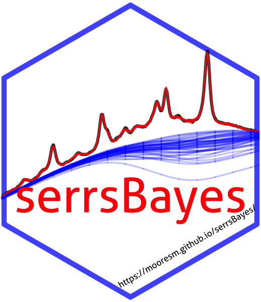
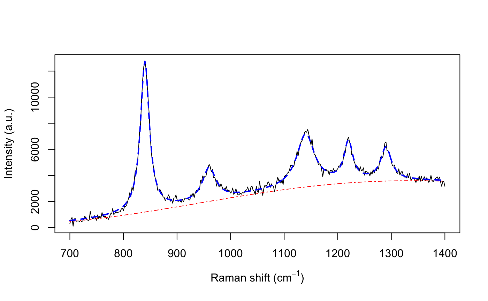
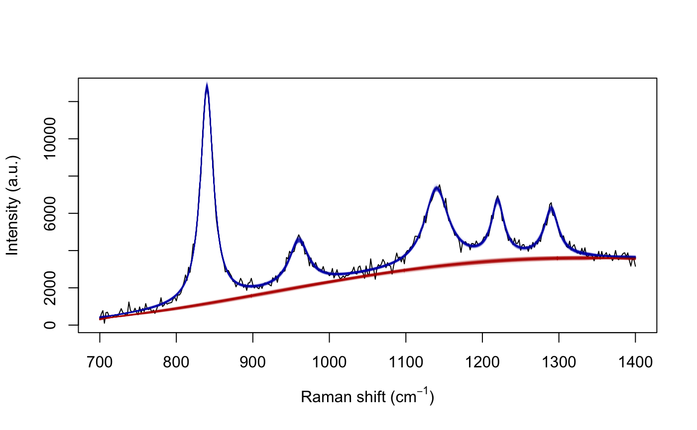

# serrsBayes

<!-- README.md is generated from README.Rmd. Please edit that file -->

[](https://cran.r-project.org/package=serrsBayes)
[](https://github.com/metacran/cranlogs.app)
[](https://travis-ci.org/mooresm/serrsBayes)
[](https://codecov.io/github/mooresm/serrsBayes?branch=master)



`serrsBayes` provides model-based quantification of surface-enhanced
resonance Raman spectroscopy (SERRS) using sequential Monte Carlo (SMC)
algorithms. The details of the Bayesian model and informative priors are
provided in the arXiv preprint, Moores et al. (2016; v2 2018) “[Bayesian
modelling and quantification of Raman
spectroscopy.](https://arxiv.org/abs/1604.07299)” Development of this
software was supported by the UK Engineering & Physical Sciences
Research Council (EPSRC) programme grant “[In Situ Nanoparticle
Assemblies for Healthcare Diagnostics and
Therapy](http://gow.epsrc.ac.uk/NGBOViewGrant.aspx?GrantRef=EP/L014165/1)”
(ref: EP/L014165/1).

# Installation Instructions

Stable releases, including binary packages for Windows & Mac OS, are
available from CRAN:

  - <https://CRAN.R-project.org/package=serrsBayes>

<!-- end list -->

``` r
install.packages("serrsBayes")
```

The current development version can be installed from GitHub:

``` r
devtools::install_github("mooresm/serrsBayes")
```

# Example Usage

To simulate a synthetic Raman spectrum with known parameters:

``` r
set.seed(1234)
library(serrsBayes)

wavenumbers <- seq(700,1400,by=2)
spectra <- matrix(nrow=1, ncol=length(wavenumbers))
peakLocations <- c(840,  960, 1140, 1220, 1290)
peakAmplitude <- c(11500, 2500, 4000, 3000, 2500)
peakScale <- c(10, 15, 20, 10, 12)
signature <- weightedLorentzian(peakLocations, peakScale, peakAmplitude, wavenumbers)
baseline <- 1000*cos(wavenumbers/200) + 2*wavenumbers
spectra[1,] <- signature + baseline + rnorm(length(wavenumbers),0,200)
plot(wavenumbers, spectra[1,], type='l', xlab=expression(paste("Raman shift (cm"^{-1}, ")")), ylab="Intensity (a.u.)")
lines(wavenumbers, baseline, col=2, lty=4)
lines(wavenumbers, baseline + signature, col=4, lty=2, lwd=2)
```

<!-- -->

Fit the model using
SMC:

``` r
lPriors <- list(scale.mu=log(11.6) - (0.4^2)/2, scale.sd=0.4, bl.smooth=10^11, bl.knots=50,
                 beta.mu=5000, beta.sd=5000, noise.sd=200, noise.nu=4)
tm <- system.time(result <- fitSpectraSMC(wavenumbers, spectra, peakLocations, lPriors))
```

Sample 200 particles from the posterior distribution:

``` r
print(tm)
#>    user  system elapsed 
#> 217.139   2.145 220.691
samp.idx <- sample.int(length(result$weights), 200, prob=result$weights)
plot(wavenumbers, spectra[1,], type='l', xlab=expression(paste("Raman shift (cm"^{-1}, ")")), ylab="Intensity (a.u.)")
for (pt in samp.idx) {
  bl.est <- result$basis %*% result$alpha[,1,pt]
  lines(wavenumbers, bl.est, col="#C3000009")
  lines(wavenumbers, bl.est + result$expFn[pt,], col="#0000C309")
}
```

<!-- -->
