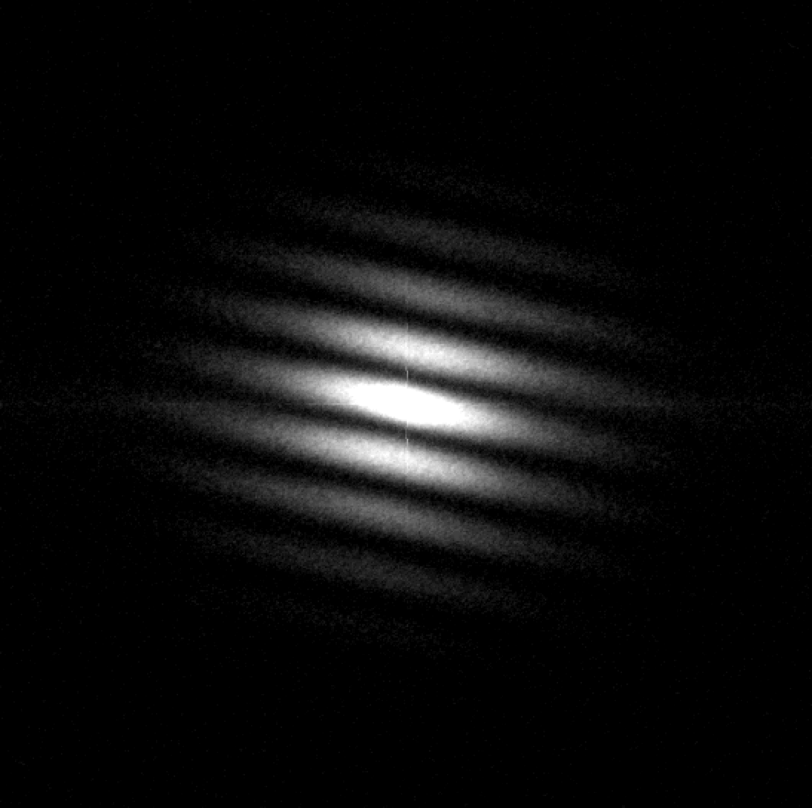

```{r setup, include = FALSE}
knitr::opts_chunk$set(
  collapse = TRUE,
  comment = "#>"
)
```

## Workflow for reduction of speckle interferometric binary stars
For reduction of speckle images of binary and multiple stars we use algorithm described in paper [Pluzhnik (2005)](https://www.aanda.org/articles/aa/pdf/2005/08/aa1158.pdf).

Calculate statistics for object file
```{r eval = FALSE}
obj_filename <- file.choose() # Choose file with binary star
obj_stat <- speckle_stat(obj_filename)
```

Calculate statistics for dark file
```{r eval = FALSE}
dark_filename <- file.choose() # Choose file with dark frames
dark_stat <- speckle_stat(dark_filename)
```

Calculate statistics for flat file
```{r eval = FALSE}
flat_filename <- file.choose() # Choose file with flat field frames
flat_stat <- speckle_stat(flat_filename)
```

Calculate average dark frame
```{r eval = FALSE}
zero_matrix <- matrix(0, 512, 512)
mid_dark <- middle_frame(filename = dark_filename, subtrahend = zero_matrix)
```

Calculate average flat field frame with average dark subtraction
```{r eval = FALSE}
mid_flat <- middle_frame(flat_filename, subtrahend = mid_dark)
```

Calculate power spectrum with subtraction of neighboring frame
```{r eval = FALSE}
ps_diff <- speckle_ps_diff(obj_filename)
```

Calculate acf
```{r eval = FALSE}
acf <- speckle_acf(ps_diff)
```

Calculate power spectrum
```{r eval = FALSE}
ps <- speckle_ps(obj_filename, dark = mid_dark, flat = mid_flat)
```

```{r, echo = FALSE, out.width = "400px", fig.cap = "Fig. 1. Power spectrum of star ADS 15182 in 550/20 nm band."}

```
