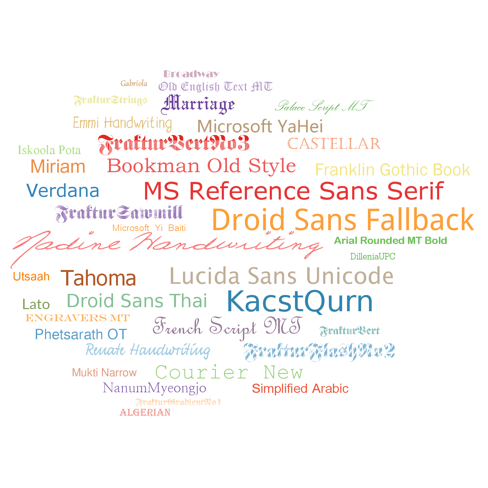

```{r,results="hide",echo=FALSE}
cairo <- function(name, width, height, ...) grDevices::cairo_pdf(file = paste0(name, ".pdf"), width = width, height = height)
png <- function(name, width, height, ...) grDevices::png(file = paste0(name, ".png"), width = width*300, height = height*300)
```

# Introduction

`tagcloud` command creates various styles of tag and word clouds.
In it simplest form, it takes a character vector (vector of tags) as an
argument. Optionally, one can add different weights, colors and layouts.
Here is an advanced example of a typical GO-Term cloud, where colors and weights
(font size) which correspond to the effect size and P-value, respectively: 


```{r fig1plot,fig.width=8,fig.height=3}
library(tagcloud)
data(gambia)
tags <- strmultline(gambia$Term)[1:40]
weights <- -log(gambia$Pvalue)[1:40]
or <- gambia$OddsRatio[1:40]
colors <- smoothPalette(or, max=4)
tagcloud(tags, weights=weights, col=colors)
```

**Notes.** The geometry of the cloud will reflect the geometry of the
plotting area: simply resize the plot and re-run `tagcloud` to get a
different look. `smoothPalette` automagically converts a numeric vector
into a vector of a color gradient of the same length. `strmultline`
breaks long, multi-word lines, which otherwise mess up the figure.

# Layouts

There is a number of algorithms that allow you to create different layouts.

```{r fig2plot,fig.width=8,fig.height=12}
par( mfrow=c( 3, 2 ) )
tagcloud(tags, weights=weights, col=colors, algorithm="oval")
tagcloud(tags, weights=weights, col=colors, algorithm="fill")
tagcloud(tags, weights=weights, col=colors, algorithm="snake")
tagcloud(tags, weights=weights, col=colors, algorithm="random")
tags2 <- gambia$Term[1:20]
cols2 <- colors[1:20]
wei2 <- weights[1:20]
tagcloud(tags2, weights=wei2, col=cols2, algorithm="list")
tagcloud(tags2, weights=wei2, col=cols2, algorithm="clist")
```

Another parameter to tune is `fvert`, the proportion of tags that are displayed
vertically (which is 0 by default).

```{r fig3plot,fig.width=8,fig.height=4}
par(mfrow=c(1, 2))
tagcloud(tags, weights=weights, col=colors, fvert=0.3)
tagcloud(tags, weights=weights, col=colors, fvert=0.7)
```

Finally, using the parameter `order` you can also influence the
layout of the word cloud:

 * `size`: tags are ordered by size, that is, their effective width multiplied by their effective height. Default.
 * `keep`: keep the order from the list of words provided
 * `random`: randomize the tag list
 * `width`: order by effective screen width
 * `height`: order by effective screen height

Starting with the tag with the largest weight typically makes this tag at the
center of the cloud. Sometimes, however, a randomized order results in a more interesting output.

```{r fig4plot,fig.width=8,fig.height=4}
par(mfrow=c(1, 2))
tagcloud(tags, weights=weights, col=colors, order="size")
tagcloud(tags, weights=weights, col=colors, order="random")
```

# Fonts

Using the parameter `family`, you can specify the font family to be used.
In the following, we use the excellent `extrafont` package^[After
installing the package, run `font_import` to import the fonts installed
on the system].  However note that to produce correct PDFs, you should use the
cairo engine, for example with `dev.copy2pdf( out.type="cairo", ... )`.
Alternatively, use the `png()` device.

```{r fig5plot,eval=FALSE}
library(extrafont)
library(RColorBrewer)
fnames <- sample(fonts(), 40)
fweights <- rgamma(40, 1)
fcolors <- colorRampPalette( brewer.pal( 12, "Paired" ) )( 40 )
tagcloud( fnames, weights=fweights, col=fcolors, family=fnames )
```



# Colors

Using the tools `smoothPalette`, you can easily map a numeric vector onto
colors. `smoothPalette` by default produces a grey-black gradient, but
anything goes with the help of `RColorBrewer`. `smoothPalette` either
takes a predefined palette (it will not expand it, however, so if you define
three colors, three colors will be on the figure, no extrapolated colors in
between), or an RColorBrewer palette.

In the example below, the weights are on purpose correlated to the color.

```{r fig6plot}
library(RColorBrewer)
colors <- smoothPalette(weights, pal= brewer.pal( 11, "Spectral" ) )
tagcloud(tags, weights=weights, col=colors, order="size")
```

Alternative way to specify the colors is to provide a function that can
generate a palette -- for example, the return value of `colorRampPalette`.
This has the advantage that `smoothPalette` will generate, with the
palette function, as many color steps as necessary.

```{r fig7plot}
palf <- colorRampPalette( c( "blue", "grey", "red" ) )
colors <- smoothPalette(weights, palfunc= palf )
tagcloud(tags, weights=weights, col=colors, order="size")
```

