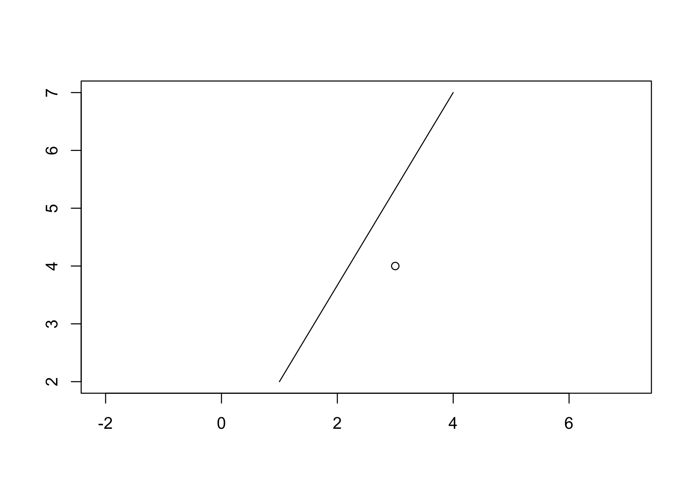
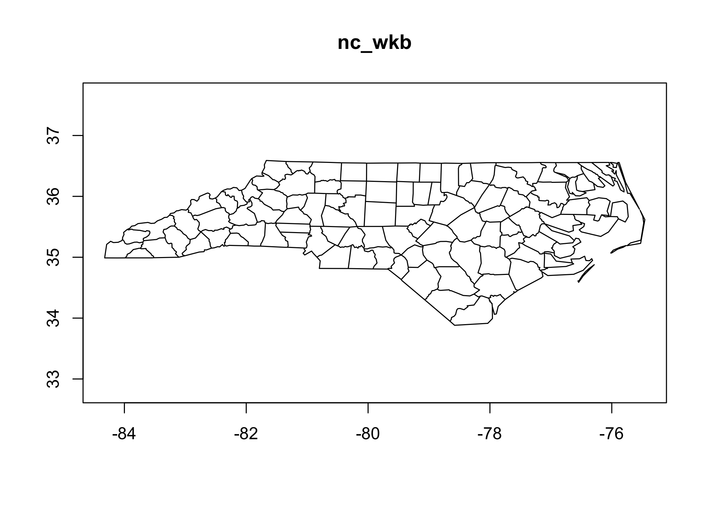

<!-- README.md is generated from README.Rmd. Please edit that file -->

# wkutils

<!-- badges: start -->

<!-- badges: end -->

Whereas the [wk package](https://paleolimbot.github.io/wk) provides
headers and class definitions for well-known geometry formats, this
package uses those headers to interrogate and transform these vectors.

## Installation

You can install the released version of wkutils from
[CRAN](https://CRAN.R-project.org) with:

``` r
install.packages("wkutils")
```

And the development version from [GitHub](https://github.com/) with:

``` r
# install.packages("remotes")
remotes::install_github("paleolimbot/wkutils")
```

## Example

The gist of the functions in this package:

``` r
library(wkutils)

wkt_coords("POINT (30 10)")
#> # A tibble: 1 x 7
#>   feature_id part_id ring_id     x     y     z     m
#>        <int>   <int>   <int> <dbl> <dbl> <dbl> <dbl>
#> 1          1       1       0    30    10    NA    NA
coords_point_translate_wkt(30, 10)
#> [1] "POINT (30 10)"
wkt_debug("POINT (30 10)")
#> nextFeatureStart(0)
#>     nextGeometryStart(POINT [1], WKReader::PART_ID_NONE)
#>         nextCoordinate(POINT [1], WKCoord(x = 30, y = 10), 0)
#>     nextGeometryEnd(POINT [1], WKReader::PART_ID_NONE)
#> nextFeatureEnd(0)
wkt_set_srid("POINT (30 10)", 1234)
#> [1] "SRID=1234;POINT (30 10)"
wkt_set_z("POINT (30 10)", 1234)
#> [1] "POINT Z (30 10 1234)"
wkt_meta("POINT (30 10)")
#> # A tibble: 1 x 8
#>   feature_id part_id type_id  size  srid has_z has_m n_coords
#>        <int>   <int>   <int> <int> <int> <lgl> <lgl>    <int>
#> 1          1       1       1     1    NA FALSE FALSE        1
wkt_ranges("POINT (30 10)")
#> # A tibble: 1 x 8
#>    xmin  ymin  zmin  mmin  xmax  ymax  zmax  mmax
#>   <dbl> <dbl> <dbl> <dbl> <dbl> <dbl> <dbl> <dbl>
#> 1    30    10   Inf   Inf    30    10  -Inf  -Inf
```

The package also contains plot methods for `wk::wkb()`, `wk::wkt()`, and
`wk::wksxp()` vectors. These aren’t intended to be high-performance, but
are helpful for debugging geometries.

``` r
plot(wk::wkt("LINESTRING (1 2, 4 7)"))
plot(wk::wkt("POINT (3 4)"), add = T)
```



Finally, the package contains slightly faster functions to send points,
lines, and polygons to a graphics device:

``` r
nc_sf <- sf::read_sf(system.file("shape/nc.shp", package = "sf"))
nc_wkb <- wk::as_wkb(sf::st_as_binary(nc_sf$geometry))
wkb_plot_new(nc_wkb)
wkb_draw_polypath(nc_wkb)
```


